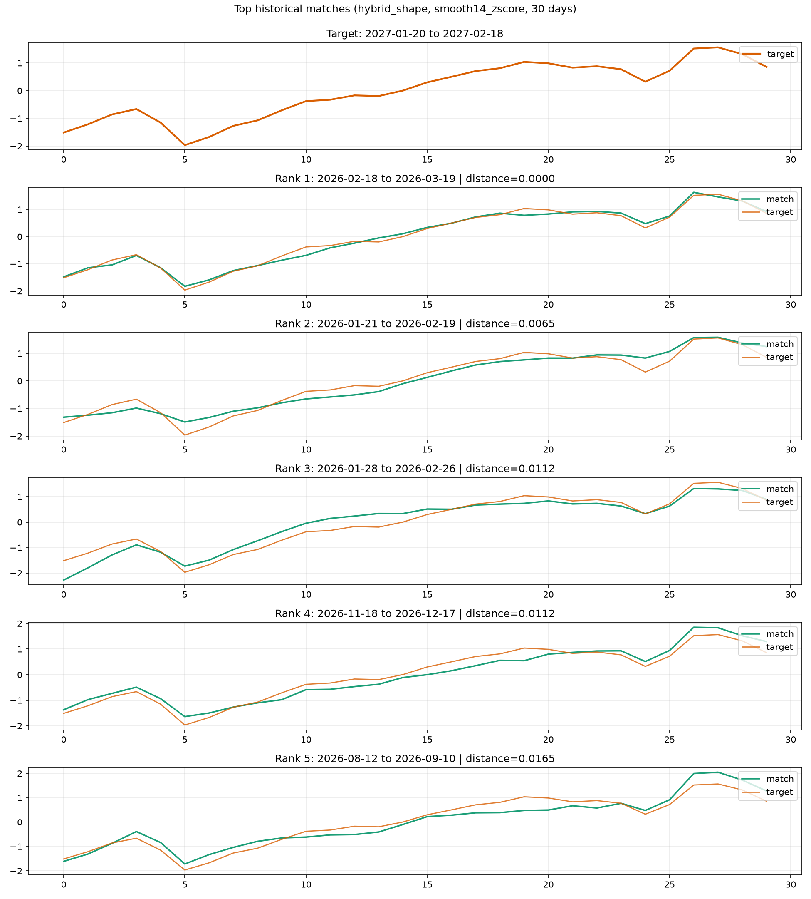

# Daily Subscriber Similarity — Beginner's Guide

## The correction: one segment at a time

**We compare daily subscribers for one `(service, service_sub, channel)` combination. We do not use total subscribers.**

For example, `초고속 / IP / 직접` is one series. `초고속 / IP / SKT` is a different series. A target from the first series searches only its own older dates. The second series does not contribute counts, model training data or historical candidates.

The previous reports used totals and therefore answered the wrong question. Their overall 45-day correlation recommendation is superseded. The corrected run analyzed **all 20 segments separately**, with **700 main settings plus six DTW follow-ups per segment: 14,120 trials**. Each segment gets its own selected method.

## Actual sample data

These seven rows are actual database observations for **초고속 / IP / 직접**. They are not sums of multiple channels or services.

| date | service | service_sub | channel | daily_subscribers |
| --- | --- | --- | --- | --- |
| 2026-01-01 | 초고속 | IP | 직접 | 536 |
| 2026-01-02 | 초고속 | IP | 직접 | 542 |
| 2026-01-03 | 초고속 | IP | 직접 | 368 |
| 2026-01-04 | 초고속 | IP | 직접 | 288 |
| 2026-01-05 | 초고속 | IP | 직접 | 498 |
| 2026-01-06 | 초고속 | IP | 직접 | 507 |
| 2026-01-07 | 초고속 | IP | 직접 | 487 |

A comparison window is a consecutive slice of this single segment's daily counts. Other segment keys have separate windows. There are 414 dates per segment and 8,280 segment/date records overall.

I did not forge the analysis records. They came from the existing database; the repository import script points to the `개통자수_일별` sheet in the supplied workbook. Whether the original workbook is simulated remains unverified. Its dates through 2027-02-18 are dataset labels, not verified future observations.

### A made-up illustration of matching shape

The following counts are **invented for teaching only and were not used in the run**. Think of both columns as different historical periods of the *same* segment.

| Day within window | Target period | Older period |
| --- | ---: | ---: |
| 1 | 100 | 200 |
| 2 | 120 | 240 |
| 3 | 80 | 160 |
| 4 | 110 | 220 |

Both periods rise, fall and recover together even though one has twice as many subscribers. Normalization helps compare these shapes instead of only their size.

## How do we choose a method?

We try 30–90-day windows, ways to smooth/normalize the counts, and several matching methods. On seven earlier **tuning dates**, we find the three closest historical windows and check how similar their following week is to the target's following week. The setting with the lowest average error is selected **separately for each segment**.

We then check that setting on four later **holdout dates** that did not select it. All candidates are older windows of the same segment. They cannot overlap the target, although candidates can overlap one another. This is a useful historical test, not proof of forecasting accuracy.

## The four metrics in plain language

**RMSE** measures error: square each day's difference, average those squares over the next seven days, then take the square root. Lower is better; zero means a perfect match.

We first divide each next-week count by the average of its own preceding observed window. That average uses days from the same segment only. For example, 110 after a window averaging 100 becomes `1.10`. Errors therefore use a relative scale, not subscriber counts or percentage accuracy.

| Metric | What it means | Better direction |
| --- | --- | --- |
| `top3_rmse_tune` | Score each of the three matches' next weeks separately; average their three errors, then average across seven tuning dates. Used to choose the segment's method. | Lower |
| `top3_rmse_holdout` | The same calculation on four later holdout dates. Shows how well the chosen method carries over. | Lower |
| `ensemble3_rmse_holdout` | First average the three normalized next-week paths day by day, then score that combined path; average across holdout dates. | Lower |
| `shape_corr_holdout` | Compare each holdout target's observed daily pattern with its single best historical match using raw-window correlation; average across holdout dates. Does not measure future accuracy. | Closer to +1 |

A correlation of +1 means perfectly aligned ups and downs, 0 means no linear relationship, and −1 means opposite movement. High correlation does not guarantee equal counts or a similar next week.

### “Top three” versus “ensemble”: an invented one-day example

Suppose the actual normalized value is `1.00`. The three historical paths give `0.90`, `1.00`, and `1.10`.

- **Top-three error:** score each separately, then average: `(0.10 + 0.00 + 0.10) / 3 = 0.0667`.
- **Ensemble error:** average the values first: `(0.90 + 1.00 + 1.10) / 3 = 1.00`. The combined error is `0.00`.

Low and high estimates cancel in this illustration. The real evaluation uses seven days and then averages query scores. An RMSE of 0.08 does not mean “92% accurate.”

## Corrected results for each segment

Each row is independent. No row represents total subscribers.

| service | service_sub | channel | window_length | preprocessing | method | top3_rmse_tune | top3_rmse_holdout | ensemble3_rmse_holdout | shape_corr_holdout |
| --- | --- | --- | --- | --- | --- | --- | --- | --- | --- |
| 방송 | CA | HnS | 60 | minmax | correlation | 0.058504 | 0.116908 | 0.102502 | 0.963310 |
| 방송 | CA | SKT | 60 | smooth3_zscore | hybrid | 0.055521 | 0.097639 | 0.086256 | 0.955484 |
| 방송 | CA | 도매 | 45 | relative_mean | hybrid_shape | 0.058971 | 0.093422 | 0.086515 | 0.958138 |
| 방송 | CA | 지역 | 45 | smooth3_zscore | hybrid_warp | 0.055242 | 0.092523 | 0.082796 | 0.965258 |
| 방송 | CA | 직접 | 45 | smooth3_zscore | hybrid_shape | 0.050901 | 0.109496 | 0.099299 | 0.968026 |
| 방송 | IP | HnS | 45 | relative_mean | cnn_pool4_seed19 | 0.053214 | 0.085672 | 0.076138 | 0.952350 |
| 방송 | IP | SKT | 30 | relative_first | euclidean | 0.068677 | 0.097073 | 0.088718 | 0.963528 |
| 방송 | IP | 도매 | 75 | smooth3_zscore | hybrid | 0.059374 | 0.100308 | 0.089048 | 0.941830 |
| 방송 | IP | 지역 | 30 | smooth14_zscore | hybrid_shape | 0.054554 | 0.092872 | 0.087166 | 0.961559 |
| 방송 | IP | 직접 | 30 | relative_first | euclidean | 0.049127 | 0.087173 | 0.081021 | 0.959277 |
| 초고속 | CA | HnS | 60 | log_zscore | dtw_0.05 | 0.059344 | 0.085149 | 0.073238 | 0.959124 |
| 초고속 | CA | SKT | 30 | smooth3_zscore | euclidean | 0.055420 | 0.105638 | 0.097050 | 0.968368 |
| 초고속 | CA | 도매 | 75 | smooth3_zscore | hybrid | 0.058301 | 0.100744 | 0.088878 | 0.952701 |
| 초고속 | CA | 지역 | 45 | smooth3_zscore | euclidean | 0.059315 | 0.098509 | 0.088514 | 0.960977 |
| 초고속 | CA | 직접 | 45 | smooth3_zscore | correlation | 0.051616 | 0.083201 | 0.075991 | 0.965330 |
| 초고속 | IP | HnS | 45 | minmax | cosine | 0.059822 | 0.106123 | 0.101183 | 0.958403 |
| 초고속 | IP | SKT | 30 | relative_mean | cnn_pool4_seed7 | 0.059655 | 0.105953 | 0.090389 | 0.965906 |
| 초고속 | IP | 도매 | 45 | minmax | cosine | 0.055545 | 0.107222 | 0.103230 | 0.967472 |
| 초고속 | IP | 지역 | 45 | minmax | hybrid_shape | 0.055787 | 0.087502 | 0.074218 | 0.966999 |
| 초고속 | IP | 직접 | 30 | smooth14_zscore | hybrid_shape | 0.059136 | 0.102484 | 0.085148 | 0.955716 |

`window_length` is the number of days compared; `preprocessing` describes smoothing or normalization; `method` is the matching algorithm. `zscore` removes a window's mean and rescales by its standard deviation. `smooth3_zscore` adds three-day smoothing first; `relative_mean` divides by the window mean and subtracts one. A `hybrid` blends multiple rankings; `cnn` uses a trained neural encoder. `relative_first` scales by the first observed count, `minmax` scales between zero and one, and `log_zscore` moderates large values before standardizing. `smooth14_zscore` smooths over fourteen days; `dtw` allows some timing shifts when aligning patterns.

## Example result: 초고속 / IP / 직접

This named segment is used as an example, not as a representative winner for all segments. Its selected setting is **30 days / smooth14_zscore / hybrid_shape**.

| Metric | This segment's result |
| --- | ---: |
| `top3_rmse_tune` | 0.059136 |
| `top3_rmse_holdout` | 0.102484 |
| `ensemble3_rmse_holdout` | 0.085148 |
| `shape_corr_holdout` | 0.955716 |

Its latest target is **2027-01-20 to 2027-02-18**. Every match below also belongs to **초고속 / IP / 직접**:

| rank | start | end | distance | shape_corr |
| --- | --- | --- | --- | --- |
| 1 | 2026-02-18 | 2026-03-19 | 0.000000 | 0.947424 |
| 2 | 2026-01-21 | 2026-02-19 | 0.006471 | 0.949117 |
| 3 | 2026-01-28 | 2026-02-26 | 0.011176 | 0.954656 |
| 4 | 2026-11-18 | 2026-12-17 | 0.011176 | 0.967032 |
| 5 | 2026-08-12 | 2026-09-10 | 0.016471 | 0.958726 |

`distance` is the selected method's score: lower means closer by that method. `shape_corr` here is the raw correlation for this particular latest match. Neither is the same as next-week RMSE or the average holdout correlation. For this hybrid, distance zero means the candidate ranks first across the component measures; it does not mean identical daily counts.

Orange shows the target and green the historical window, aligned by day within the window. This example uses fourteen-day smoothing and z-score normalization, so the vertical axis shows transformed values, not raw counts. Negative values mean below that window’s smoothed average:

## What can we conclude?

Use the result for the **exact service, subservice and channel you care about**. Do not transfer the previous total-subscriber winner, or another segment's winner, to it without testing.

Every selected segment has higher holdout error than tuning error, meaning the method performed worse on later dates. Good observed shape similarity does not ensure a good next-week match. There are only four holdout dates per segment, and many settings were tried, so the results remain provisional.

The latest target has no observed following week in this extract. Its future accuracy is unknown. The [complete corrected report](similarity-analysis-report.md) contains all segments' matches and detailed comparisons.
