# 일일 가입자 유사도 — 독립 리프 세그먼트 분석

## 정정된 분석 기준

**하나의 시계열은 하나의 `(service, service_sub, channel)` 조합입니다. 서로 다른 조합의 수치는 절대 합산하지 않습니다.** 대상 윈도우는 자체 세그먼트의 과거 윈도우만 검색합니다. 이 보고서는 선택 구성과 지표가 의도한 질문에 답하지 못했던 이전 전체 가입자 분석을 대체합니다.

**20개 세그먼트**를 모두 독립적으로 다시 실행했습니다. 세그먼트당 700개(그중 CNN 설정 40개)를 포함한 **주 그리드 세그먼트/구성 시험 14,000회**와 세그먼트당 6개인 **요일 인지 DTW 정제 120회**입니다. 따라서 정정된 실행은 **주 그리드 신경망 설정 800개**를 포함해 **14,120회**를 실행했습니다. 각 세그먼트에는 자체 튜닝 승자, 모델 적합, 후보 풀 및 정규화가 있습니다. 상속된 집계 승자나 세그먼트 간 매칭은 없습니다.

## 데이터 감사 및 준비

기존 `subscribers_historical` 테이블에는 8,280개 레코드가 있습니다. 20개 독립 세그먼트 × 연속 날짜 414개(2026-01-01~2027-02-18)입니다. 각 세그먼트/날짜에는 정확히 하나의 수치가 있습니다. 어떤 세그먼트에도 누락된 날짜나 수치, 중복 세그먼트/날짜 키가 없으며 수치는 양수입니다. 원본은 읽기만 했고 생성하거나 수정하지 않았습니다.

저장소의 가져오기 스크립트는 통합 문서의 `개통자수_일별` 시트를 이 테이블에 매핑합니다. 원본 통합 문서의 생성 방식/출처는 검증되지 않았습니다. 작업 날짜인 2026-09-14 이후 날짜는 검증된 미래 관측값이 아니라 데이터셋 레이블로 취급합니다.

`select_daily_series`는 이제 여러 차원 키를 합산하지 않고 거부합니다. 중복 날짜, 누락 날짜, 누락 키 및 유한하지 않은 수치도 거부합니다. 부분 CLI 필터는 일치하는 리프 세그먼트를 열거해 각각 독립적으로 분석합니다. 저장된 모든 CSV에는 `segment_id`, `service`, `service_sub`, `channel`이 포함되며 메타데이터에는 `candidate_scope: same segment only`라고 명시됩니다.

| 서비스 | 서비스_하위 | 채널 | days | minimum | mean | maximum | lag7_corr |
| --- | --- | --- | --- | --- | --- | --- | --- |
| 방송 | CA | HnS | 414 | 29.000000 | 52.135266 | 74.000000 | 0.934418 |
| 방송 | CA | SKT | 414 | 27.000000 | 49.263285 | 67.000000 | 0.935142 |
| 방송 | CA | 도매 | 414 | 20.000000 | 34.867150 | 47.000000 | 0.938926 |
| 방송 | CA | 지역 | 414 | 35.000000 | 63.065217 | 86.000000 | 0.941929 |
| 방송 | CA | 직접 | 414 | 51.000000 | 90.202899 | 120.000000 | 0.940909 |
| 방송 | IP | HnS | 414 | 83.000000 | 153.939614 | 207.000000 | 0.942880 |
| 방송 | IP | SKT | 414 | 79.000000 | 143.258454 | 195.000000 | 0.934645 |
| 방송 | IP | 도매 | 414 | 56.000000 | 103.183575 | 139.000000 | 0.931243 |
| 방송 | IP | 지역 | 414 | 101.000000 | 184.570048 | 255.000000 | 0.938307 |
| 방송 | IP | 직접 | 414 | 148.000000 | 271.021739 | 376.000000 | 0.934776 |
| 초고속 | CA | HnS | 414 | 22.000000 | 39.642512 | 53.000000 | 0.936663 |
| 초고속 | CA | SKT | 414 | 21.000000 | 38.565217 | 52.000000 | 0.937143 |
| 초고속 | CA | 도매 | 414 | 14.000000 | 26.367150 | 35.000000 | 0.933200 |
| 초고속 | CA | 지역 | 414 | 26.000000 | 47.966184 | 64.000000 | 0.935385 |
| 초고속 | CA | 직접 | 414 | 38.000000 | 68.152174 | 90.000000 | 0.945048 |
| 초고속 | IP | HnS | 414 | 160.000000 | 301.048309 | 425.000000 | 0.938315 |
| 초고속 | IP | SKT | 414 | 147.000000 | 287.347826 | 403.000000 | 0.943395 |
| 초고속 | IP | 도매 | 414 | 105.000000 | 196.326087 | 280.000000 | 0.938399 |
| 초고속 | IP | 지역 | 414 | 201.000000 | 367.330918 | 498.000000 | 0.936382 |
| 초고속 | IP | 직접 | 414 | 280.000000 | 530.823671 | 707.000000 | 0.942135 |


아래 각 플롯 패널은 별도의 세그먼트입니다. 이 선들은 합산한 값이 아닙니다.

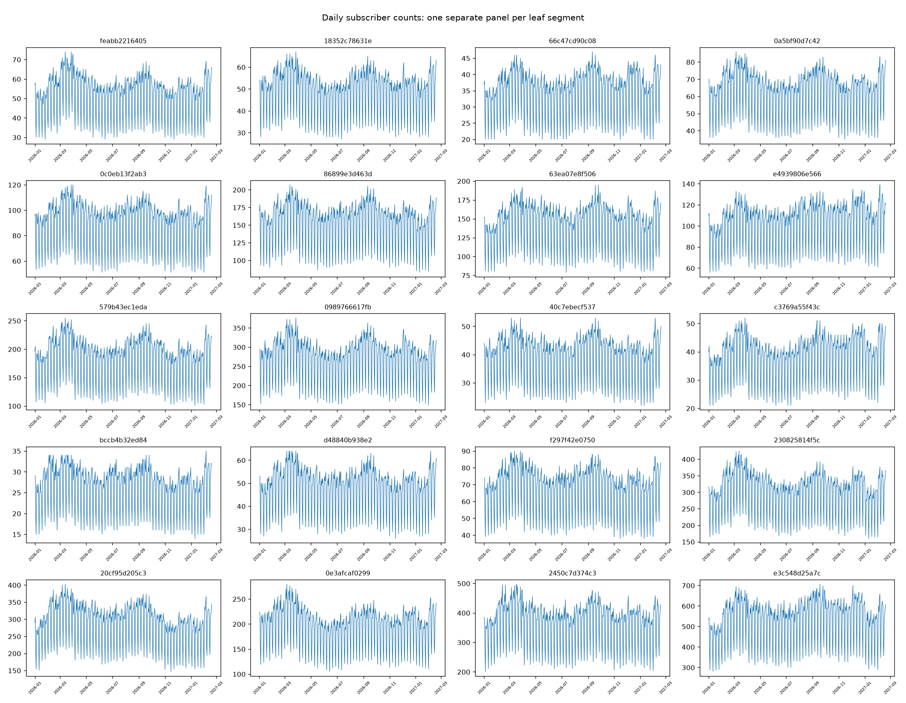

## 평가 프로토콜

주 그리드는 30, 45, 60, 75, 90일 윈도우와 11가지 변환을 사용합니다. z-점수, 최소-최대, 상대 평균, 상대 첫 값, 중앙 3/7/14일 평활화 후 z-점수, 추세 제거 z-점수, 1차 차분 z-점수, 변화율 z-점수, 로그 z-점수입니다.

방법은 RMS 유클리드, 코사인, 상관관계, 5/15/30% 밴드 DTW(최소 반경 2), 표준화 통계 특성 거리, 순위 가중 DTW/상관관계/유클리드 하이브리드 3종, CNN 아키텍처/시드 조합 4종 및 최근/요일-최근 기준선입니다. CNN은 z-점수 및 상대 평균 입력으로 시험합니다. 기준선/전처리 조합은 동일한 기준선 동작을 반복하므로 세그먼트당 명목 구성 700개가 700개의 독립 아이디어는 아닙니다.

- Tuning query ends: 2026-09-12, 2026-09-26, 2026-10-10, 2026-10-24, 2026-11-07, 2026-11-21, 2026-12-05.
- Holdout query ends: 2026-12-19, 2027-01-02, 2027-01-16, 2027-01-30.
- All lengths and segments use these same seven tuning and four holdout endpoints.
- The winner for each segment minimizes its own tuning seven-day top-three continuation RMSE, excluding baseline rows. Holdout scores do not select it.
- Fourteen-day continuations are also scored. Query endpoints are fourteen days apart; target windows still overlap, so results are dependent.
- Candidates end at least `max(14, window_length // 2)` index-days before the target starts. Candidate continuations therefore also precede the target.
- Retrieved starting dates are at least seven days apart. Candidates can still share many observed days; they are not independent historical events.
- Across all 308,000 query/horizon rows, 4,126 rows return fewer than five diversified neighbors. All rows have at least three, so the selection criterion always uses three neighbors. Top-five errors average available neighbors.
- CNN fitting, feature scaling and rank normalization use only eligible older windows **within that segment**. No other segment's records enter these operations.

다음 주 수치는 자체 직전 관측 윈도우의 평균으로 나눕니다. 이 평균은 한 세그먼트 내의 날짜만 평균 내며 세그먼트 키를 결합하지 않습니다. 평균 100 뒤의 수치 110은 1.10이 됩니다. 평가는 이 상대 경로를 비교합니다. RMSE는 일일 제곱 오류 평균의 제곱근이며 낮을수록 좋습니다. 가입자 수 기준 오류나 백분율 정확도가 아닙니다.

| 보고서 열 | 정의 |
| --- | --- |
| `top3_rmse_tune` | Average the three individual neighbor continuation RMSEs per tuning query, then average the seven query scores |
| `top3_rmse_holdout` | Same calculation over the four holdout queries |
| `ensemble3_rmse_holdout` | Average three normalized continuation paths first, calculate that combined path's RMSE, then average over holdout queries |
| `shape_corr_holdout` | Average raw-window Pearson correlation between each holdout target and its rank-1 candidate; observed shape only, not future error |

앞의 세 열은 낮아야 합니다. 형태 상관관계는 +1에 가까워야 합니다. 형태 상관관계가 높아도 미래 연속성 정확도는 낮을 수 있습니다. 초보자용 예시는 [간단한 보고서](similarity-analysis-report-simple_ko.md)를 참조하세요.

### 거리 및 특성 정의

유클리드 거리는 변환된 윈도우의 지점별 RMS 거리입니다. 코사인 거리는 1에서 벡터 코사인을 뺀 값이고, 상관 거리도 1에서 피어슨 상관관계를 뺀 값입니다. 중심화·표준화된 데이터에서 이 방법들은 같은 순위를 낼 수 있으므로, 표시된 승자가 동률 대안보다 유일하게 뛰어난 것은 아닐 수 있습니다.

DTW는 지정된 밴드 안에서 누적 비용이 최소인 경로를 따라 국소 절대 차이를 합산한 뒤, 선택된 경로의 길이로 나눕니다. 평균 경로 비용을 직접 최적화하지는 않습니다. 통계 특성은 평균, 표준편차, 1/3사분위수, 선형 기울기, 평균 절대 1차 차분, 1차 차분 표준편차, 반 윈도우 평균 대비, 7시차 상관 거리입니다. 특성 스케일링은 같은 세그먼트의 적격 과거 윈도우에 맞춥니다.

`(DTW 15%, 상관관계, 유클리드)`의 하이브리드 가중치는 `hybrid`에서 `(0.45, 0.35, 0.20)`, `hybrid_shape`에서 `(0.20, 0.60, 0.20)`, `hybrid_warp`에서 `(0.70, 0.20, 0.10)`입니다. 각 구성 요소는 동률 평균 백분위 순위를 사용합니다. 하이브리드 거리 0은 후보가 구성 요소 순위에서 선두임을 뜻할 뿐, 두 관측 시퀀스가 동일함을 뜻하지 않습니다. 최근 기준선은 적격 최신성을 순위화하며, 요일 버전은 시작 요일이 일치하는 경우를 우선합니다.

CNN 쌍 뷰는 표준편차 0.02의 독립 가우스 잡음을 사용하며 두 분기는 인코더 가중치를 공유합니다. 모든 변환과 학습 파라미터는 하나의 세그먼트 내에 유지됩니다. 이동 평균은 중앙 정렬되지만 관측 윈도우로 제한되고 가장자리에는 더 짧은 평균을 사용합니다. 추세 제거는 적합 직선을 제거하고, 1차 차분과 변화율은 시퀀스 길이를 하나 줄이며, `log_zscore`는 표준화 전에 `log1p`를 사용합니다.

## 모든 세그먼트의 선택 구성

각 행은 해당 세그먼트의 튜닝 점수를 사용해 독립적으로 선택했습니다. 이것이 정정된 주요 결과입니다.

| 세그먼트_ID | 서비스 | 서비스_하위 | 채널 | 윈도우_길이 | 전처리 | 방법 | top3_rmse_tune | top3_rmse_holdout | ensemble3_rmse_holdout | shape_corr_holdout |
| --- | --- | --- | --- | --- | --- | --- | --- | --- | --- | --- |
| feabb2216405 | 방송 | CA | HnS | 60 | minmax | correlation | 0.058504 | 0.116908 | 0.102502 | 0.963310 |
| 18352c78631e | 방송 | CA | SKT | 60 | smooth3_zscore | hybrid | 0.055521 | 0.097639 | 0.086256 | 0.955484 |
| 66c47cd90c08 | 방송 | CA | 도매 | 45 | relative_mean | hybrid_shape | 0.058971 | 0.093422 | 0.086515 | 0.958138 |
| 0a5bf90d7c42 | 방송 | CA | 지역 | 45 | smooth3_zscore | hybrid_warp | 0.055242 | 0.092523 | 0.082796 | 0.965258 |
| 0c0eb13f2ab3 | 방송 | CA | 직접 | 45 | smooth3_zscore | hybrid_shape | 0.050901 | 0.109496 | 0.099299 | 0.968026 |
| 86899e3d463d | 방송 | IP | HnS | 45 | relative_mean | cnn_pool4_seed19 | 0.053214 | 0.085672 | 0.076138 | 0.952350 |
| 63ea07e8f506 | 방송 | IP | SKT | 30 | relative_first | euclidean | 0.068677 | 0.097073 | 0.088718 | 0.963528 |
| e4939806e566 | 방송 | IP | 도매 | 75 | smooth3_zscore | hybrid | 0.059374 | 0.100308 | 0.089048 | 0.941830 |
| 579b43ec1eda | 방송 | IP | 지역 | 30 | smooth14_zscore | hybrid_shape | 0.054554 | 0.092872 | 0.087166 | 0.961559 |
| 0989766617fb | 방송 | IP | 직접 | 30 | relative_first | euclidean | 0.049127 | 0.087173 | 0.081021 | 0.959277 |
| 40c7ebecf537 | 초고속 | CA | HnS | 60 | log_zscore | dtw_0.05 | 0.059344 | 0.085149 | 0.073238 | 0.959124 |
| c3769a55f43c | 초고속 | CA | SKT | 30 | smooth3_zscore | euclidean | 0.055420 | 0.105638 | 0.097050 | 0.968368 |
| bccb4b32ed84 | 초고속 | CA | 도매 | 75 | smooth3_zscore | hybrid | 0.058301 | 0.100744 | 0.088878 | 0.952701 |
| d48840b938e2 | 초고속 | CA | 지역 | 45 | smooth3_zscore | euclidean | 0.059315 | 0.098509 | 0.088514 | 0.960977 |
| f297f42e0750 | 초고속 | CA | 직접 | 45 | smooth3_zscore | correlation | 0.051616 | 0.083201 | 0.075991 | 0.965330 |
| 230825814f5c | 초고속 | IP | HnS | 45 | minmax | cosine | 0.059822 | 0.106123 | 0.101183 | 0.958403 |
| 20cf95d205c3 | 초고속 | IP | SKT | 30 | relative_mean | cnn_pool4_seed7 | 0.059655 | 0.105953 | 0.090389 | 0.965906 |
| 0e3afcaf0299 | 초고속 | IP | 도매 | 45 | minmax | cosine | 0.055545 | 0.107222 | 0.103230 | 0.967472 |
| 2450c7d374c3 | 초고속 | IP | 지역 | 45 | minmax | hybrid_shape | 0.055787 | 0.087502 | 0.074218 | 0.966999 |
| e3c548d25a7c | 초고속 | IP | 직접 | 30 | smooth14_zscore | hybrid_shape | 0.059136 | 0.102484 | 0.085148 | 0.955716 |


같은 세그먼트에서 독립 튜닝으로 선택한 요일-최근성 기준선과 비교하면, 선택된 매처는 **20개 세그먼트 중 11개**에서 7일 홀드아웃 상위 3개 오류가 더 낮습니다. 이는 기술적 결과일 뿐이며, 세그먼트당 홀드아웃 쿼리 4개로 통계적 우위를 입증할 수는 없습니다.

## 세그먼트 전반의 알고리즘 비교

각 방법에 대해 먼저 각 세그먼트 안에서 최적의 튜닝 설정을 독립적으로 선택한 뒤, 결과 세그먼트 점수를 동일 가중치로 평균 냅니다. 이는 결합 가입자 수나 세그먼트 간 유사도 계산이 아닌 **평가 점수의 평균**입니다. 여기서 홀드아웃 정렬은 기술 목적이며 선택된 설정을 바꾸지 않습니다.

| 방법 | top3_rmse_tune | top3_rmse_holdout | ensemble3_rmse_holdout | shape_corr_holdout |
| --- | --- | --- | --- | --- |
| hybrid_warp | 0.059515 | 0.096966 | 0.086336 | 0.960977 |
| cosine | 0.058240 | 0.097394 | 0.087851 | 0.962550 |
| hybrid | 0.058954 | 0.097507 | 0.087667 | 0.962127 |
| hybrid_shape | 0.058334 | 0.097646 | 0.088174 | 0.961257 |
| correlation | 0.058572 | 0.097820 | 0.088401 | 0.962036 |
| euclidean | 0.058040 | 0.098295 | 0.088674 | 0.962321 |
| dtw_0.05 | 0.061033 | 0.099367 | 0.088829 | 0.952020 |
| weekday_recent | 0.080206 | 0.102193 | 0.094028 | 0.916902 |
| dtw_0.15 | 0.061814 | 0.102838 | 0.091791 | 0.944556 |
| dtw_0.30 | 0.061814 | 0.102854 | 0.091671 | 0.944556 |
| cnn_pool4_seed19 | 0.064135 | 0.115252 | 0.105279 | 0.900742 |
| cnn_pool1_seed7 | 0.095197 | 0.120922 | 0.111519 | 0.850978 |
| cnn_pool4_seed7 | 0.064565 | 0.133633 | 0.118303 | 0.786019 |
| feature | 0.086365 | 0.139008 | 0.123340 | 0.752870 |
| cnn_pool1_seed19 | 0.128813 | 0.148255 | 0.131367 | 0.760097 |
| recent | 0.229827 | 0.281530 | 0.278918 | 0.267769 |


### 세그먼트별 최적 튜닝 CNN 설정

CNN은 두 합성곱 계층(1→8→16 채널, 커널 5), ReLU, 1개 또는 4개 시간 빈으로의 평균 풀링 및 정규화된 16차원 임베딩을 사용합니다. 학습에는 같은 과거 윈도우의 잡음 쌍 뷰, 대조 온도 0.1, Adam 학습률 0.01, 60에포크, 시드 7/19를 사용합니다. 인코더는 세그먼트/쿼리별로 독립적으로 다시 적합합니다. 레이블이 지정된 긍정/부정 인간 유사도 판단은 없으며, 겹치는 윈도우는 거짓 음성일 수 있습니다.

| 세그먼트_ID | 서비스 | 서비스_하위 | 채널 | 윈도우_길이 | 전처리 | 방법 | top3_rmse_tune | top3_rmse_holdout | ensemble3_rmse_holdout | shape_corr_holdout |
| --- | --- | --- | --- | --- | --- | --- | --- | --- | --- | --- |
| 0989766617fb | 방송 | IP | 직접 | 30 | zscore | cnn_pool4_seed7 | 0.060835 | 0.130577 | 0.105790 | 0.663188 |
| 0a5bf90d7c42 | 방송 | CA | 지역 | 45 | relative_mean | cnn_pool4_seed7 | 0.057153 | 0.099613 | 0.084423 | 0.962662 |
| 0c0eb13f2ab3 | 방송 | CA | 직접 | 45 | relative_mean | cnn_pool4_seed19 | 0.056178 | 0.114336 | 0.109545 | 0.957919 |
| 0e3afcaf0299 | 초고속 | IP | 도매 | 30 | relative_mean | cnn_pool4_seed19 | 0.060895 | 0.108146 | 0.101339 | 0.959664 |
| 18352c78631e | 방송 | CA | SKT | 45 | relative_mean | cnn_pool4_seed19 | 0.057229 | 0.099713 | 0.094423 | 0.948234 |
| 20cf95d205c3 | 초고속 | IP | SKT | 30 | relative_mean | cnn_pool4_seed7 | 0.059655 | 0.105953 | 0.090389 | 0.965906 |
| 230825814f5c | 초고속 | IP | HnS | 45 | zscore | cnn_pool4_seed19 | 0.066632 | 0.237205 | 0.217678 | 0.138563 |
| 2450c7d374c3 | 초고속 | IP | 지역 | 30 | relative_mean | cnn_pool4_seed19 | 0.065348 | 0.088643 | 0.079732 | 0.965869 |
| 40c7ebecf537 | 초고속 | CA | HnS | 45 | relative_mean | cnn_pool4_seed7 | 0.060648 | 0.094424 | 0.086689 | 0.950230 |
| 579b43ec1eda | 방송 | IP | 지역 | 45 | relative_mean | cnn_pool4_seed19 | 0.062543 | 0.109043 | 0.100049 | 0.956066 |
| 63ea07e8f506 | 방송 | IP | SKT | 30 | zscore | cnn_pool4_seed7 | 0.070198 | 0.204743 | 0.193181 | 0.470594 |
| 66c47cd90c08 | 방송 | CA | 도매 | 45 | zscore | cnn_pool4_seed19 | 0.060206 | 0.162539 | 0.149798 | 0.789500 |
| 86899e3d463d | 방송 | IP | HnS | 45 | relative_mean | cnn_pool4_seed19 | 0.053214 | 0.085672 | 0.076138 | 0.952350 |
| bccb4b32ed84 | 초고속 | CA | 도매 | 30 | relative_mean | cnn_pool4_seed7 | 0.060867 | 0.095328 | 0.084837 | 0.956760 |
| c3769a55f43c | 초고속 | CA | SKT | 45 | relative_mean | cnn_pool4_seed19 | 0.062918 | 0.107052 | 0.102433 | 0.955918 |
| d48840b938e2 | 초고속 | CA | 지역 | 45 | zscore | cnn_pool4_seed19 | 0.063933 | 0.109541 | 0.098680 | 0.958071 |
| e3c548d25a7c | 초고속 | IP | 직접 | 45 | relative_mean | cnn_pool4_seed19 | 0.064888 | 0.113329 | 0.104916 | 0.796441 |
| e4939806e566 | 방송 | IP | 도매 | 45 | relative_mean | cnn_pool4_seed7 | 0.060753 | 0.173894 | 0.153472 | 0.588924 |
| f297f42e0750 | 초고속 | CA | 직접 | 45 | relative_mean | cnn_pool4_seed7 | 0.055307 | 0.113765 | 0.104817 | 0.956228 |
| feabb2216405 | 방송 | CA | HnS | 45 | zscore | cnn_pool4_seed7 | 0.068293 | 0.192114 | 0.170361 | 0.652485 |


## 시각적 점검 개요

각 패널은 공통 z-점수 표시를 사용해 한 세그먼트의 최신 대상과 자체 선택된 1위 과거 매칭을 비교합니다. 짧은 ID는 선택 구성 표의 전체 키에 매핑됩니다. 패널 상관관계는 원시 윈도우를 사용하므로 선택 알고리즘의 거리와 다를 수 있습니다.

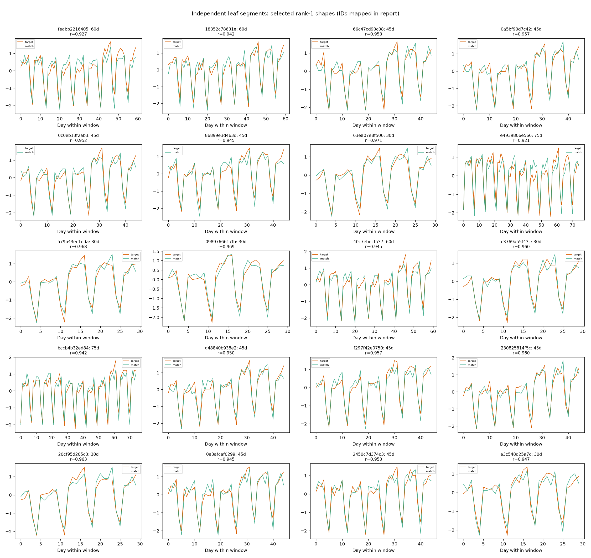

### 완료된 실행 및 점검 플롯 해석

윈도우 선택은 다양합니다. 6개 세그먼트가 30일, 9개가 45일, 3개가 60일, 2개가 75일을 선택했고 이 튜닝 기준에서 90일을 선택한 세그먼트는 없습니다. 2개 세그먼트는 4빈 CNN을 선택했고 18개는 통계 또는 하이브리드 방법을 선택했습니다. 이는 세그먼트별 결과일 뿐 모든 키에 하나의 모델을 적용할 근거는 아닙니다.

원시 형태 개요는 20개 최신 1위 매칭 모두에서 정렬된 주간 저점을 보여 주며 상관관계는 0.920501~0.970607입니다. 최고점 높이와 일부 국소 변동은 여전히 다릅니다. 가장 약한 1위 원시 상관관계는 75일 `방송 / IP / 도매` 매칭으로, 더 긴 관점에서 주간 최고점 간 차이가 더 드러납니다. 이 시각 점검은 동일한 동작을 주장하지 않으면서 관측 패턴의 유사성을 뒷받침합니다.

초보자 예시인 `초고속 / IP / 직접`에서 선택한 14일 평활화 플롯은 전반적인 상승 움직임과 초기 하락을 보존합니다. 별도의 원시 형태 개요는 평활화 표시에서는 대부분 사라진 주간 정렬을 확인해 줍니다. 최신 매칭은 같은 정확한 세그먼트의 2026-02-18~2026-03-19입니다. 여기서 순위 앙상블 거리 0은 원시 오류 0이 아니라 최상위 후보를 뜻합니다.

선택된 모든 세그먼트는 홀드아웃의 7일 상위 3개 RMSE가 튜닝보다 높습니다. 홀드아웃 오류는 0.083201~0.116908인 반면 홀드아웃 원시 형태 상관관계는 높게 유지됩니다(0.941830~0.968368). 이는 관측 형태가 가까워도 이후 경로가 똑같이 가깝다는 보장은 없다는 직접적인 근거입니다. 많은 설정 중 선택한 점과 이후 데이터 체계 모두 가능한 원인이지만, 이 실험은 원인을 분리하지 않습니다.

## 세그먼트별 근거

다음 절에서는 각 세그먼트의 최신 상위 5개 매칭, 방법별 최적 튜닝 설정 및 선택 구성의 쿼리 수준 평가를 제공합니다. 최신 대상은 2027-02-18에 끝나며 이 추출 데이터에는 관측된 이후 경로가 없습니다. 상세 매칭 플롯은 각각 선택된 전처리 변환을 사용하므로 세로축은 원시 가입자 수가 아니라 변환값을 나타냅니다. 위 개요는 원시 윈도우 z-점수를 별도로 표시합니다.

### 방송 / CA / HnS (`feabb2216405`)

선택: **60 days / minmax / correlation**. 대상: **2026-12-21 to 2027-02-18**. 아래의 모든 과거 기간은 **방송 / CA / HnS**에 속합니다.

| 순위 | 시작일 | 종료일 | 거리 | 유사도_점수 | 형태_상관 | 평균_비율 |
| --- | --- | --- | --- | --- | --- | --- |
| 1 | 2026-05-25 | 2026-07-23 | 0.072958 | 0.932003 | 0.927042 | 0.958240 |
| 2 | 2026-07-27 | 2026-09-24 | 0.075179 | 0.930078 | 0.924821 | 1.041439 |
| 3 | 2026-06-22 | 2026-08-20 | 0.087702 | 0.919369 | 0.912298 | 0.981690 |
| 4 | 2026-07-13 | 2026-09-10 | 0.088652 | 0.918567 | 0.911348 | 1.013492 |
| 5 | 2026-05-18 | 2026-07-16 | 0.095751 | 0.912616 | 0.904249 | 0.961131 |


`mean_ratio`는 이 세그먼트 내 후보 평균 / 대상 평균입니다. `distance`는 방법별 값이며 `similarity_score = 1/(1+distance)`는 확률이 아닌 표시 점수입니다. 하이브리드 거리는 적격 풀에 따라 달라집니다. DTW는 이동된 이벤트를 정렬할 수 있으므로 워핑하지 않은 원시 상관관계는 거리에서 예상하는 것보다 낮을 수 있습니다.

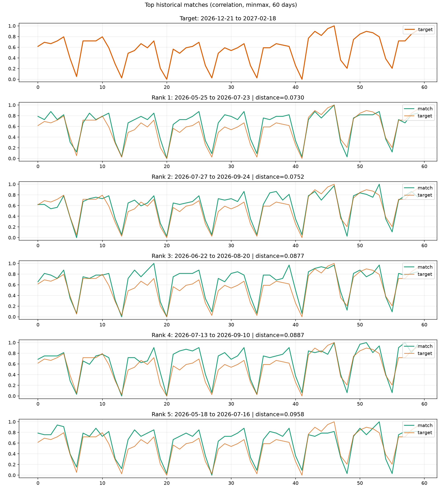

각 방법 내 최적 튜닝 구성:

| 윈도우_길이 | 전처리 | 방법 | top3_rmse_tune | top3_rmse_holdout | ensemble3_rmse_holdout | shape_corr_holdout |
| --- | --- | --- | --- | --- | --- | --- |
| 60 | minmax | correlation | 0.058504 | 0.116908 | 0.102502 | 0.963310 |
| 60 | zscore | euclidean | 0.058504 | 0.116908 | 0.102502 | 0.963310 |
| 60 | zscore | cosine | 0.058504 | 0.116908 | 0.102502 | 0.963310 |
| 45 | relative_mean | hybrid_warp | 0.059435 | 0.098532 | 0.091785 | 0.969171 |
| 45 | relative_mean | dtw_0.05 | 0.059712 | 0.098532 | 0.091785 | 0.969171 |
| 45 | relative_mean | dtw_0.15 | 0.059712 | 0.098532 | 0.091785 | 0.969171 |
| 45 | log_zscore | hybrid | 0.059712 | 0.105549 | 0.097946 | 0.970453 |
| 45 | relative_mean | dtw_0.30 | 0.059712 | 0.098532 | 0.091785 | 0.969171 |
| 45 | smooth3_zscore | hybrid_shape | 0.061339 | 0.109460 | 0.099334 | 0.970062 |
| 45 | zscore | cnn_pool4_seed7 | 0.068293 | 0.192114 | 0.170361 | 0.652485 |
| 45 | relative_mean | cnn_pool4_seed19 | 0.070239 | 0.113647 | 0.104739 | 0.952314 |
| 90 | pct_change_zscore | weekday_recent | 0.077286 | 0.089409 | 0.078959 | 0.931801 |
| 30 | pct_change_zscore | feature | 0.101987 | 0.109685 | 0.099635 | 0.956675 |
| 30 | relative_mean | cnn_pool1_seed7 | 0.115194 | 0.130158 | 0.115219 | 0.956337 |
| 45 | relative_mean | cnn_pool1_seed19 | 0.132487 | 0.221245 | 0.197658 | 0.635441 |
| 90 | pct_change_zscore | recent | 0.231716 | 0.259700 | 0.257523 | 0.188134 |


선택 방법의 쿼리 수준 결과(7일 및 14일 예측 기간):

| 쿼리_종료일 | 분할 | 예측_기간 | top1_rmse | top3_rmse | ensemble3_rmse | shape_corr |
| --- | --- | --- | --- | --- | --- | --- |
| 2026-09-12 | tune | 7 | 0.095263 | 0.087989 | 0.062473 | 0.924931 |
| 2026-09-12 | tune | 14 | 0.096895 | 0.095199 | 0.053821 | 0.924931 |
| 2026-09-26 | tune | 7 | 0.098253 | 0.083916 | 0.052979 | 0.940842 |
| 2026-09-26 | tune | 14 | 0.083652 | 0.071776 | 0.052246 | 0.940842 |
| 2026-10-10 | tune | 7 | 0.040429 | 0.050423 | 0.039778 | 0.945331 |
| 2026-10-10 | tune | 14 | 0.037764 | 0.056614 | 0.045271 | 0.945331 |
| 2026-10-24 | tune | 7 | 0.060251 | 0.044244 | 0.029574 | 0.955964 |
| 2026-10-24 | tune | 14 | 0.063505 | 0.052535 | 0.043490 | 0.955964 |
| 2026-11-07 | tune | 7 | 0.043150 | 0.040829 | 0.034438 | 0.963836 |
| 2026-11-07 | tune | 14 | 0.045469 | 0.042198 | 0.035113 | 0.963836 |
| 2026-11-21 | tune | 7 | 0.047418 | 0.045930 | 0.023890 | 0.962433 |
| 2026-11-21 | tune | 14 | 0.057853 | 0.072111 | 0.063306 | 0.962433 |
| 2026-12-05 | tune | 7 | 0.071734 | 0.056197 | 0.048813 | 0.959766 |
| 2026-12-05 | tune | 14 | 0.068233 | 0.054871 | 0.045261 | 0.959766 |
| 2026-12-19 | holdout | 7 | 0.056480 | 0.057966 | 0.042840 | 0.964160 |
| 2026-12-19 | holdout | 14 | 0.063479 | 0.075838 | 0.063337 | 0.964160 |
| 2027-01-02 | holdout | 7 | 0.081491 | 0.096967 | 0.069045 | 0.960220 |
| 2027-01-02 | holdout | 14 | 0.074683 | 0.092851 | 0.066131 | 0.960220 |
| 2027-01-16 | holdout | 7 | 0.127425 | 0.094737 | 0.081682 | 0.957999 |
| 2027-01-16 | holdout | 14 | 0.105877 | 0.088435 | 0.066355 | 0.957999 |
| 2027-01-30 | holdout | 7 | 0.242361 | 0.217963 | 0.216439 | 0.970863 |
| 2027-01-30 | holdout | 14 | 0.237159 | 0.203472 | 0.201065 | 0.970863 |


### 방송 / CA / SKT (`18352c78631e`)

선택: **60 days / smooth3_zscore / hybrid**. 대상: **2026-12-21 to 2027-02-18**. 아래의 모든 과거 기간은 **방송 / CA / SKT**에 속합니다.

| 순위 | 시작일 | 종료일 | 거리 | 유사도_점수 | 형태_상관 | 평균_비율 |
| --- | --- | --- | --- | --- | --- | --- |
| 1 | 2026-06-22 | 2026-08-20 | 0.001698 | 0.998305 | 0.942001 | 0.980939 |
| 2 | 2026-06-15 | 2026-08-13 | 0.013962 | 0.986230 | 0.929551 | 0.966984 |
| 3 | 2026-06-29 | 2026-08-27 | 0.023962 | 0.976598 | 0.909602 | 0.992852 |
| 4 | 2026-06-08 | 2026-08-06 | 0.039811 | 0.961713 | 0.915443 | 0.953029 |
| 5 | 2026-01-12 | 2026-03-12 | 0.054151 | 0.948631 | 0.896198 | 1.050374 |


`mean_ratio`는 이 세그먼트 내 후보 평균 / 대상 평균입니다. `distance`는 방법별 값이며 `similarity_score = 1/(1+distance)`는 확률이 아닌 표시 점수입니다. 하이브리드 거리는 적격 풀에 따라 달라집니다. DTW는 이동된 이벤트를 정렬할 수 있으므로 워핑하지 않은 원시 상관관계는 거리에서 예상하는 것보다 낮을 수 있습니다.

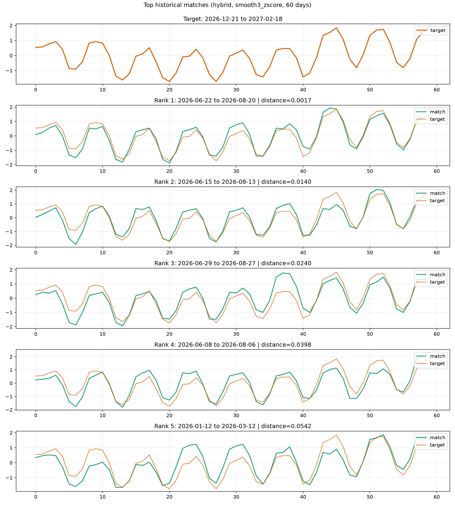

각 방법 내 최적 튜닝 구성:

| 윈도우_길이 | 전처리 | 방법 | top3_rmse_tune | top3_rmse_holdout | ensemble3_rmse_holdout | shape_corr_holdout |
| --- | --- | --- | --- | --- | --- | --- |
| 60 | smooth3_zscore | hybrid | 0.055521 | 0.097639 | 0.086256 | 0.955484 |
| 60 | smooth3_zscore | hybrid_warp | 0.055521 | 0.097639 | 0.086256 | 0.955484 |
| 60 | smooth3_zscore | hybrid_shape | 0.055648 | 0.094986 | 0.084043 | 0.959258 |
| 45 | smooth3_zscore | correlation | 0.056708 | 0.108943 | 0.100544 | 0.962676 |
| 45 | smooth3_zscore | cosine | 0.056708 | 0.108943 | 0.100544 | 0.962676 |
| 45 | smooth3_zscore | euclidean | 0.056708 | 0.108943 | 0.100544 | 0.962676 |
| 45 | relative_mean | cnn_pool4_seed19 | 0.057229 | 0.099713 | 0.094423 | 0.948234 |
| 45 | minmax | dtw_0.05 | 0.057444 | 0.112351 | 0.098632 | 0.952712 |
| 30 | zscore | dtw_0.15 | 0.059900 | 0.088591 | 0.079512 | 0.967400 |
| 30 | zscore | dtw_0.30 | 0.059900 | 0.088591 | 0.079512 | 0.967400 |
| 30 | relative_mean | cnn_pool4_seed7 | 0.062292 | 0.105049 | 0.091407 | 0.644831 |
| 30 | log_zscore | weekday_recent | 0.083537 | 0.090410 | 0.079085 | 0.937236 |
| 30 | relative_mean | cnn_pool1_seed7 | 0.085405 | 0.149671 | 0.140538 | 0.758193 |
| 30 | pct_change_zscore | feature | 0.092190 | 0.144509 | 0.118498 | 0.938348 |
| 30 | zscore | cnn_pool1_seed19 | 0.094674 | 0.162596 | 0.131970 | 0.757663 |
| 75 | difference_zscore | recent | 0.234947 | 0.281338 | 0.278335 | 0.273024 |


선택 방법의 쿼리 수준 결과(7일 및 14일 예측 기간):

| 쿼리_종료일 | 분할 | 예측_기간 | top1_rmse | top3_rmse | ensemble3_rmse | shape_corr |
| --- | --- | --- | --- | --- | --- | --- |
| 2026-09-12 | tune | 7 | 0.052947 | 0.057605 | 0.045809 | 0.956159 |
| 2026-09-12 | tune | 14 | 0.048484 | 0.073748 | 0.055853 | 0.956159 |
| 2026-09-26 | tune | 7 | 0.067918 | 0.094728 | 0.066863 | 0.959051 |
| 2026-09-26 | tune | 14 | 0.060977 | 0.087046 | 0.063956 | 0.959051 |
| 2026-10-10 | tune | 7 | 0.026601 | 0.039859 | 0.034519 | 0.959139 |
| 2026-10-10 | tune | 14 | 0.039813 | 0.046886 | 0.039782 | 0.959139 |
| 2026-10-24 | tune | 7 | 0.080612 | 0.050671 | 0.026110 | 0.961651 |
| 2026-10-24 | tune | 14 | 0.070818 | 0.063225 | 0.038873 | 0.961651 |
| 2026-11-07 | tune | 7 | 0.091954 | 0.058918 | 0.051284 | 0.960265 |
| 2026-11-07 | tune | 14 | 0.088684 | 0.063451 | 0.048360 | 0.960265 |
| 2026-11-21 | tune | 7 | 0.037668 | 0.038785 | 0.029084 | 0.952478 |
| 2026-11-21 | tune | 14 | 0.079223 | 0.082443 | 0.077909 | 0.952478 |
| 2026-12-05 | tune | 7 | 0.037501 | 0.048079 | 0.038681 | 0.965597 |
| 2026-12-05 | tune | 14 | 0.041540 | 0.042980 | 0.032508 | 0.965597 |
| 2026-12-19 | holdout | 7 | 0.026989 | 0.043263 | 0.026011 | 0.962899 |
| 2026-12-19 | holdout | 14 | 0.032861 | 0.056164 | 0.044203 | 0.962899 |
| 2027-01-02 | holdout | 7 | 0.130103 | 0.132337 | 0.114163 | 0.969492 |
| 2027-01-02 | holdout | 14 | 0.171675 | 0.140658 | 0.124147 | 0.969492 |
| 2027-01-16 | holdout | 7 | 0.049139 | 0.043198 | 0.035356 | 0.939275 |
| 2027-01-16 | holdout | 14 | 0.044011 | 0.049756 | 0.040327 | 0.939275 |
| 2027-01-30 | holdout | 7 | 0.154315 | 0.171758 | 0.169495 | 0.950271 |
| 2027-01-30 | holdout | 14 | 0.150803 | 0.172852 | 0.170298 | 0.950271 |


### 방송 / CA / 도매 (`66c47cd90c08`)

선택: **45 days / relative_mean / hybrid_shape**. 대상: **2027-01-05 to 2027-02-18**. 아래의 모든 과거 기간은 **방송 / CA / 도매**에 속합니다.

| 순위 | 시작일 | 종료일 | 거리 | 유사도_점수 | 형태_상관 | 평균_비율 |
| --- | --- | --- | --- | --- | --- | --- |
| 1 | 2026-01-06 | 2026-02-19 | 0.003300 | 0.996711 | 0.953432 | 0.942602 |
| 2 | 2026-08-04 | 2026-09-17 | 0.010561 | 0.989549 | 0.948375 | 1.069515 |
| 3 | 2026-02-03 | 2026-03-19 | 0.013201 | 0.986971 | 0.939751 | 1.056122 |
| 4 | 2026-07-07 | 2026-08-20 | 0.016502 | 0.983766 | 0.940035 | 0.996811 |
| 5 | 2026-06-30 | 2026-08-13 | 0.023102 | 0.977419 | 0.947021 | 0.982781 |


`mean_ratio`는 이 세그먼트 내 후보 평균 / 대상 평균입니다. `distance`는 방법별 값이며 `similarity_score = 1/(1+distance)`는 확률이 아닌 표시 점수입니다. 하이브리드 거리는 적격 풀에 따라 달라집니다. DTW는 이동된 이벤트를 정렬할 수 있으므로 워핑하지 않은 원시 상관관계는 거리에서 예상하는 것보다 낮을 수 있습니다.

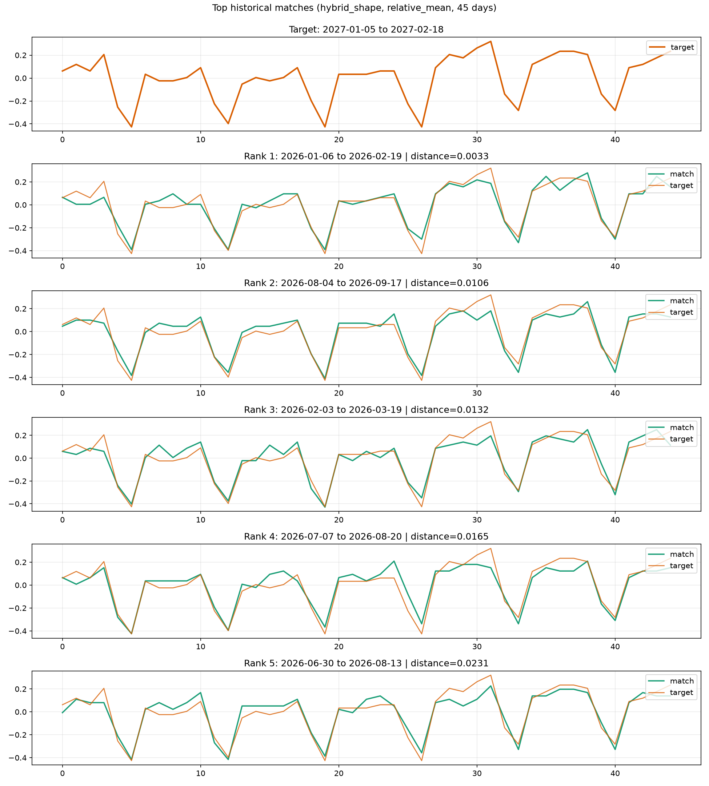

각 방법 내 최적 튜닝 구성:

| 윈도우_길이 | 전처리 | 방법 | top3_rmse_tune | top3_rmse_holdout | ensemble3_rmse_holdout | shape_corr_holdout |
| --- | --- | --- | --- | --- | --- | --- |
| 45 | relative_mean | hybrid_shape | 0.058971 | 0.093422 | 0.086515 | 0.958138 |
| 45 | zscore | cnn_pool4_seed19 | 0.060206 | 0.162539 | 0.149798 | 0.789500 |
| 45 | smooth3_zscore | euclidean | 0.062012 | 0.093422 | 0.086515 | 0.955983 |
| 45 | smooth3_zscore | correlation | 0.062012 | 0.093422 | 0.086515 | 0.955983 |
| 45 | smooth3_zscore | cosine | 0.062012 | 0.093422 | 0.086515 | 0.955983 |
| 45 | minmax | dtw_0.30 | 0.062022 | 0.125996 | 0.112871 | 0.951788 |
| 45 | minmax | dtw_0.05 | 0.062022 | 0.098101 | 0.087200 | 0.951788 |
| 45 | minmax | dtw_0.15 | 0.062022 | 0.125996 | 0.112871 | 0.951788 |
| 45 | minmax | hybrid | 0.063222 | 0.098101 | 0.087200 | 0.953656 |
| 45 | minmax | hybrid_warp | 0.063222 | 0.098101 | 0.087200 | 0.951788 |
| 30 | relative_mean | cnn_pool4_seed7 | 0.065717 | 0.090095 | 0.084015 | 0.959572 |
| 90 | zscore | weekday_recent | 0.084214 | 0.108780 | 0.102519 | 0.898038 |
| 30 | relative_mean | feature | 0.090273 | 0.201317 | 0.177085 | 0.404412 |
| 30 | relative_mean | cnn_pool1_seed7 | 0.097695 | 0.170430 | 0.156720 | 0.434038 |
| 30 | zscore | cnn_pool1_seed19 | 0.132645 | 0.143826 | 0.123276 | 0.790075 |
| 75 | smooth3_zscore | recent | 0.232739 | 0.284759 | 0.282287 | 0.285551 |


선택 방법의 쿼리 수준 결과(7일 및 14일 예측 기간):

| 쿼리_종료일 | 분할 | 예측_기간 | top1_rmse | top3_rmse | ensemble3_rmse | shape_corr |
| --- | --- | --- | --- | --- | --- | --- |
| 2026-09-12 | tune | 7 | 0.054978 | 0.059802 | 0.024891 | 0.960991 |
| 2026-09-12 | tune | 14 | 0.050614 | 0.055172 | 0.029896 | 0.960991 |
| 2026-09-26 | tune | 7 | 0.074055 | 0.079525 | 0.064337 | 0.974158 |
| 2026-09-26 | tune | 14 | 0.096882 | 0.100655 | 0.088146 | 0.974158 |
| 2026-10-10 | tune | 7 | 0.035015 | 0.049956 | 0.045456 | 0.967729 |
| 2026-10-10 | tune | 14 | 0.038604 | 0.058414 | 0.046991 | 0.967729 |
| 2026-10-24 | tune | 7 | 0.046506 | 0.040924 | 0.020684 | 0.968952 |
| 2026-10-24 | tune | 14 | 0.050635 | 0.051531 | 0.035731 | 0.968952 |
| 2026-11-07 | tune | 7 | 0.023477 | 0.042516 | 0.029278 | 0.964949 |
| 2026-11-07 | tune | 14 | 0.049781 | 0.060557 | 0.053745 | 0.964949 |
| 2026-11-21 | tune | 7 | 0.058473 | 0.059901 | 0.047917 | 0.967644 |
| 2026-11-21 | tune | 14 | 0.058274 | 0.085114 | 0.077385 | 0.967644 |
| 2026-12-05 | tune | 7 | 0.052308 | 0.080171 | 0.075251 | 0.962678 |
| 2026-12-05 | tune | 14 | 0.062885 | 0.091884 | 0.086958 | 0.962678 |
| 2026-12-19 | holdout | 7 | 0.087604 | 0.065905 | 0.061673 | 0.965502 |
| 2026-12-19 | holdout | 14 | 0.080989 | 0.074663 | 0.062158 | 0.965502 |
| 2027-01-02 | holdout | 7 | 0.062512 | 0.067365 | 0.048200 | 0.960733 |
| 2027-01-02 | holdout | 14 | 0.067167 | 0.069766 | 0.057474 | 0.960733 |
| 2027-01-16 | holdout | 7 | 0.084555 | 0.068085 | 0.066102 | 0.959075 |
| 2027-01-16 | holdout | 14 | 0.070010 | 0.056416 | 0.052454 | 0.959075 |
| 2027-01-30 | holdout | 7 | 0.156656 | 0.172333 | 0.170083 | 0.947241 |
| 2027-01-30 | holdout | 14 | 0.174449 | 0.171601 | 0.169384 | 0.947241 |


### 방송 / CA / 지역 (`0a5bf90d7c42`)

선택: **45 days / smooth3_zscore / hybrid_warp**. 대상: **2027-01-05 to 2027-02-18**. 아래의 모든 과거 기간은 **방송 / CA / 지역**에 속합니다.

| 순위 | 시작일 | 종료일 | 거리 | 유사도_점수 | 형태_상관 | 평균_비율 |
| --- | --- | --- | --- | --- | --- | --- |
| 1 | 2026-01-06 | 2026-02-19 | 0.002310 | 0.997695 | 0.956913 | 0.984540 |
| 2 | 2026-02-03 | 2026-03-19 | 0.012541 | 0.987614 | 0.946786 | 1.099438 |
| 3 | 2026-07-07 | 2026-08-20 | 0.022772 | 0.977735 | 0.942028 | 0.973647 |
| 4 | 2026-07-14 | 2026-08-27 | 0.036304 | 0.964968 | 0.944608 | 0.990162 |
| 5 | 2026-08-04 | 2026-09-17 | 0.046865 | 0.955233 | 0.940369 | 1.050246 |


`mean_ratio`는 이 세그먼트 내 후보 평균 / 대상 평균입니다. `distance`는 방법별 값이며 `similarity_score = 1/(1+distance)`는 확률이 아닌 표시 점수입니다. 하이브리드 거리는 적격 풀에 따라 달라집니다. DTW는 이동된 이벤트를 정렬할 수 있으므로 워핑하지 않은 원시 상관관계는 거리에서 예상하는 것보다 낮을 수 있습니다.

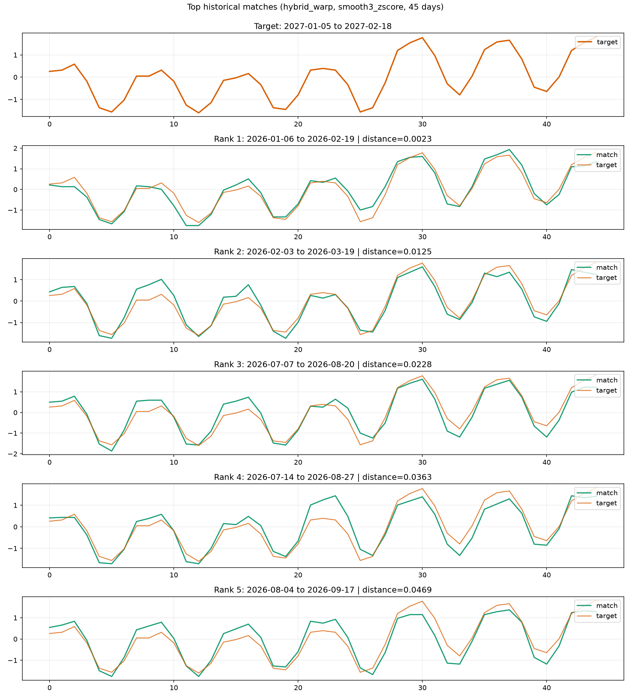

각 방법 내 최적 튜닝 구성:

| 윈도우_길이 | 전처리 | 방법 | top3_rmse_tune | top3_rmse_holdout | ensemble3_rmse_holdout | shape_corr_holdout |
| --- | --- | --- | --- | --- | --- | --- |
| 45 | smooth3_zscore | hybrid_warp | 0.055242 | 0.092523 | 0.082796 | 0.965258 |
| 45 | smooth3_zscore | hybrid | 0.057123 | 0.094273 | 0.085705 | 0.965358 |
| 45 | relative_mean | cnn_pool4_seed7 | 0.057153 | 0.099613 | 0.084423 | 0.962662 |
| 45 | minmax | euclidean | 0.058324 | 0.113466 | 0.102148 | 0.966596 |
| 30 | relative_first | cosine | 0.058577 | 0.088328 | 0.075451 | 0.971908 |
| 30 | smooth14_zscore | correlation | 0.058631 | 0.083987 | 0.074113 | 0.959707 |
| 60 | smooth3_zscore | hybrid_shape | 0.059455 | 0.100578 | 0.091576 | 0.962583 |
| 45 | zscore | cnn_pool4_seed19 | 0.059497 | 0.139558 | 0.116392 | 0.958651 |
| 45 | relative_mean | dtw_0.15 | 0.063373 | 0.087285 | 0.078802 | 0.967345 |
| 45 | zscore | dtw_0.30 | 0.063373 | 0.087611 | 0.076399 | 0.967345 |
| 45 | log_zscore | dtw_0.05 | 0.063373 | 0.089383 | 0.079085 | 0.967078 |
| 30 | relative_mean | cnn_pool1_seed7 | 0.081253 | 0.090775 | 0.083282 | 0.967967 |
| 30 | detrended_zscore | feature | 0.082302 | 0.168915 | 0.144589 | 0.780021 |
| 30 | smooth14_zscore | weekday_recent | 0.096139 | 0.089244 | 0.079458 | 0.944573 |
| 30 | zscore | cnn_pool1_seed19 | 0.141342 | 0.081227 | 0.071915 | 0.965679 |
| 75 | zscore | recent | 0.237916 | 0.282693 | 0.280384 | 0.275185 |


선택 방법의 쿼리 수준 결과(7일 및 14일 예측 기간):

| 쿼리_종료일 | 분할 | 예측_기간 | top1_rmse | top3_rmse | ensemble3_rmse | shape_corr |
| --- | --- | --- | --- | --- | --- | --- |
| 2026-09-12 | tune | 7 | 0.034006 | 0.049714 | 0.029114 | 0.963752 |
| 2026-09-12 | tune | 14 | 0.037630 | 0.064990 | 0.049225 | 0.963752 |
| 2026-09-26 | tune | 7 | 0.042121 | 0.054712 | 0.038774 | 0.959616 |
| 2026-09-26 | tune | 14 | 0.052792 | 0.060004 | 0.039360 | 0.959616 |
| 2026-10-10 | tune | 7 | 0.047615 | 0.050938 | 0.045920 | 0.960106 |
| 2026-10-10 | tune | 14 | 0.045864 | 0.048271 | 0.039961 | 0.960106 |
| 2026-10-24 | tune | 7 | 0.073957 | 0.055889 | 0.037525 | 0.970685 |
| 2026-10-24 | tune | 14 | 0.085358 | 0.064920 | 0.051041 | 0.970685 |
| 2026-11-07 | tune | 7 | 0.038292 | 0.053725 | 0.048907 | 0.969133 |
| 2026-11-07 | tune | 14 | 0.060331 | 0.060037 | 0.055249 | 0.969133 |
| 2026-11-21 | tune | 7 | 0.040187 | 0.044689 | 0.039440 | 0.958029 |
| 2026-11-21 | tune | 14 | 0.080196 | 0.075098 | 0.064330 | 0.958029 |
| 2026-12-05 | tune | 7 | 0.067324 | 0.077031 | 0.072158 | 0.956763 |
| 2026-12-05 | tune | 14 | 0.064892 | 0.075894 | 0.069193 | 0.956763 |
| 2026-12-19 | holdout | 7 | 0.052212 | 0.042095 | 0.027542 | 0.970893 |
| 2026-12-19 | holdout | 14 | 0.055458 | 0.065923 | 0.047959 | 0.970893 |
| 2027-01-02 | holdout | 7 | 0.046094 | 0.073024 | 0.054607 | 0.966145 |
| 2027-01-02 | holdout | 14 | 0.053470 | 0.084934 | 0.060958 | 0.966145 |
| 2027-01-16 | holdout | 7 | 0.042449 | 0.039602 | 0.035593 | 0.963395 |
| 2027-01-16 | holdout | 14 | 0.053062 | 0.051457 | 0.040247 | 0.963395 |
| 2027-01-30 | holdout | 7 | 0.239786 | 0.215373 | 0.213441 | 0.960598 |
| 2027-01-30 | holdout | 14 | 0.244375 | 0.207903 | 0.205202 | 0.960598 |


### 방송 / CA / 직접 (`0c0eb13f2ab3`)

선택: **45 days / smooth3_zscore / hybrid_shape**. 대상: **2027-01-05 to 2027-02-18**. 아래의 모든 과거 기간은 **방송 / CA / 직접**에 속합니다.

| 순위 | 시작일 | 종료일 | 거리 | 유사도_점수 | 형태_상관 | 평균_비율 |
| --- | --- | --- | --- | --- | --- | --- |
| 1 | 2026-01-06 | 2026-02-19 | 0.000660 | 0.999340 | 0.951670 | 0.989285 |
| 2 | 2026-02-03 | 2026-03-19 | 0.003960 | 0.996055 | 0.942970 | 1.082482 |
| 3 | 2026-02-10 | 2026-03-26 | 0.012541 | 0.987614 | 0.939994 | 1.097184 |
| 4 | 2026-06-30 | 2026-08-13 | 0.030363 | 0.970532 | 0.921320 | 1.016945 |
| 5 | 2026-08-11 | 2026-09-24 | 0.031023 | 0.969910 | 0.927143 | 1.063294 |


`mean_ratio`는 이 세그먼트 내 후보 평균 / 대상 평균입니다. `distance`는 방법별 값이며 `similarity_score = 1/(1+distance)`는 확률이 아닌 표시 점수입니다. 하이브리드 거리는 적격 풀에 따라 달라집니다. DTW는 이동된 이벤트를 정렬할 수 있으므로 워핑하지 않은 원시 상관관계는 거리에서 예상하는 것보다 낮을 수 있습니다.

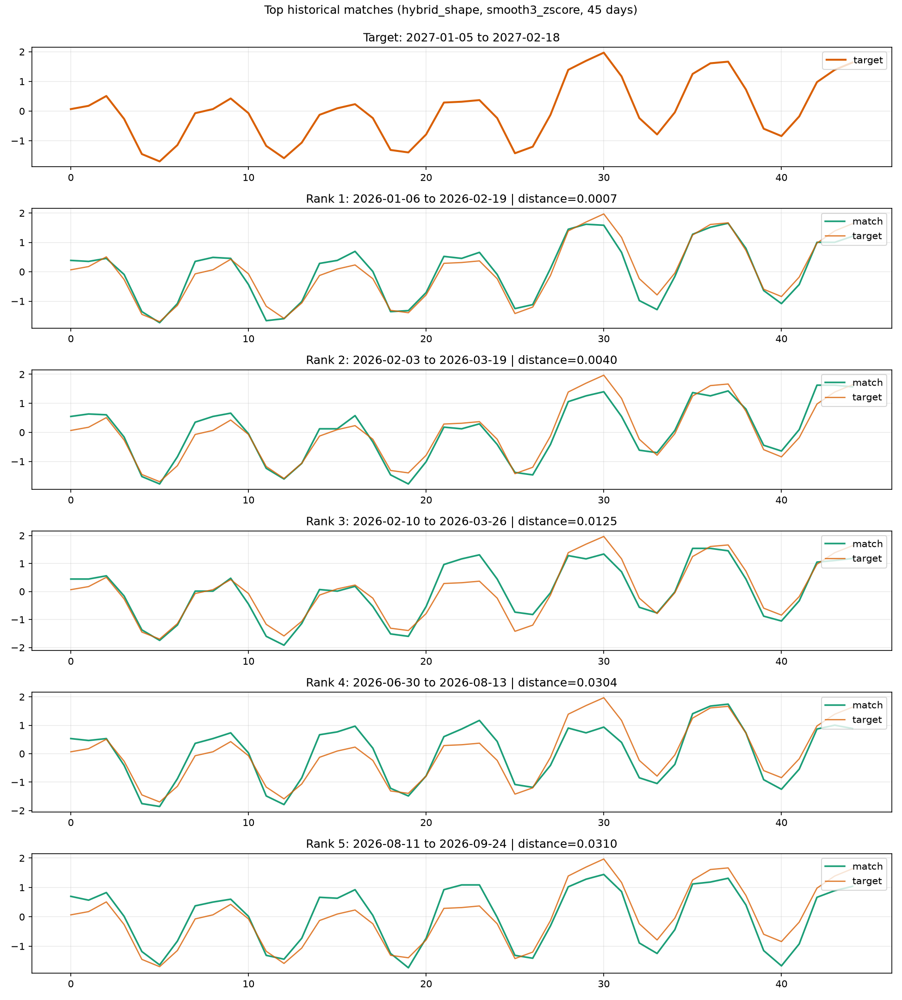

각 방법 내 최적 튜닝 구성:

| 윈도우_길이 | 전처리 | 방법 | top3_rmse_tune | top3_rmse_holdout | ensemble3_rmse_holdout | shape_corr_holdout |
| --- | --- | --- | --- | --- | --- | --- |
| 45 | smooth3_zscore | hybrid_shape | 0.050901 | 0.109496 | 0.099299 | 0.968026 |
| 45 | smooth3_zscore | cosine | 0.051797 | 0.105953 | 0.100654 | 0.964241 |
| 45 | smooth3_zscore | correlation | 0.051797 | 0.105953 | 0.100654 | 0.964241 |
| 45 | smooth3_zscore | euclidean | 0.051797 | 0.105953 | 0.100654 | 0.964241 |
| 30 | log_zscore | hybrid_warp | 0.051985 | 0.088516 | 0.075617 | 0.974978 |
| 30 | log_zscore | hybrid | 0.052515 | 0.092080 | 0.083785 | 0.974978 |
| 30 | log_zscore | dtw_0.15 | 0.054991 | 0.088721 | 0.079127 | 0.960677 |
| 30 | log_zscore | dtw_0.30 | 0.054991 | 0.088721 | 0.079127 | 0.960677 |
| 30 | log_zscore | dtw_0.05 | 0.055193 | 0.088721 | 0.079127 | 0.960677 |
| 45 | relative_mean | cnn_pool4_seed19 | 0.056178 | 0.114336 | 0.109545 | 0.957919 |
| 90 | zscore | weekday_recent | 0.058774 | 0.094164 | 0.088777 | 0.933540 |
| 75 | zscore | cnn_pool4_seed7 | 0.061547 | 0.262878 | 0.255170 | 0.289492 |
| 90 | relative_mean | feature | 0.068655 | 0.096716 | 0.079119 | 0.936734 |
| 30 | relative_mean | cnn_pool1_seed7 | 0.078735 | 0.110884 | 0.102169 | 0.963220 |
| 30 | relative_mean | cnn_pool1_seed19 | 0.136194 | 0.112374 | 0.097657 | 0.933127 |
| 75 | detrended_zscore | recent | 0.221546 | 0.271901 | 0.269718 | 0.287814 |


선택 방법의 쿼리 수준 결과(7일 및 14일 예측 기간):

| 쿼리_종료일 | 분할 | 예측_기간 | top1_rmse | top3_rmse | ensemble3_rmse | shape_corr |
| --- | --- | --- | --- | --- | --- | --- |
| 2026-09-12 | tune | 7 | 0.034787 | 0.041971 | 0.029192 | 0.960160 |
| 2026-09-12 | tune | 14 | 0.040903 | 0.047816 | 0.034618 | 0.960160 |
| 2026-09-26 | tune | 7 | 0.092821 | 0.087692 | 0.086017 | 0.966626 |
| 2026-09-26 | tune | 14 | 0.107220 | 0.128823 | 0.124746 | 0.966626 |
| 2026-10-10 | tune | 7 | 0.044443 | 0.047273 | 0.041273 | 0.964329 |
| 2026-10-10 | tune | 14 | 0.042145 | 0.043573 | 0.035217 | 0.964329 |
| 2026-10-24 | tune | 7 | 0.040510 | 0.045864 | 0.029646 | 0.969460 |
| 2026-10-24 | tune | 14 | 0.053528 | 0.059537 | 0.040214 | 0.969460 |
| 2026-11-07 | tune | 7 | 0.046253 | 0.039532 | 0.032429 | 0.962944 |
| 2026-11-07 | tune | 14 | 0.056911 | 0.055557 | 0.050472 | 0.962944 |
| 2026-11-21 | tune | 7 | 0.046869 | 0.052095 | 0.042130 | 0.957079 |
| 2026-11-21 | tune | 14 | 0.098696 | 0.088537 | 0.082646 | 0.957079 |
| 2026-12-05 | tune | 7 | 0.039106 | 0.041879 | 0.030757 | 0.951915 |
| 2026-12-05 | tune | 14 | 0.049376 | 0.052927 | 0.036515 | 0.951915 |
| 2026-12-19 | holdout | 7 | 0.096309 | 0.070939 | 0.044247 | 0.958219 |
| 2026-12-19 | holdout | 14 | 0.097980 | 0.078494 | 0.056142 | 0.958219 |
| 2027-01-02 | holdout | 7 | 0.116757 | 0.117693 | 0.115145 | 0.967400 |
| 2027-01-02 | holdout | 14 | 0.120136 | 0.115909 | 0.112029 | 0.967400 |
| 2027-01-16 | holdout | 7 | 0.031870 | 0.042231 | 0.033088 | 0.970339 |
| 2027-01-16 | holdout | 14 | 0.036219 | 0.046820 | 0.030815 | 0.970339 |
| 2027-01-30 | holdout | 7 | 0.213287 | 0.207121 | 0.204716 | 0.976148 |
| 2027-01-30 | holdout | 14 | 0.198954 | 0.185752 | 0.181441 | 0.976148 |


### 방송 / IP / HnS (`86899e3d463d`)

선택: **45 days / relative_mean / cnn_pool4_seed19**. 대상: **2027-01-05 to 2027-02-18**. 아래의 모든 과거 기간은 **방송 / IP / HnS**에 속합니다.

| 순위 | 시작일 | 종료일 | 거리 | 유사도_점수 | 형태_상관 | 평균_비율 |
| --- | --- | --- | --- | --- | --- | --- |
| 1 | 2026-02-10 | 2026-03-26 | 0.126848 | 0.887431 | 0.944863 | 1.134537 |
| 2 | 2026-01-06 | 2026-02-19 | 0.152902 | 0.867376 | 0.941180 | 1.026336 |
| 3 | 2026-08-04 | 2026-09-17 | 0.174108 | 0.851711 | 0.940644 | 1.101129 |
| 4 | 2026-02-03 | 2026-03-19 | 0.234333 | 0.810154 | 0.947183 | 1.120391 |
| 5 | 2026-05-19 | 2026-07-02 | 0.271282 | 0.786607 | 0.916189 | 0.999850 |


`mean_ratio`는 이 세그먼트 내 후보 평균 / 대상 평균입니다. `distance`는 방법별 값이며 `similarity_score = 1/(1+distance)`는 확률이 아닌 표시 점수입니다. 하이브리드 거리는 적격 풀에 따라 달라집니다. DTW는 이동된 이벤트를 정렬할 수 있으므로 워핑하지 않은 원시 상관관계는 거리에서 예상하는 것보다 낮을 수 있습니다.

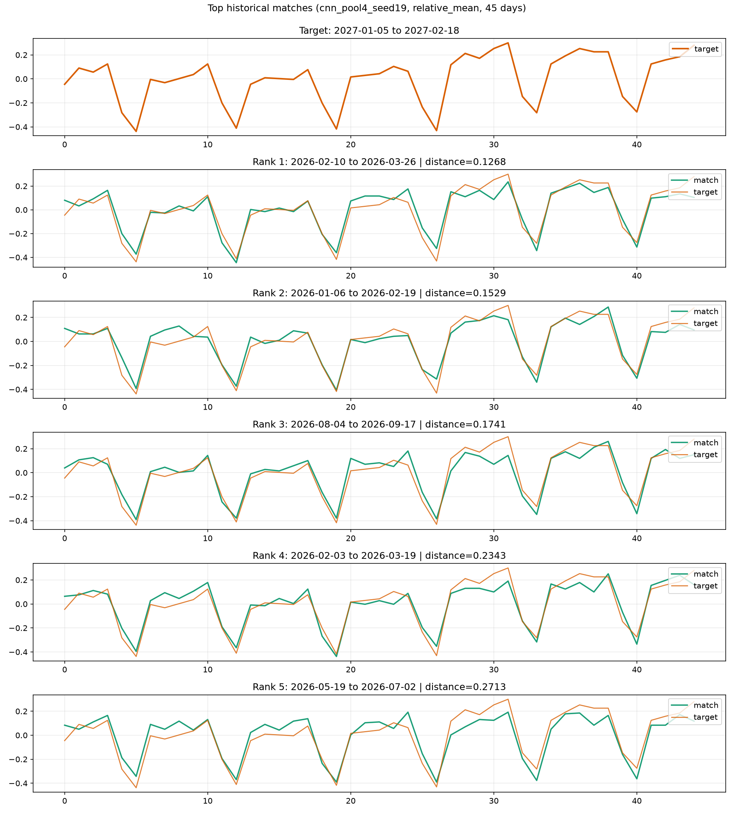

각 방법 내 최적 튜닝 구성:

| 윈도우_길이 | 전처리 | 방법 | top3_rmse_tune | top3_rmse_holdout | ensemble3_rmse_holdout | shape_corr_holdout |
| --- | --- | --- | --- | --- | --- | --- |
| 45 | relative_mean | cnn_pool4_seed19 | 0.053214 | 0.085672 | 0.076138 | 0.952350 |
| 45 | log_zscore | hybrid_shape | 0.054580 | 0.094732 | 0.085234 | 0.966485 |
| 45 | smooth3_zscore | cosine | 0.055183 | 0.096914 | 0.088659 | 0.963607 |
| 45 | smooth3_zscore | correlation | 0.055183 | 0.096914 | 0.088659 | 0.963607 |
| 45 | smooth3_zscore | euclidean | 0.055183 | 0.096914 | 0.088659 | 0.963607 |
| 60 | relative_mean | hybrid_warp | 0.057577 | 0.104935 | 0.097792 | 0.962981 |
| 60 | relative_mean | hybrid | 0.057577 | 0.100150 | 0.092894 | 0.962981 |
| 30 | zscore | dtw_0.30 | 0.059762 | 0.102553 | 0.092951 | 0.965041 |
| 30 | zscore | dtw_0.05 | 0.059762 | 0.102553 | 0.092951 | 0.965041 |
| 30 | zscore | dtw_0.15 | 0.059762 | 0.102553 | 0.092951 | 0.965041 |
| 30 | zscore | cnn_pool4_seed7 | 0.062660 | 0.120874 | 0.102357 | 0.638763 |
| 30 | detrended_zscore | feature | 0.075667 | 0.129980 | 0.117078 | 0.940249 |
| 90 | zscore | weekday_recent | 0.077667 | 0.100263 | 0.091903 | 0.904380 |
| 30 | relative_mean | cnn_pool1_seed7 | 0.090093 | 0.109012 | 0.101286 | 0.959804 |
| 30 | zscore | cnn_pool1_seed19 | 0.125138 | 0.148370 | 0.139229 | 0.758883 |
| 75 | difference_zscore | recent | 0.229218 | 0.276621 | 0.273807 | 0.273262 |


선택 방법의 쿼리 수준 결과(7일 및 14일 예측 기간):

| 쿼리_종료일 | 분할 | 예측_기간 | top1_rmse | top3_rmse | ensemble3_rmse | shape_corr |
| --- | --- | --- | --- | --- | --- | --- |
| 2026-09-12 | tune | 7 | 0.064443 | 0.058898 | 0.037760 | 0.945994 |
| 2026-09-12 | tune | 14 | 0.055764 | 0.065225 | 0.044956 | 0.945994 |
| 2026-09-26 | tune | 7 | 0.050321 | 0.095216 | 0.083186 | 0.957212 |
| 2026-09-26 | tune | 14 | 0.058405 | 0.120066 | 0.109180 | 0.957212 |
| 2026-10-10 | tune | 7 | 0.037164 | 0.039740 | 0.034347 | 0.961323 |
| 2026-10-10 | tune | 14 | 0.036975 | 0.037550 | 0.026384 | 0.961323 |
| 2026-10-24 | tune | 7 | 0.030581 | 0.045312 | 0.019233 | 0.964694 |
| 2026-10-24 | tune | 14 | 0.044314 | 0.058168 | 0.042687 | 0.964694 |
| 2026-11-07 | tune | 7 | 0.064127 | 0.043365 | 0.038998 | 0.934105 |
| 2026-11-07 | tune | 14 | 0.057332 | 0.053262 | 0.046208 | 0.934105 |
| 2026-11-21 | tune | 7 | 0.048392 | 0.046173 | 0.032346 | 0.964531 |
| 2026-11-21 | tune | 14 | 0.049994 | 0.071660 | 0.064247 | 0.964531 |
| 2026-12-05 | tune | 7 | 0.044167 | 0.043795 | 0.033207 | 0.951481 |
| 2026-12-05 | tune | 14 | 0.058055 | 0.049258 | 0.035839 | 0.951481 |
| 2026-12-19 | holdout | 7 | 0.041750 | 0.062916 | 0.041360 | 0.962021 |
| 2026-12-19 | holdout | 14 | 0.118759 | 0.094344 | 0.072537 | 0.962021 |
| 2027-01-02 | holdout | 7 | 0.058534 | 0.054399 | 0.047462 | 0.933436 |
| 2027-01-02 | holdout | 14 | 0.055462 | 0.056480 | 0.050654 | 0.933436 |
| 2027-01-16 | holdout | 7 | 0.049207 | 0.042724 | 0.035198 | 0.952867 |
| 2027-01-16 | holdout | 14 | 0.039745 | 0.040277 | 0.032299 | 0.952867 |
| 2027-01-30 | holdout | 7 | 0.196508 | 0.182648 | 0.180532 | 0.961074 |
| 2027-01-30 | holdout | 14 | 0.193835 | 0.194216 | 0.191999 | 0.961074 |


### 방송 / IP / SKT (`63ea07e8f506`)

선택: **30 days / relative_first / euclidean**. 대상: **2027-01-20 to 2027-02-18**. 아래의 모든 과거 기간은 **방송 / IP / SKT**에 속합니다.

| 순위 | 시작일 | 종료일 | 거리 | 유사도_점수 | 형태_상관 | 평균_비율 |
| --- | --- | --- | --- | --- | --- | --- |
| 1 | 2026-01-21 | 2026-02-19 | 0.077473 | 0.928098 | 0.970607 | 0.943418 |
| 2 | 2026-07-29 | 2026-08-27 | 0.082047 | 0.924174 | 0.927382 | 0.990069 |
| 3 | 2026-02-25 | 2026-03-26 | 0.084825 | 0.921807 | 0.931684 | 1.084988 |
| 4 | 2026-01-28 | 2026-02-26 | 0.085750 | 0.921022 | 0.928065 | 0.965589 |
| 5 | 2026-08-19 | 2026-09-17 | 0.100114 | 0.908997 | 0.937277 | 1.043418 |


`mean_ratio`는 이 세그먼트 내 후보 평균 / 대상 평균입니다. `distance`는 방법별 값이며 `similarity_score = 1/(1+distance)`는 확률이 아닌 표시 점수입니다. 하이브리드 거리는 적격 풀에 따라 달라집니다. DTW는 이동된 이벤트를 정렬할 수 있으므로 워핑하지 않은 원시 상관관계는 거리에서 예상하는 것보다 낮을 수 있습니다.

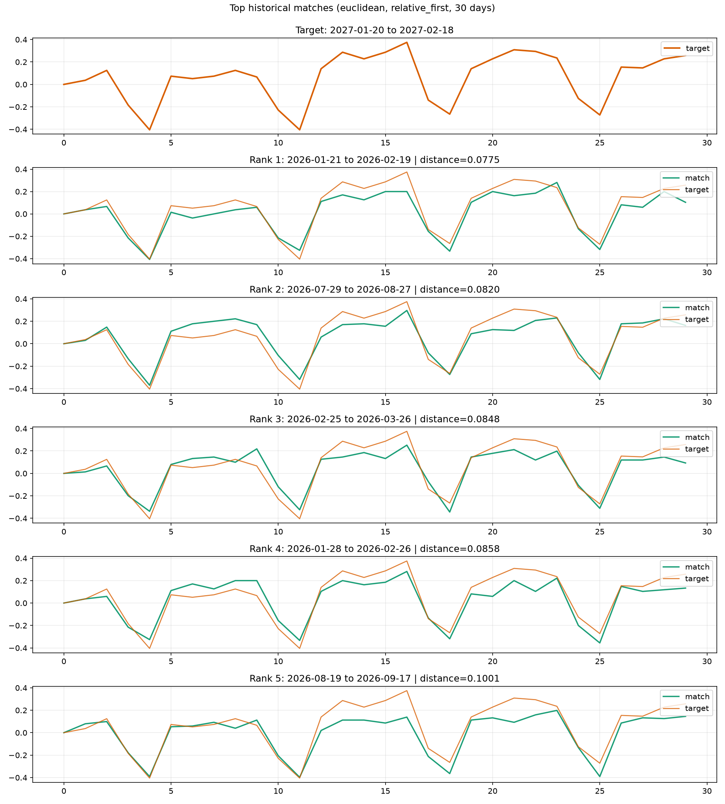

각 방법 내 최적 튜닝 구성:

| 윈도우_길이 | 전처리 | 방법 | top3_rmse_tune | top3_rmse_holdout | ensemble3_rmse_holdout | shape_corr_holdout |
| --- | --- | --- | --- | --- | --- | --- |
| 30 | relative_first | euclidean | 0.068677 | 0.097073 | 0.088718 | 0.963528 |
| 30 | difference_zscore | dtw_0.30 | 0.069057 | 0.152284 | 0.142065 | 0.950781 |
| 30 | difference_zscore | dtw_0.15 | 0.069057 | 0.152284 | 0.142065 | 0.950781 |
| 30 | difference_zscore | dtw_0.05 | 0.069057 | 0.153427 | 0.142590 | 0.950781 |
| 30 | smooth3_zscore | cosine | 0.069833 | 0.099879 | 0.089253 | 0.963094 |
| 30 | smooth3_zscore | correlation | 0.069833 | 0.099879 | 0.089253 | 0.963094 |
| 30 | relative_first | hybrid_warp | 0.070092 | 0.110984 | 0.102064 | 0.962788 |
| 30 | zscore | cnn_pool4_seed7 | 0.070198 | 0.204743 | 0.193181 | 0.470594 |
| 30 | relative_first | hybrid | 0.070416 | 0.112242 | 0.103082 | 0.963528 |
| 75 | log_zscore | hybrid_shape | 0.070459 | 0.096223 | 0.089721 | 0.940533 |
| 90 | detrended_zscore | weekday_recent | 0.077358 | 0.088600 | 0.076848 | 0.892560 |
| 30 | relative_mean | cnn_pool4_seed19 | 0.078528 | 0.132422 | 0.111443 | 0.961620 |
| 30 | difference_zscore | feature | 0.086103 | 0.128986 | 0.121174 | 0.947357 |
| 30 | zscore | cnn_pool1_seed19 | 0.092218 | 0.164095 | 0.147303 | 0.784521 |
| 30 | relative_mean | cnn_pool1_seed7 | 0.115899 | 0.156968 | 0.145459 | 0.608748 |
| 75 | minmax | recent | 0.225312 | 0.291758 | 0.289164 | 0.274229 |


선택 방법의 쿼리 수준 결과(7일 및 14일 예측 기간):

| 쿼리_종료일 | 분할 | 예측_기간 | top1_rmse | top3_rmse | ensemble3_rmse | shape_corr |
| --- | --- | --- | --- | --- | --- | --- |
| 2026-09-12 | tune | 7 | 0.124876 | 0.090956 | 0.070637 | 0.963384 |
| 2026-09-12 | tune | 14 | 0.122140 | 0.090462 | 0.075075 | 0.963384 |
| 2026-09-26 | tune | 7 | 0.096420 | 0.090486 | 0.081650 | 0.968977 |
| 2026-09-26 | tune | 14 | 0.079711 | 0.113124 | 0.095586 | 0.968977 |
| 2026-10-10 | tune | 7 | 0.079045 | 0.060654 | 0.056420 | 0.966810 |
| 2026-10-10 | tune | 14 | 0.074976 | 0.065751 | 0.061230 | 0.966810 |
| 2026-10-24 | tune | 7 | 0.072111 | 0.055877 | 0.044420 | 0.945664 |
| 2026-10-24 | tune | 14 | 0.111382 | 0.076068 | 0.065730 | 0.945664 |
| 2026-11-07 | tune | 7 | 0.074043 | 0.058630 | 0.047952 | 0.969570 |
| 2026-11-07 | tune | 14 | 0.067691 | 0.063421 | 0.053470 | 0.969570 |
| 2026-11-21 | tune | 7 | 0.045597 | 0.075072 | 0.054605 | 0.980933 |
| 2026-11-21 | tune | 14 | 0.106578 | 0.102488 | 0.059178 | 0.980933 |
| 2026-12-05 | tune | 7 | 0.034830 | 0.049067 | 0.034686 | 0.956339 |
| 2026-12-05 | tune | 14 | 0.078199 | 0.070808 | 0.054260 | 0.956339 |
| 2026-12-19 | holdout | 7 | 0.098540 | 0.111599 | 0.097626 | 0.958937 |
| 2026-12-19 | holdout | 14 | 0.093209 | 0.141496 | 0.121082 | 0.958937 |
| 2027-01-02 | holdout | 7 | 0.066402 | 0.072557 | 0.065279 | 0.959723 |
| 2027-01-02 | holdout | 14 | 0.061061 | 0.073390 | 0.063859 | 0.959723 |
| 2027-01-16 | holdout | 7 | 0.047634 | 0.037994 | 0.028581 | 0.958655 |
| 2027-01-16 | holdout | 14 | 0.037543 | 0.037570 | 0.024225 | 0.958655 |
| 2027-01-30 | holdout | 7 | 0.213402 | 0.166142 | 0.163386 | 0.976797 |
| 2027-01-30 | holdout | 14 | 0.214763 | 0.159489 | 0.155915 | 0.976797 |


### 방송 / IP / 도매 (`e4939806e566`)

선택: **75 days / smooth3_zscore / hybrid**. 대상: **2026-12-06 to 2027-02-18**. 아래의 모든 과거 기간은 **방송 / IP / 도매**에 속합니다.

| 순위 | 시작일 | 종료일 | 거리 | 유사도_점수 | 형태_상관 | 평균_비율 |
| --- | --- | --- | --- | --- | --- | --- |
| 1 | 2026-04-12 | 2026-06-25 | 0.012061 | 0.988082 | 0.920501 | 0.922972 |
| 2 | 2026-04-05 | 2026-06-18 | 0.015789 | 0.984456 | 0.938231 | 0.922228 |
| 3 | 2026-04-19 | 2026-07-02 | 0.016228 | 0.984031 | 0.922860 | 0.919127 |
| 4 | 2026-02-22 | 2026-05-07 | 0.032237 | 0.968770 | 0.924455 | 0.969114 |
| 5 | 2026-08-16 | 2026-10-29 | 0.034430 | 0.966716 | 0.910682 | 0.994666 |


`mean_ratio`는 이 세그먼트 내 후보 평균 / 대상 평균입니다. `distance`는 방법별 값이며 `similarity_score = 1/(1+distance)`는 확률이 아닌 표시 점수입니다. 하이브리드 거리는 적격 풀에 따라 달라집니다. DTW는 이동된 이벤트를 정렬할 수 있으므로 워핑하지 않은 원시 상관관계는 거리에서 예상하는 것보다 낮을 수 있습니다.

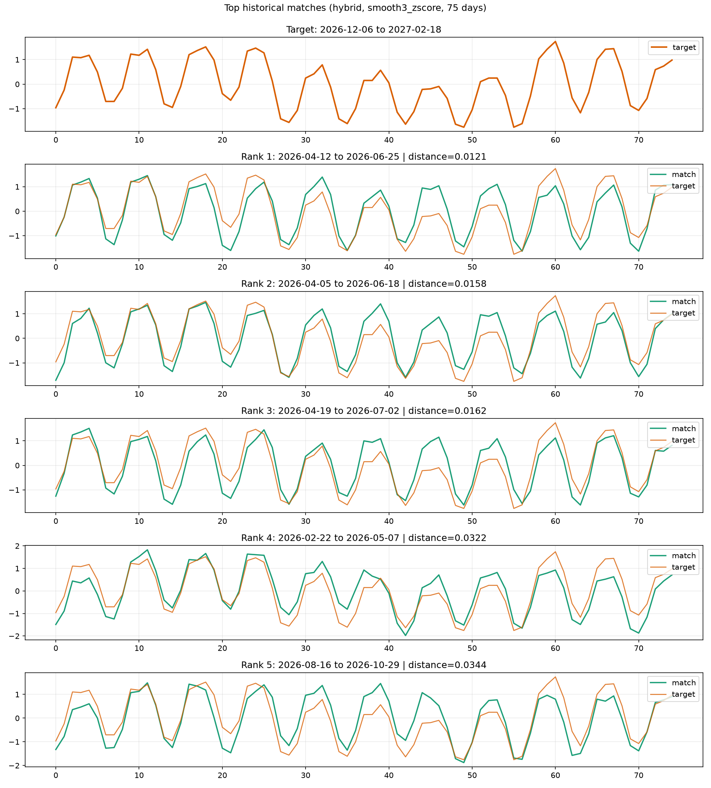

각 방법 내 최적 튜닝 구성:

| 윈도우_길이 | 전처리 | 방법 | top3_rmse_tune | top3_rmse_holdout | ensemble3_rmse_holdout | shape_corr_holdout |
| --- | --- | --- | --- | --- | --- | --- |
| 75 | smooth3_zscore | hybrid | 0.059374 | 0.100308 | 0.089048 | 0.941830 |
| 75 | smooth3_zscore | hybrid_shape | 0.060408 | 0.103626 | 0.091999 | 0.944771 |
| 45 | relative_mean | cnn_pool4_seed7 | 0.060753 | 0.173894 | 0.153472 | 0.588924 |
| 60 | smooth3_zscore | euclidean | 0.060941 | 0.085793 | 0.070402 | 0.945181 |
| 60 | smooth3_zscore | cosine | 0.060941 | 0.085793 | 0.070402 | 0.945181 |
| 60 | smooth3_zscore | correlation | 0.060941 | 0.085793 | 0.070402 | 0.945181 |
| 90 | relative_first | weekday_recent | 0.062099 | 0.104830 | 0.092194 | 0.923276 |
| 45 | minmax | hybrid_warp | 0.062576 | 0.091410 | 0.077349 | 0.942383 |
| 45 | minmax | dtw_0.30 | 0.062576 | 0.104629 | 0.084087 | 0.939283 |
| 45 | minmax | dtw_0.15 | 0.062576 | 0.104629 | 0.084087 | 0.939283 |
| 45 | zscore | dtw_0.05 | 0.063931 | 0.119869 | 0.112620 | 0.788774 |
| 90 | relative_mean | feature | 0.068461 | 0.162549 | 0.146199 | 0.584324 |
| 30 | relative_mean | cnn_pool4_seed19 | 0.068970 | 0.102066 | 0.098400 | 0.959869 |
| 30 | relative_mean | cnn_pool1_seed7 | 0.077180 | 0.137446 | 0.129802 | 0.742534 |
| 60 | zscore | cnn_pool1_seed19 | 0.109912 | 0.249902 | 0.234034 | 0.067040 |
| 75 | minmax | recent | 0.222924 | 0.266698 | 0.263753 | 0.260803 |


선택 방법의 쿼리 수준 결과(7일 및 14일 예측 기간):

| 쿼리_종료일 | 분할 | 예측_기간 | top1_rmse | top3_rmse | ensemble3_rmse | shape_corr |
| --- | --- | --- | --- | --- | --- | --- |
| 2026-09-12 | tune | 7 | 0.073417 | 0.061582 | 0.030139 | 0.913196 |
| 2026-09-12 | tune | 14 | 0.076355 | 0.070525 | 0.043385 | 0.913196 |
| 2026-09-26 | tune | 7 | 0.062487 | 0.074129 | 0.047691 | 0.923787 |
| 2026-09-26 | tune | 14 | 0.049306 | 0.060914 | 0.042730 | 0.923787 |
| 2026-10-10 | tune | 7 | 0.046224 | 0.043686 | 0.036053 | 0.941206 |
| 2026-10-10 | tune | 14 | 0.035963 | 0.041197 | 0.030468 | 0.941206 |
| 2026-10-24 | tune | 7 | 0.041843 | 0.048521 | 0.037632 | 0.950684 |
| 2026-10-24 | tune | 14 | 0.047788 | 0.053235 | 0.043821 | 0.950684 |
| 2026-11-07 | tune | 7 | 0.040371 | 0.041274 | 0.025235 | 0.953425 |
| 2026-11-07 | tune | 14 | 0.056772 | 0.051835 | 0.040596 | 0.953425 |
| 2026-11-21 | tune | 7 | 0.076094 | 0.068109 | 0.059703 | 0.956133 |
| 2026-11-21 | tune | 14 | 0.078843 | 0.073680 | 0.064666 | 0.956133 |
| 2026-12-05 | tune | 7 | 0.086900 | 0.078318 | 0.061955 | 0.954535 |
| 2026-12-05 | tune | 14 | 0.105318 | 0.087560 | 0.074815 | 0.954535 |
| 2026-12-19 | holdout | 7 | 0.055692 | 0.052416 | 0.015664 | 0.959932 |
| 2026-12-19 | holdout | 14 | 0.088459 | 0.078083 | 0.058554 | 0.959932 |
| 2027-01-02 | holdout | 7 | 0.084625 | 0.114518 | 0.110843 | 0.943996 |
| 2027-01-02 | holdout | 14 | 0.116415 | 0.115567 | 0.109854 | 0.943996 |
| 2027-01-16 | holdout | 7 | 0.095815 | 0.111014 | 0.109063 | 0.939926 |
| 2027-01-16 | holdout | 14 | 0.073998 | 0.093261 | 0.088417 | 0.939926 |
| 2027-01-30 | holdout | 7 | 0.137714 | 0.123286 | 0.120621 | 0.923466 |
| 2027-01-30 | holdout | 14 | 0.126044 | 0.117101 | 0.113559 | 0.923466 |


### 방송 / IP / 지역 (`579b43ec1eda`)

선택: **30 days / smooth14_zscore / hybrid_shape**. 대상: **2027-01-20 to 2027-02-18**. 아래의 모든 과거 기간은 **방송 / IP / 지역**에 속합니다.

| 순위 | 시작일 | 종료일 | 거리 | 유사도_점수 | 형태_상관 | 평균_비율 |
| --- | --- | --- | --- | --- | --- | --- |
| 1 | 2026-01-21 | 2026-02-19 | 0.000000 | 1.000000 | 0.968361 | 0.999287 |
| 2 | 2026-02-18 | 2026-03-19 | 0.004118 | 0.995899 | 0.955721 | 1.116084 |
| 3 | 2026-11-18 | 2026-12-17 | 0.024118 | 0.976450 | 0.950158 | 0.931170 |
| 4 | 2026-07-22 | 2026-08-20 | 0.024706 | 0.975890 | 0.941017 | 1.008916 |
| 5 | 2026-02-25 | 2026-03-26 | 0.061176 | 0.942350 | 0.930891 | 1.144258 |


`mean_ratio`는 이 세그먼트 내 후보 평균 / 대상 평균입니다. `distance`는 방법별 값이며 `similarity_score = 1/(1+distance)`는 확률이 아닌 표시 점수입니다. 하이브리드 거리는 적격 풀에 따라 달라집니다. DTW는 이동된 이벤트를 정렬할 수 있으므로 워핑하지 않은 원시 상관관계는 거리에서 예상하는 것보다 낮을 수 있습니다.

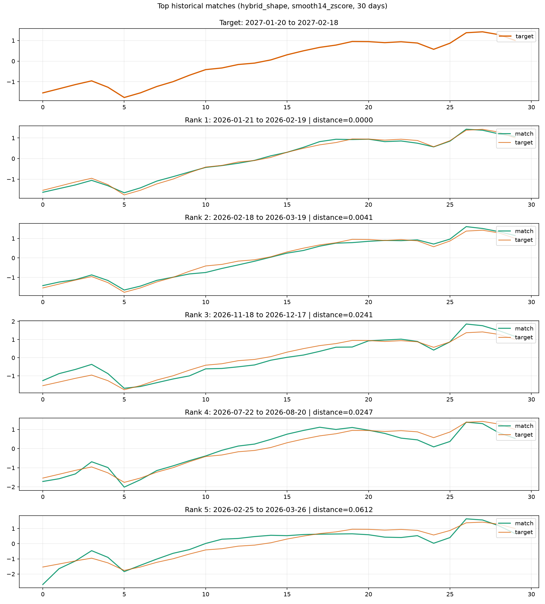

각 방법 내 최적 튜닝 구성:

| 윈도우_길이 | 전처리 | 방법 | top3_rmse_tune | top3_rmse_holdout | ensemble3_rmse_holdout | shape_corr_holdout |
| --- | --- | --- | --- | --- | --- | --- |
| 30 | smooth14_zscore | hybrid_shape | 0.054554 | 0.092872 | 0.087166 | 0.961559 |
| 30 | smooth14_zscore | correlation | 0.056314 | 0.092872 | 0.087166 | 0.961559 |
| 30 | smooth14_zscore | euclidean | 0.056314 | 0.092872 | 0.087166 | 0.961559 |
| 30 | smooth14_zscore | cosine | 0.056314 | 0.092872 | 0.087166 | 0.961559 |
| 45 | smooth3_zscore | hybrid | 0.058637 | 0.085476 | 0.075921 | 0.967604 |
| 45 | relative_mean | hybrid_warp | 0.061981 | 0.092639 | 0.081963 | 0.966640 |
| 45 | relative_mean | cnn_pool4_seed19 | 0.062543 | 0.109043 | 0.100049 | 0.956066 |
| 45 | zscore | cnn_pool4_seed7 | 0.063898 | 0.122223 | 0.113472 | 0.942110 |
| 30 | minmax | dtw_0.05 | 0.065791 | 0.086201 | 0.071505 | 0.971511 |
| 30 | relative_mean | dtw_0.30 | 0.069023 | 0.085820 | 0.071776 | 0.974134 |
| 30 | relative_mean | dtw_0.15 | 0.069023 | 0.085820 | 0.071776 | 0.974134 |
| 30 | relative_mean | weekday_recent | 0.097748 | 0.093999 | 0.081119 | 0.943732 |
| 30 | detrended_zscore | feature | 0.108219 | 0.098055 | 0.080142 | 0.936912 |
| 30 | relative_mean | cnn_pool1_seed7 | 0.133398 | 0.092112 | 0.085592 | 0.958119 |
| 30 | zscore | cnn_pool1_seed19 | 0.151294 | 0.149747 | 0.143103 | 0.636910 |
| 75 | smooth14_zscore | recent | 0.239400 | 0.290690 | 0.288083 | 0.248056 |


선택 방법의 쿼리 수준 결과(7일 및 14일 예측 기간):

| 쿼리_종료일 | 분할 | 예측_기간 | top1_rmse | top3_rmse | ensemble3_rmse | shape_corr |
| --- | --- | --- | --- | --- | --- | --- |
| 2026-09-12 | tune | 7 | 0.042879 | 0.044586 | 0.029337 | 0.962982 |
| 2026-09-12 | tune | 14 | 0.051884 | 0.048278 | 0.037849 | 0.962982 |
| 2026-09-26 | tune | 7 | 0.060962 | 0.073972 | 0.054793 | 0.980143 |
| 2026-09-26 | tune | 14 | 0.072940 | 0.109779 | 0.076314 | 0.980143 |
| 2026-10-10 | tune | 7 | 0.046326 | 0.045428 | 0.033641 | 0.960309 |
| 2026-10-10 | tune | 14 | 0.056069 | 0.049022 | 0.039677 | 0.960309 |
| 2026-10-24 | tune | 7 | 0.040860 | 0.055479 | 0.036501 | 0.963823 |
| 2026-10-24 | tune | 14 | 0.051406 | 0.071369 | 0.060102 | 0.963823 |
| 2026-11-07 | tune | 7 | 0.065635 | 0.071778 | 0.043964 | 0.956953 |
| 2026-11-07 | tune | 14 | 0.057771 | 0.072385 | 0.056046 | 0.956953 |
| 2026-11-21 | tune | 7 | 0.041524 | 0.044548 | 0.035691 | 0.948320 |
| 2026-11-21 | tune | 14 | 0.093468 | 0.080949 | 0.068122 | 0.948320 |
| 2026-12-05 | tune | 7 | 0.046545 | 0.046089 | 0.034341 | 0.943463 |
| 2026-12-05 | tune | 14 | 0.059367 | 0.058501 | 0.051631 | 0.943463 |
| 2026-12-19 | holdout | 7 | 0.042331 | 0.038643 | 0.032547 | 0.961244 |
| 2026-12-19 | holdout | 14 | 0.086046 | 0.076042 | 0.047752 | 0.961244 |
| 2027-01-02 | holdout | 7 | 0.152031 | 0.136178 | 0.133835 | 0.948072 |
| 2027-01-02 | holdout | 14 | 0.149045 | 0.135902 | 0.132520 | 0.948072 |
| 2027-01-16 | holdout | 7 | 0.071798 | 0.056722 | 0.046062 | 0.959654 |
| 2027-01-16 | holdout | 14 | 0.072404 | 0.062661 | 0.053902 | 0.959654 |
| 2027-01-30 | holdout | 7 | 0.177330 | 0.139947 | 0.136220 | 0.977267 |
| 2027-01-30 | holdout | 14 | 0.163340 | 0.133132 | 0.130169 | 0.977267 |


### 방송 / IP / 직접 (`0989766617fb`)

선택: **30 days / relative_first / euclidean**. 대상: **2027-01-20 to 2027-02-18**. 아래의 모든 과거 기간은 **방송 / IP / 직접**에 속합니다.

| 순위 | 시작일 | 종료일 | 거리 | 유사도_점수 | 형태_상관 | 평균_비율 |
| --- | --- | --- | --- | --- | --- | --- |
| 1 | 2026-11-18 | 2026-12-17 | 0.047360 | 0.954781 | 0.969116 | 1.051269 |
| 2 | 2026-01-21 | 2026-02-19 | 0.053262 | 0.949431 | 0.969415 | 1.044232 |
| 3 | 2026-08-12 | 2026-09-10 | 0.059131 | 0.944170 | 0.952229 | 1.093114 |
| 4 | 2026-07-08 | 2026-08-06 | 0.067545 | 0.936728 | 0.945976 | 0.992712 |
| 5 | 2026-07-15 | 2026-08-13 | 0.070581 | 0.934072 | 0.935813 | 1.013571 |


`mean_ratio`는 이 세그먼트 내 후보 평균 / 대상 평균입니다. `distance`는 방법별 값이며 `similarity_score = 1/(1+distance)`는 확률이 아닌 표시 점수입니다. 하이브리드 거리는 적격 풀에 따라 달라집니다. DTW는 이동된 이벤트를 정렬할 수 있으므로 워핑하지 않은 원시 상관관계는 거리에서 예상하는 것보다 낮을 수 있습니다.

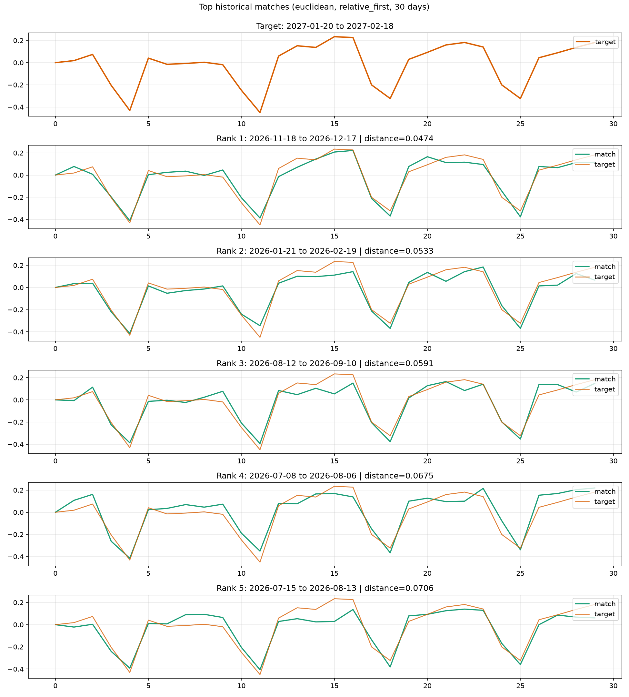

각 방법 내 최적 튜닝 구성:

| 윈도우_길이 | 전처리 | 방법 | top3_rmse_tune | top3_rmse_holdout | ensemble3_rmse_holdout | shape_corr_holdout |
| --- | --- | --- | --- | --- | --- | --- |
| 30 | relative_first | euclidean | 0.049127 | 0.087173 | 0.081021 | 0.959277 |
| 30 | relative_first | cosine | 0.052232 | 0.084850 | 0.079422 | 0.959677 |
| 30 | relative_first | hybrid | 0.052595 | 0.080232 | 0.074205 | 0.959277 |
| 30 | relative_first | hybrid_shape | 0.054014 | 0.083543 | 0.077279 | 0.962755 |
| 30 | zscore | hybrid_warp | 0.055406 | 0.070463 | 0.061692 | 0.964934 |
| 30 | zscore | dtw_0.05 | 0.055406 | 0.073352 | 0.065239 | 0.962974 |
| 30 | zscore | dtw_0.15 | 0.055406 | 0.073352 | 0.065239 | 0.962974 |
| 30 | zscore | dtw_0.30 | 0.055406 | 0.073352 | 0.065239 | 0.962974 |
| 60 | minmax | correlation | 0.056170 | 0.095706 | 0.087540 | 0.963014 |
| 30 | pct_change_zscore | feature | 0.060100 | 0.097787 | 0.088619 | 0.926157 |
| 30 | zscore | cnn_pool4_seed7 | 0.060835 | 0.130577 | 0.105790 | 0.663188 |
| 30 | relative_mean | cnn_pool4_seed19 | 0.069471 | 0.090672 | 0.077279 | 0.961341 |
| 90 | pct_change_zscore | weekday_recent | 0.084383 | 0.132019 | 0.128186 | 0.880313 |
| 30 | relative_mean | cnn_pool1_seed7 | 0.094274 | 0.091495 | 0.081997 | 0.960621 |
| 30 | zscore | cnn_pool1_seed19 | 0.132044 | 0.118949 | 0.096949 | 0.951670 |
| 75 | difference_zscore | recent | 0.230747 | 0.285628 | 0.282881 | 0.271020 |


선택 방법의 쿼리 수준 결과(7일 및 14일 예측 기간):

| 쿼리_종료일 | 분할 | 예측_기간 | top1_rmse | top3_rmse | ensemble3_rmse | shape_corr |
| --- | --- | --- | --- | --- | --- | --- |
| 2026-09-12 | tune | 7 | 0.044299 | 0.048566 | 0.032793 | 0.954895 |
| 2026-09-12 | tune | 14 | 0.053440 | 0.067439 | 0.057207 | 0.954895 |
| 2026-09-26 | tune | 7 | 0.056906 | 0.057827 | 0.047062 | 0.973489 |
| 2026-09-26 | tune | 14 | 0.074767 | 0.082654 | 0.075846 | 0.973489 |
| 2026-10-10 | tune | 7 | 0.041412 | 0.045784 | 0.040304 | 0.965542 |
| 2026-10-10 | tune | 14 | 0.044463 | 0.050574 | 0.043049 | 0.965542 |
| 2026-10-24 | tune | 7 | 0.029623 | 0.031044 | 0.016691 | 0.960455 |
| 2026-10-24 | tune | 14 | 0.054346 | 0.045562 | 0.030772 | 0.960455 |
| 2026-11-07 | tune | 7 | 0.027612 | 0.041325 | 0.028029 | 0.974840 |
| 2026-11-07 | tune | 14 | 0.055948 | 0.058492 | 0.045887 | 0.974840 |
| 2026-11-21 | tune | 7 | 0.040472 | 0.054170 | 0.038634 | 0.967313 |
| 2026-11-21 | tune | 14 | 0.108330 | 0.113886 | 0.108187 | 0.967313 |
| 2026-12-05 | tune | 7 | 0.056111 | 0.065177 | 0.053918 | 0.965088 |
| 2026-12-05 | tune | 14 | 0.050788 | 0.059865 | 0.047903 | 0.965088 |
| 2026-12-19 | holdout | 7 | 0.049260 | 0.085300 | 0.079151 | 0.946981 |
| 2026-12-19 | holdout | 14 | 0.109221 | 0.146069 | 0.139257 | 0.946981 |
| 2027-01-02 | holdout | 7 | 0.068284 | 0.069873 | 0.067106 | 0.959343 |
| 2027-01-02 | holdout | 14 | 0.066003 | 0.073182 | 0.068436 | 0.959343 |
| 2027-01-16 | holdout | 7 | 0.036659 | 0.043980 | 0.032343 | 0.968773 |
| 2027-01-16 | holdout | 14 | 0.034324 | 0.045088 | 0.033701 | 0.968773 |
| 2027-01-30 | holdout | 7 | 0.096781 | 0.149537 | 0.145484 | 0.962010 |
| 2027-01-30 | holdout | 14 | 0.076743 | 0.137187 | 0.130161 | 0.962010 |


### 초고속 / CA / HnS (`40c7ebecf537`)

선택: **60 days / log_zscore / dtw_0.05**. 대상: **2026-12-21 to 2027-02-18**. 아래의 모든 과거 기간은 **초고속 / CA / HnS**에 속합니다.

| 순위 | 시작일 | 종료일 | 거리 | 유사도_점수 | 형태_상관 | 평균_비율 |
| --- | --- | --- | --- | --- | --- | --- |
| 1 | 2026-06-22 | 2026-08-20 | 0.171419 | 0.853666 | 0.945357 | 1.007715 |
| 2 | 2026-06-30 | 2026-08-28 | 0.181574 | 0.846328 | 0.335058 | 1.018003 |
| 3 | 2026-07-28 | 2026-09-25 | 0.203253 | 0.831080 | 0.333487 | 1.082297 |
| 4 | 2026-07-07 | 2026-09-04 | 0.212974 | 0.824420 | 0.336552 | 1.031290 |
| 5 | 2026-05-25 | 2026-07-23 | 0.213006 | 0.824398 | 0.899217 | 0.986712 |


`mean_ratio`는 이 세그먼트 내 후보 평균 / 대상 평균입니다. `distance`는 방법별 값이며 `similarity_score = 1/(1+distance)`는 확률이 아닌 표시 점수입니다. 하이브리드 거리는 적격 풀에 따라 달라집니다. DTW는 이동된 이벤트를 정렬할 수 있으므로 워핑하지 않은 원시 상관관계는 거리에서 예상하는 것보다 낮을 수 있습니다.

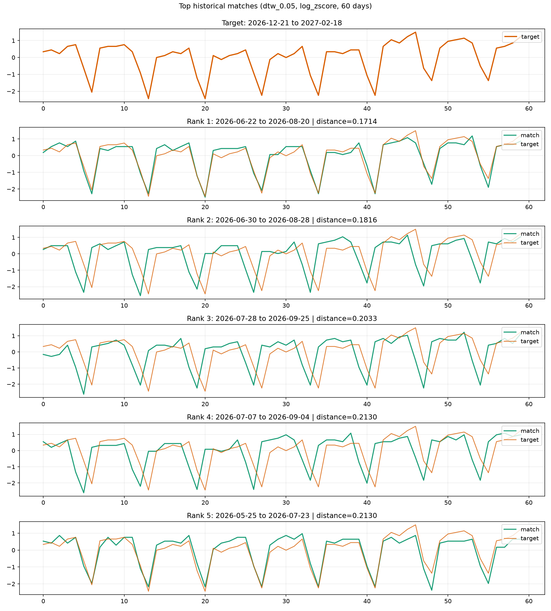

각 방법 내 최적 튜닝 구성:

| 윈도우_길이 | 전처리 | 방법 | top3_rmse_tune | top3_rmse_holdout | ensemble3_rmse_holdout | shape_corr_holdout |
| --- | --- | --- | --- | --- | --- | --- |
| 60 | log_zscore | dtw_0.05 | 0.059344 | 0.085149 | 0.073238 | 0.959124 |
| 60 | smooth3_zscore | hybrid_shape | 0.059576 | 0.092667 | 0.084196 | 0.965648 |
| 60 | smooth3_zscore | hybrid_warp | 0.059664 | 0.085276 | 0.075532 | 0.965957 |
| 60 | smooth3_zscore | hybrid | 0.059736 | 0.092667 | 0.084196 | 0.965648 |
| 60 | relative_mean | dtw_0.15 | 0.059777 | 0.150093 | 0.131011 | 0.630499 |
| 60 | relative_mean | dtw_0.30 | 0.059777 | 0.150093 | 0.131011 | 0.630499 |
| 60 | smooth3_zscore | correlation | 0.060042 | 0.092667 | 0.084196 | 0.965648 |
| 60 | smooth3_zscore | cosine | 0.060042 | 0.092667 | 0.084196 | 0.965648 |
| 60 | smooth3_zscore | euclidean | 0.060042 | 0.092667 | 0.084196 | 0.965648 |
| 45 | relative_mean | cnn_pool4_seed7 | 0.060648 | 0.094424 | 0.086689 | 0.950230 |
| 30 | relative_mean | cnn_pool4_seed19 | 0.065856 | 0.086901 | 0.079860 | 0.969248 |
| 90 | smooth14_zscore | weekday_recent | 0.076535 | 0.102710 | 0.093849 | 0.916986 |
| 30 | relative_mean | cnn_pool1_seed7 | 0.093652 | 0.105274 | 0.100990 | 0.953775 |
| 30 | detrended_zscore | feature | 0.114006 | 0.112532 | 0.093005 | 0.591962 |
| 30 | zscore | cnn_pool1_seed19 | 0.149526 | 0.114099 | 0.103651 | 0.961991 |
| 75 | pct_change_zscore | recent | 0.224443 | 0.293546 | 0.290833 | 0.273598 |


선택 방법의 쿼리 수준 결과(7일 및 14일 예측 기간):

| 쿼리_종료일 | 분할 | 예측_기간 | top1_rmse | top3_rmse | ensemble3_rmse | shape_corr |
| --- | --- | --- | --- | --- | --- | --- |
| 2026-09-12 | tune | 7 | 0.061649 | 0.062174 | 0.042310 | 0.940691 |
| 2026-09-12 | tune | 14 | 0.067722 | 0.070910 | 0.046065 | 0.940691 |
| 2026-09-26 | tune | 7 | 0.165626 | 0.100440 | 0.073270 | 0.938956 |
| 2026-09-26 | tune | 14 | 0.173529 | 0.101215 | 0.077506 | 0.938956 |
| 2026-10-10 | tune | 7 | 0.043559 | 0.051323 | 0.048457 | 0.955913 |
| 2026-10-10 | tune | 14 | 0.039990 | 0.047790 | 0.043836 | 0.955913 |
| 2026-10-24 | tune | 7 | 0.045951 | 0.055289 | 0.032516 | 0.963090 |
| 2026-10-24 | tune | 14 | 0.053175 | 0.092418 | 0.078443 | 0.963090 |
| 2026-11-07 | tune | 7 | 0.068146 | 0.071140 | 0.068124 | 0.965211 |
| 2026-11-07 | tune | 14 | 0.066597 | 0.069007 | 0.064100 | 0.965211 |
| 2026-11-21 | tune | 7 | 0.027878 | 0.038090 | 0.028324 | 0.958274 |
| 2026-11-21 | tune | 14 | 0.056387 | 0.048156 | 0.036351 | 0.958274 |
| 2026-12-05 | tune | 7 | 0.030694 | 0.036949 | 0.026514 | 0.959292 |
| 2026-12-05 | tune | 14 | 0.039678 | 0.050539 | 0.033840 | 0.959292 |
| 2026-12-19 | holdout | 7 | 0.040912 | 0.045654 | 0.038630 | 0.964141 |
| 2026-12-19 | holdout | 14 | 0.059039 | 0.062450 | 0.044411 | 0.964141 |
| 2027-01-02 | holdout | 7 | 0.064273 | 0.078578 | 0.054630 | 0.961646 |
| 2027-01-02 | holdout | 14 | 0.115809 | 0.100001 | 0.079849 | 0.961646 |
| 2027-01-16 | holdout | 7 | 0.045666 | 0.044280 | 0.029463 | 0.953610 |
| 2027-01-16 | holdout | 14 | 0.050731 | 0.059356 | 0.036884 | 0.953610 |
| 2027-01-30 | holdout | 7 | 0.171811 | 0.172082 | 0.170227 | 0.957098 |
| 2027-01-30 | holdout | 14 | 0.155875 | 0.162886 | 0.161219 | 0.957098 |


### 초고속 / CA / SKT (`c3769a55f43c`)

선택: **30 days / smooth3_zscore / euclidean**. 대상: **2027-01-20 to 2027-02-18**. 아래의 모든 과거 기간은 **초고속 / CA / SKT**에 속합니다.

| 순위 | 시작일 | 종료일 | 거리 | 유사도_점수 | 형태_상관 | 평균_비율 |
| --- | --- | --- | --- | --- | --- | --- |
| 1 | 2026-01-21 | 2026-02-19 | 0.228241 | 0.814173 | 0.960421 | 0.919702 |
| 2 | 2026-02-18 | 2026-03-19 | 0.244342 | 0.803638 | 0.952101 | 1.038907 |
| 3 | 2026-11-18 | 2026-12-17 | 0.348882 | 0.741355 | 0.946042 | 1.024007 |
| 4 | 2026-08-26 | 2026-09-24 | 0.352476 | 0.739385 | 0.938870 | 1.022351 |
| 5 | 2026-08-19 | 2026-09-17 | 0.417763 | 0.705336 | 0.915575 | 1.009106 |


`mean_ratio`는 이 세그먼트 내 후보 평균 / 대상 평균입니다. `distance`는 방법별 값이며 `similarity_score = 1/(1+distance)`는 확률이 아닌 표시 점수입니다. 하이브리드 거리는 적격 풀에 따라 달라집니다. DTW는 이동된 이벤트를 정렬할 수 있으므로 워핑하지 않은 원시 상관관계는 거리에서 예상하는 것보다 낮을 수 있습니다.

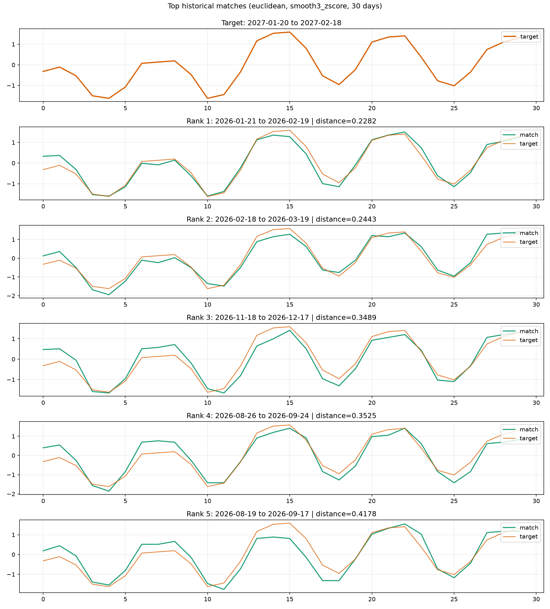

각 방법 내 최적 튜닝 구성:

| 윈도우_길이 | 전처리 | 방법 | top3_rmse_tune | top3_rmse_holdout | ensemble3_rmse_holdout | shape_corr_holdout |
| --- | --- | --- | --- | --- | --- | --- |
| 30 | smooth3_zscore | euclidean | 0.055420 | 0.105638 | 0.097050 | 0.968368 |
| 30 | smooth3_zscore | cosine | 0.055420 | 0.105638 | 0.097050 | 0.968368 |
| 30 | smooth3_zscore | correlation | 0.055420 | 0.105638 | 0.097050 | 0.968368 |
| 30 | smooth3_zscore | hybrid | 0.055829 | 0.107562 | 0.097517 | 0.968368 |
| 30 | smooth3_zscore | hybrid_shape | 0.055977 | 0.105638 | 0.097050 | 0.968368 |
| 30 | smooth14_zscore | hybrid_warp | 0.056043 | 0.146927 | 0.127977 | 0.963802 |
| 30 | minmax | dtw_0.05 | 0.058867 | 0.097667 | 0.090107 | 0.964863 |
| 30 | log_zscore | dtw_0.15 | 0.060272 | 0.103336 | 0.091897 | 0.964166 |
| 30 | log_zscore | dtw_0.30 | 0.060272 | 0.103336 | 0.091897 | 0.964166 |
| 45 | relative_mean | cnn_pool4_seed19 | 0.062918 | 0.107052 | 0.102433 | 0.955918 |
| 30 | relative_mean | cnn_pool4_seed7 | 0.068001 | 0.111322 | 0.099051 | 0.958548 |
| 30 | detrended_zscore | feature | 0.073409 | 0.161131 | 0.147020 | 0.949100 |
| 30 | relative_mean | cnn_pool1_seed7 | 0.076571 | 0.148885 | 0.139264 | 0.805457 |
| 30 | detrended_zscore | weekday_recent | 0.077924 | 0.115632 | 0.112773 | 0.938959 |
| 30 | zscore | cnn_pool1_seed19 | 0.113021 | 0.180185 | 0.158706 | 0.629403 |
| 75 | zscore | recent | 0.235626 | 0.281778 | 0.279278 | 0.274423 |


선택 방법의 쿼리 수준 결과(7일 및 14일 예측 기간):

| 쿼리_종료일 | 분할 | 예측_기간 | top1_rmse | top3_rmse | ensemble3_rmse | shape_corr |
| --- | --- | --- | --- | --- | --- | --- |
| 2026-09-12 | tune | 7 | 0.068349 | 0.060631 | 0.041575 | 0.957721 |
| 2026-09-12 | tune | 14 | 0.086813 | 0.081846 | 0.071714 | 0.957721 |
| 2026-09-26 | tune | 7 | 0.169598 | 0.107538 | 0.061084 | 0.966789 |
| 2026-09-26 | tune | 14 | 0.187669 | 0.115517 | 0.064062 | 0.966789 |
| 2026-10-10 | tune | 7 | 0.052290 | 0.051770 | 0.045642 | 0.957816 |
| 2026-10-10 | tune | 14 | 0.044921 | 0.046719 | 0.041211 | 0.957816 |
| 2026-10-24 | tune | 7 | 0.053015 | 0.046362 | 0.027350 | 0.964879 |
| 2026-10-24 | tune | 14 | 0.052982 | 0.052784 | 0.035642 | 0.964879 |
| 2026-11-07 | tune | 7 | 0.052234 | 0.048881 | 0.028320 | 0.973527 |
| 2026-11-07 | tune | 14 | 0.087297 | 0.069406 | 0.042908 | 0.973527 |
| 2026-11-21 | tune | 7 | 0.026367 | 0.031134 | 0.016131 | 0.966751 |
| 2026-11-21 | tune | 14 | 0.046830 | 0.045410 | 0.033026 | 0.966751 |
| 2026-12-05 | tune | 7 | 0.048267 | 0.041621 | 0.033194 | 0.974686 |
| 2026-12-05 | tune | 14 | 0.052054 | 0.052058 | 0.035538 | 0.974686 |
| 2026-12-19 | holdout | 7 | 0.028264 | 0.051592 | 0.030684 | 0.979026 |
| 2026-12-19 | holdout | 14 | 0.088757 | 0.084394 | 0.071214 | 0.979026 |
| 2027-01-02 | holdout | 7 | 0.093622 | 0.103206 | 0.097430 | 0.974240 |
| 2027-01-02 | holdout | 14 | 0.087753 | 0.104398 | 0.100010 | 0.974240 |
| 2027-01-16 | holdout | 7 | 0.075695 | 0.090268 | 0.087100 | 0.946177 |
| 2027-01-16 | holdout | 14 | 0.062277 | 0.078659 | 0.069963 | 0.946177 |
| 2027-01-30 | holdout | 7 | 0.158888 | 0.177486 | 0.172987 | 0.974028 |
| 2027-01-30 | holdout | 14 | 0.134103 | 0.160275 | 0.152121 | 0.974028 |


### 초고속 / CA / 도매 (`bccb4b32ed84`)

선택: **75 days / smooth3_zscore / hybrid**. 대상: **2026-12-06 to 2027-02-18**. 아래의 모든 과거 기간은 **초고속 / CA / 도매**에 속합니다.

| 순위 | 시작일 | 종료일 | 거리 | 유사도_점수 | 형태_상관 | 평균_비율 |
| --- | --- | --- | --- | --- | --- | --- |
| 1 | 2026-04-26 | 2026-07-09 | 0.000000 | 1.000000 | 0.941738 | 1.005184 |
| 2 | 2026-04-19 | 2026-07-02 | 0.012719 | 0.987440 | 0.927689 | 1.003110 |
| 3 | 2026-05-03 | 2026-07-16 | 0.014254 | 0.985946 | 0.934918 | 1.008813 |
| 4 | 2026-07-12 | 2026-09-24 | 0.034868 | 0.966306 | 0.930815 | 1.054951 |
| 5 | 2026-07-05 | 2026-09-17 | 0.045175 | 0.956777 | 0.914508 | 1.052877 |


`mean_ratio`는 이 세그먼트 내 후보 평균 / 대상 평균입니다. `distance`는 방법별 값이며 `similarity_score = 1/(1+distance)`는 확률이 아닌 표시 점수입니다. 하이브리드 거리는 적격 풀에 따라 달라집니다. DTW는 이동된 이벤트를 정렬할 수 있으므로 워핑하지 않은 원시 상관관계는 거리에서 예상하는 것보다 낮을 수 있습니다.

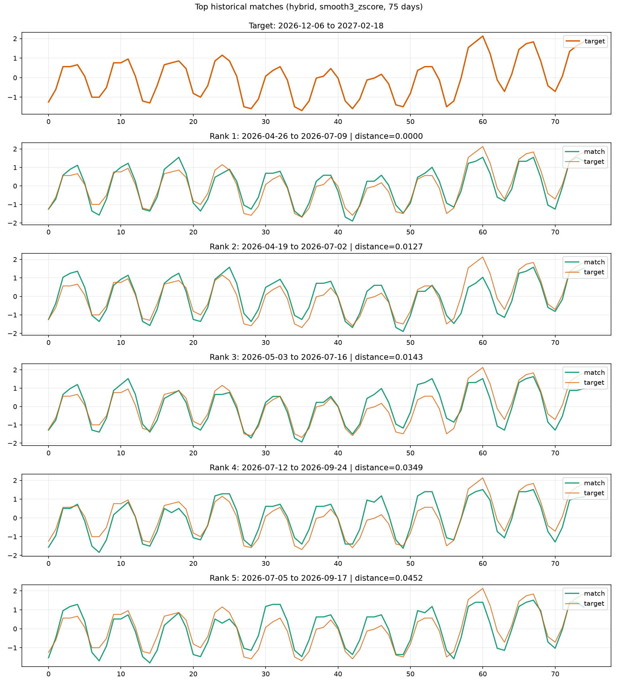

각 방법 내 최적 튜닝 구성:

| 윈도우_길이 | 전처리 | 방법 | top3_rmse_tune | top3_rmse_holdout | ensemble3_rmse_holdout | shape_corr_holdout |
| --- | --- | --- | --- | --- | --- | --- |
| 75 | smooth3_zscore | hybrid | 0.058301 | 0.100744 | 0.088878 | 0.952701 |
| 60 | zscore | hybrid_shape | 0.058338 | 0.092708 | 0.076435 | 0.959742 |
| 60 | relative_mean | euclidean | 0.058381 | 0.090006 | 0.072258 | 0.959742 |
| 45 | smooth3_zscore | correlation | 0.059123 | 0.097129 | 0.084348 | 0.958319 |
| 45 | smooth3_zscore | cosine | 0.059123 | 0.097129 | 0.084348 | 0.958319 |
| 60 | log_zscore | dtw_0.05 | 0.059378 | 0.099333 | 0.081655 | 0.947688 |
| 60 | log_zscore | dtw_0.30 | 0.059378 | 0.099333 | 0.081655 | 0.947688 |
| 60 | log_zscore | dtw_0.15 | 0.059378 | 0.099333 | 0.081655 | 0.947688 |
| 60 | relative_mean | hybrid_warp | 0.059823 | 0.098887 | 0.081108 | 0.952644 |
| 30 | relative_mean | cnn_pool4_seed7 | 0.060867 | 0.095328 | 0.084837 | 0.956760 |
| 30 | relative_mean | cnn_pool4_seed19 | 0.066340 | 0.101568 | 0.095082 | 0.953035 |
| 30 | relative_mean | cnn_pool1_seed7 | 0.079730 | 0.088157 | 0.076515 | 0.936645 |
| 45 | minmax | weekday_recent | 0.084854 | 0.111051 | 0.104708 | 0.913318 |
| 30 | detrended_zscore | feature | 0.089271 | 0.162655 | 0.137490 | 0.578328 |
| 90 | relative_mean | cnn_pool1_seed19 | 0.122243 | 0.226276 | 0.212606 | 0.313834 |
| 75 | relative_first | recent | 0.235171 | 0.275110 | 0.272330 | 0.261211 |


선택 방법의 쿼리 수준 결과(7일 및 14일 예측 기간):

| 쿼리_종료일 | 분할 | 예측_기간 | top1_rmse | top3_rmse | ensemble3_rmse | shape_corr |
| --- | --- | --- | --- | --- | --- | --- |
| 2026-09-12 | tune | 7 | 0.130777 | 0.090970 | 0.072749 | 0.931989 |
| 2026-09-12 | tune | 14 | 0.143097 | 0.105798 | 0.088805 | 0.931989 |
| 2026-09-26 | tune | 7 | 0.059938 | 0.075705 | 0.063029 | 0.946126 |
| 2026-09-26 | tune | 14 | 0.058437 | 0.065046 | 0.054655 | 0.946126 |
| 2026-10-10 | tune | 7 | 0.056368 | 0.046124 | 0.037172 | 0.959435 |
| 2026-10-10 | tune | 14 | 0.046333 | 0.047976 | 0.032355 | 0.959435 |
| 2026-10-24 | tune | 7 | 0.052084 | 0.039885 | 0.028554 | 0.961315 |
| 2026-10-24 | tune | 14 | 0.061724 | 0.059749 | 0.052234 | 0.961315 |
| 2026-11-07 | tune | 7 | 0.074393 | 0.055164 | 0.050435 | 0.960889 |
| 2026-11-07 | tune | 14 | 0.061082 | 0.056172 | 0.049198 | 0.960889 |
| 2026-11-21 | tune | 7 | 0.021933 | 0.036389 | 0.023287 | 0.958470 |
| 2026-11-21 | tune | 14 | 0.072252 | 0.065895 | 0.056964 | 0.958470 |
| 2026-12-05 | tune | 7 | 0.051117 | 0.063867 | 0.021667 | 0.949507 |
| 2026-12-05 | tune | 14 | 0.042100 | 0.064855 | 0.031308 | 0.949507 |
| 2026-12-19 | holdout | 7 | 0.059920 | 0.062665 | 0.049980 | 0.957634 |
| 2026-12-19 | holdout | 14 | 0.068302 | 0.074212 | 0.062363 | 0.957634 |
| 2027-01-02 | holdout | 7 | 0.033572 | 0.072067 | 0.063259 | 0.960096 |
| 2027-01-02 | holdout | 14 | 0.055506 | 0.086611 | 0.078986 | 0.960096 |
| 2027-01-16 | holdout | 7 | 0.121269 | 0.077899 | 0.054194 | 0.954980 |
| 2027-01-16 | holdout | 14 | 0.101821 | 0.086197 | 0.044478 | 0.954980 |
| 2027-01-30 | holdout | 7 | 0.246535 | 0.190344 | 0.188079 | 0.938092 |
| 2027-01-30 | holdout | 14 | 0.220365 | 0.166328 | 0.163390 | 0.938092 |


### 초고속 / CA / 지역 (`d48840b938e2`)

선택: **45 days / smooth3_zscore / euclidean**. 대상: **2027-01-05 to 2027-02-18**. 아래의 모든 과거 기간은 **초고속 / CA / 지역**에 속합니다.

| 순위 | 시작일 | 종료일 | 거리 | 유사도_점수 | 형태_상관 | 평균_비율 |
| --- | --- | --- | --- | --- | --- | --- |
| 1 | 2026-01-06 | 2026-02-19 | 0.288956 | 0.775822 | 0.950259 | 0.988837 |
| 2 | 2026-02-03 | 2026-03-19 | 0.329114 | 0.752381 | 0.944586 | 1.096279 |
| 3 | 2026-02-10 | 2026-03-26 | 0.372608 | 0.728540 | 0.938415 | 1.108372 |
| 4 | 2026-08-04 | 2026-09-17 | 0.390726 | 0.719049 | 0.928399 | 1.051628 |
| 5 | 2026-08-11 | 2026-09-24 | 0.420036 | 0.704208 | 0.931266 | 1.058605 |


`mean_ratio`는 이 세그먼트 내 후보 평균 / 대상 평균입니다. `distance`는 방법별 값이며 `similarity_score = 1/(1+distance)`는 확률이 아닌 표시 점수입니다. 하이브리드 거리는 적격 풀에 따라 달라집니다. DTW는 이동된 이벤트를 정렬할 수 있으므로 워핑하지 않은 원시 상관관계는 거리에서 예상하는 것보다 낮을 수 있습니다.

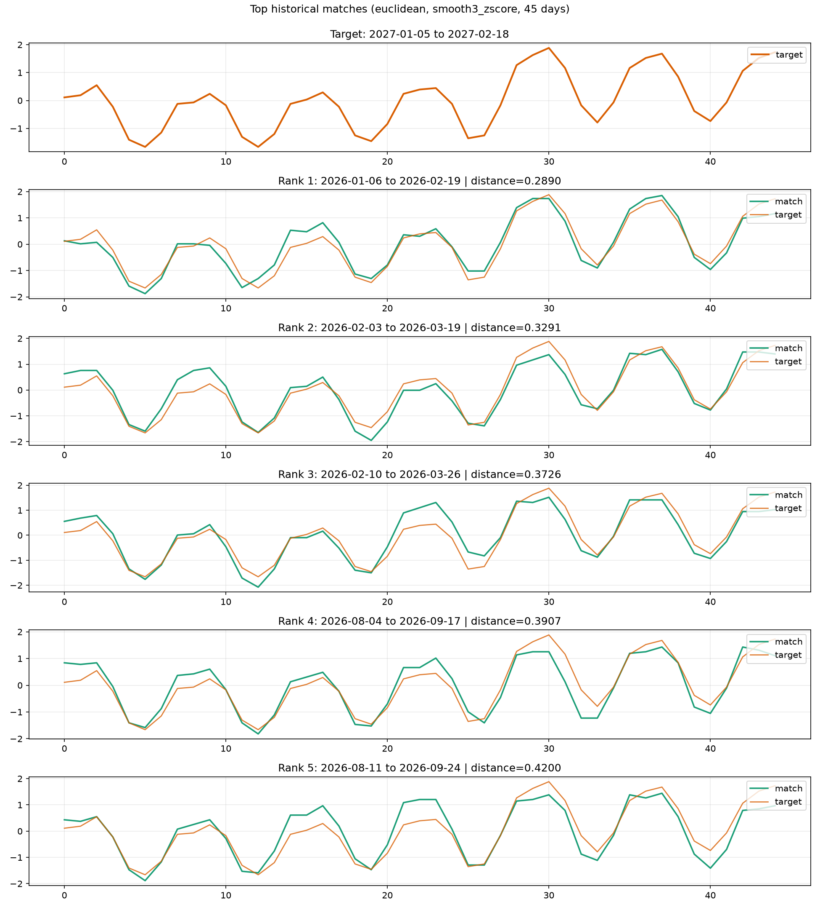

각 방법 내 최적 튜닝 구성:

| 윈도우_길이 | 전처리 | 방법 | top3_rmse_tune | top3_rmse_holdout | ensemble3_rmse_holdout | shape_corr_holdout |
| --- | --- | --- | --- | --- | --- | --- |
| 45 | smooth3_zscore | euclidean | 0.059315 | 0.098509 | 0.088514 | 0.960977 |
| 45 | smooth3_zscore | cosine | 0.059315 | 0.098509 | 0.088514 | 0.960977 |
| 45 | smooth3_zscore | correlation | 0.059315 | 0.098509 | 0.088514 | 0.960977 |
| 60 | smooth3_zscore | hybrid_shape | 0.061475 | 0.098613 | 0.088421 | 0.953479 |
| 45 | zscore | cnn_pool4_seed19 | 0.063933 | 0.109541 | 0.098680 | 0.958071 |
| 60 | difference_zscore | hybrid_warp | 0.064024 | 0.100545 | 0.093494 | 0.934361 |
| 60 | relative_mean | hybrid | 0.064582 | 0.101172 | 0.082158 | 0.955475 |
| 45 | log_zscore | dtw_0.05 | 0.067575 | 0.097658 | 0.082917 | 0.958491 |
| 75 | log_zscore | dtw_0.30 | 0.069475 | 0.120673 | 0.109182 | 0.947118 |
| 75 | log_zscore | dtw_0.15 | 0.069475 | 0.120673 | 0.109182 | 0.947118 |
| 45 | relative_mean | cnn_pool4_seed7 | 0.072748 | 0.092535 | 0.083015 | 0.951514 |
| 90 | difference_zscore | weekday_recent | 0.077726 | 0.078804 | 0.069759 | 0.926969 |
| 30 | relative_mean | cnn_pool1_seed7 | 0.100025 | 0.086737 | 0.076522 | 0.958111 |
| 30 | relative_first | feature | 0.106426 | 0.155830 | 0.139365 | 0.588162 |
| 30 | zscore | cnn_pool1_seed19 | 0.144976 | 0.105623 | 0.087947 | 0.958186 |
| 75 | smooth_zscore | recent | 0.223183 | 0.291085 | 0.287796 | 0.272408 |


선택 방법의 쿼리 수준 결과(7일 및 14일 예측 기간):

| 쿼리_종료일 | 분할 | 예측_기간 | top1_rmse | top3_rmse | ensemble3_rmse | shape_corr |
| --- | --- | --- | --- | --- | --- | --- |
| 2026-09-12 | tune | 7 | 0.061006 | 0.060981 | 0.038850 | 0.953162 |
| 2026-09-12 | tune | 14 | 0.086763 | 0.068940 | 0.046703 | 0.953162 |
| 2026-09-26 | tune | 7 | 0.061843 | 0.088522 | 0.075353 | 0.959102 |
| 2026-09-26 | tune | 14 | 0.062709 | 0.124263 | 0.108500 | 0.959102 |
| 2026-10-10 | tune | 7 | 0.029810 | 0.053581 | 0.050720 | 0.959525 |
| 2026-10-10 | tune | 14 | 0.028846 | 0.056810 | 0.051663 | 0.959525 |
| 2026-10-24 | tune | 7 | 0.054388 | 0.059902 | 0.036033 | 0.973669 |
| 2026-10-24 | tune | 14 | 0.054122 | 0.070112 | 0.052381 | 0.973669 |
| 2026-11-07 | tune | 7 | 0.075334 | 0.060775 | 0.052526 | 0.964391 |
| 2026-11-07 | tune | 14 | 0.061090 | 0.063148 | 0.056155 | 0.964391 |
| 2026-11-21 | tune | 7 | 0.024759 | 0.034637 | 0.025878 | 0.954065 |
| 2026-11-21 | tune | 14 | 0.049356 | 0.063902 | 0.058291 | 0.954065 |
| 2026-12-05 | tune | 7 | 0.059124 | 0.056803 | 0.046350 | 0.959443 |
| 2026-12-05 | tune | 14 | 0.063310 | 0.062283 | 0.052650 | 0.959443 |
| 2026-12-19 | holdout | 7 | 0.049058 | 0.049877 | 0.037819 | 0.962556 |
| 2026-12-19 | holdout | 14 | 0.074089 | 0.079516 | 0.064872 | 0.962556 |
| 2027-01-02 | holdout | 7 | 0.099871 | 0.092461 | 0.072882 | 0.955664 |
| 2027-01-02 | holdout | 14 | 0.088484 | 0.096251 | 0.068699 | 0.955664 |
| 2027-01-16 | holdout | 7 | 0.049498 | 0.040296 | 0.033610 | 0.966252 |
| 2027-01-16 | holdout | 14 | 0.049526 | 0.053746 | 0.045256 | 0.966252 |
| 2027-01-30 | holdout | 7 | 0.185583 | 0.211401 | 0.209744 | 0.959437 |
| 2027-01-30 | holdout | 14 | 0.161879 | 0.199194 | 0.196711 | 0.959437 |


### 초고속 / CA / 직접 (`f297f42e0750`)

선택: **45 days / smooth3_zscore / correlation**. 대상: **2027-01-05 to 2027-02-18**. 아래의 모든 과거 기간은 **초고속 / CA / 직접**에 속합니다.

| 순위 | 시작일 | 종료일 | 거리 | 유사도_점수 | 형태_상관 | 평균_비율 |
| --- | --- | --- | --- | --- | --- | --- |
| 1 | 2026-02-03 | 2026-03-19 | 0.027385 | 0.973345 | 0.956587 | 1.096262 |
| 2 | 2026-01-06 | 2026-02-19 | 0.030564 | 0.970342 | 0.967316 | 0.984783 |
| 3 | 2026-01-13 | 2026-02-26 | 0.057572 | 0.945562 | 0.949318 | 1.003639 |
| 4 | 2026-08-11 | 2026-09-24 | 0.063022 | 0.940715 | 0.951591 | 1.074099 |
| 5 | 2026-07-07 | 2026-08-20 | 0.073815 | 0.931259 | 0.939497 | 1.023487 |


`mean_ratio`는 이 세그먼트 내 후보 평균 / 대상 평균입니다. `distance`는 방법별 값이며 `similarity_score = 1/(1+distance)`는 확률이 아닌 표시 점수입니다. 하이브리드 거리는 적격 풀에 따라 달라집니다. DTW는 이동된 이벤트를 정렬할 수 있으므로 워핑하지 않은 원시 상관관계는 거리에서 예상하는 것보다 낮을 수 있습니다.

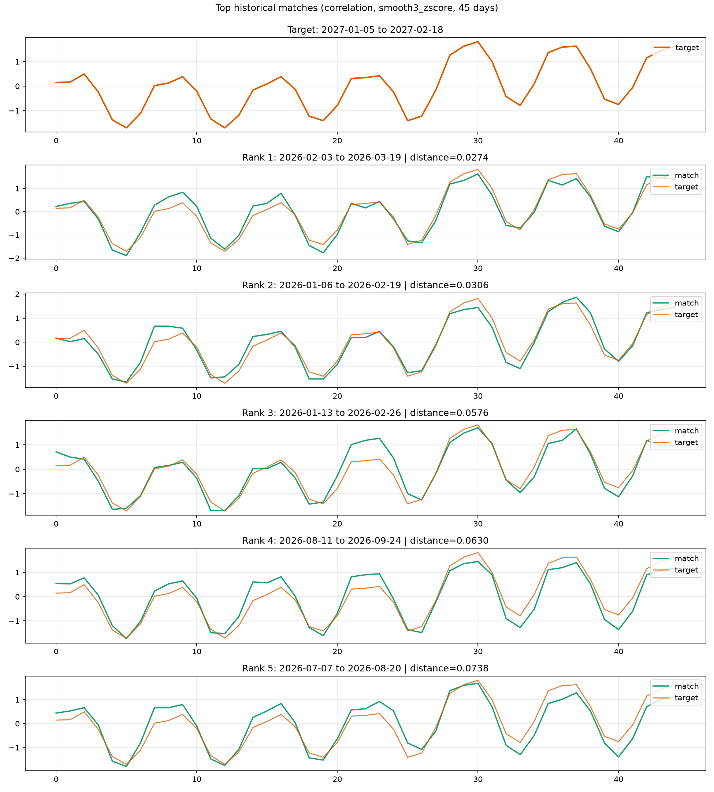

각 방법 내 최적 튜닝 구성:

| 윈도우_길이 | 전처리 | 방법 | top3_rmse_tune | top3_rmse_holdout | ensemble3_rmse_holdout | shape_corr_holdout |
| --- | --- | --- | --- | --- | --- | --- |
| 45 | smooth3_zscore | correlation | 0.051616 | 0.083201 | 0.075991 | 0.965330 |
| 45 | smooth3_zscore | cosine | 0.051616 | 0.083201 | 0.075991 | 0.965330 |
| 45 | smooth3_zscore | euclidean | 0.051616 | 0.083201 | 0.075991 | 0.965330 |
| 45 | smooth3_zscore | hybrid_shape | 0.051616 | 0.083201 | 0.075991 | 0.965330 |
| 45 | smooth3_zscore | hybrid | 0.051636 | 0.082774 | 0.073685 | 0.965330 |
| 45 | smooth3_zscore | hybrid_warp | 0.054001 | 0.082774 | 0.073685 | 0.963064 |
| 45 | log_zscore | dtw_0.05 | 0.054965 | 0.091568 | 0.081791 | 0.962940 |
| 45 | relative_mean | cnn_pool4_seed7 | 0.055307 | 0.113765 | 0.104817 | 0.956228 |
| 30 | relative_first | dtw_0.30 | 0.058962 | 0.105686 | 0.096251 | 0.966187 |
| 30 | relative_first | dtw_0.15 | 0.058962 | 0.105686 | 0.096251 | 0.966187 |
| 30 | difference_zscore | feature | 0.061957 | 0.124824 | 0.110009 | 0.304050 |
| 45 | relative_mean | cnn_pool4_seed19 | 0.064347 | 0.093764 | 0.088064 | 0.960158 |
| 90 | pct_change_zscore | weekday_recent | 0.078570 | 0.089914 | 0.082579 | 0.919211 |
| 30 | relative_mean | cnn_pool1_seed7 | 0.094936 | 0.078057 | 0.071345 | 0.965652 |
| 30 | relative_mean | cnn_pool1_seed19 | 0.109102 | 0.076043 | 0.068424 | 0.956780 |
| 75 | relative_mean | recent | 0.230019 | 0.277099 | 0.274822 | 0.269690 |


선택 방법의 쿼리 수준 결과(7일 및 14일 예측 기간):

| 쿼리_종료일 | 분할 | 예측_기간 | top1_rmse | top3_rmse | ensemble3_rmse | shape_corr |
| --- | --- | --- | --- | --- | --- | --- |
| 2026-09-12 | tune | 7 | 0.052404 | 0.044543 | 0.029757 | 0.960900 |
| 2026-09-12 | tune | 14 | 0.047434 | 0.046298 | 0.034509 | 0.960900 |
| 2026-09-26 | tune | 7 | 0.067428 | 0.068922 | 0.056973 | 0.970058 |
| 2026-09-26 | tune | 14 | 0.070704 | 0.076586 | 0.064941 | 0.970058 |
| 2026-10-10 | tune | 7 | 0.056950 | 0.073114 | 0.065358 | 0.962174 |
| 2026-10-10 | tune | 14 | 0.046499 | 0.076275 | 0.065211 | 0.962174 |
| 2026-10-24 | tune | 7 | 0.037402 | 0.034354 | 0.013049 | 0.968687 |
| 2026-10-24 | tune | 14 | 0.054332 | 0.057909 | 0.047443 | 0.968687 |
| 2026-11-07 | tune | 7 | 0.047350 | 0.044645 | 0.037623 | 0.962573 |
| 2026-11-07 | tune | 14 | 0.048381 | 0.053446 | 0.046862 | 0.962573 |
| 2026-11-21 | tune | 7 | 0.028170 | 0.036544 | 0.026862 | 0.959381 |
| 2026-11-21 | tune | 14 | 0.062278 | 0.056521 | 0.048948 | 0.959381 |
| 2026-12-05 | tune | 7 | 0.046278 | 0.059192 | 0.049722 | 0.964974 |
| 2026-12-05 | tune | 14 | 0.040926 | 0.057610 | 0.047999 | 0.964974 |
| 2026-12-19 | holdout | 7 | 0.061184 | 0.056103 | 0.047868 | 0.967275 |
| 2026-12-19 | holdout | 14 | 0.060501 | 0.060612 | 0.050791 | 0.967275 |
| 2027-01-02 | holdout | 7 | 0.066012 | 0.059974 | 0.045577 | 0.970790 |
| 2027-01-02 | holdout | 14 | 0.084248 | 0.078538 | 0.069190 | 0.970790 |
| 2027-01-16 | holdout | 7 | 0.045102 | 0.044252 | 0.040657 | 0.959573 |
| 2027-01-16 | holdout | 14 | 0.059168 | 0.053179 | 0.049300 | 0.959573 |
| 2027-01-30 | holdout | 7 | 0.133366 | 0.172476 | 0.169862 | 0.963683 |
| 2027-01-30 | holdout | 14 | 0.125951 | 0.163357 | 0.159647 | 0.963683 |


### 초고속 / IP / HnS (`230825814f5c`)

선택: **45 days / minmax / cosine**. 대상: **2027-01-05 to 2027-02-18**. 아래의 모든 과거 기간은 **초고속 / IP / HnS**에 속합니다.

| 순위 | 시작일 | 종료일 | 거리 | 유사도_점수 | 형태_상관 | 평균_비율 |
| --- | --- | --- | --- | --- | --- | --- |
| 1 | 2026-01-06 | 2026-02-19 | 0.007055 | 0.992994 | 0.960106 | 1.020163 |
| 2 | 2026-02-03 | 2026-03-19 | 0.008316 | 0.991752 | 0.951130 | 1.186351 |
| 3 | 2026-01-13 | 2026-02-26 | 0.009310 | 0.990776 | 0.947780 | 1.047383 |
| 4 | 2026-08-04 | 2026-09-17 | 0.009863 | 0.990233 | 0.942976 | 1.090112 |
| 5 | 2026-07-07 | 2026-08-20 | 0.010032 | 0.990068 | 0.941125 | 1.013959 |


`mean_ratio`는 이 세그먼트 내 후보 평균 / 대상 평균입니다. `distance`는 방법별 값이며 `similarity_score = 1/(1+distance)`는 확률이 아닌 표시 점수입니다. 하이브리드 거리는 적격 풀에 따라 달라집니다. DTW는 이동된 이벤트를 정렬할 수 있으므로 워핑하지 않은 원시 상관관계는 거리에서 예상하는 것보다 낮을 수 있습니다.

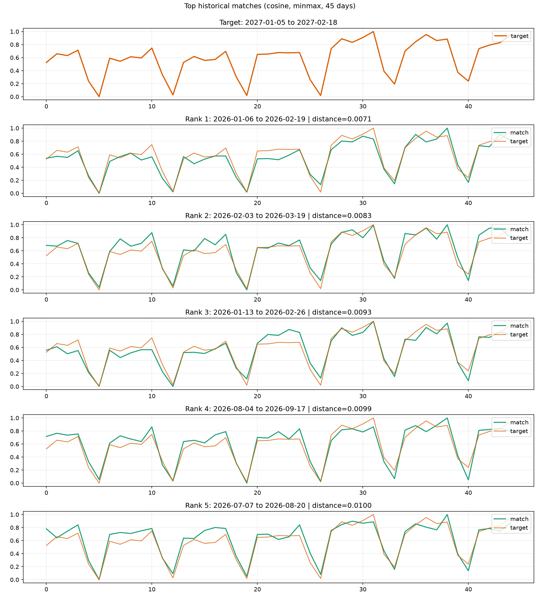

각 방법 내 최적 튜닝 구성:

| 윈도우_길이 | 전처리 | 방법 | top3_rmse_tune | top3_rmse_holdout | ensemble3_rmse_holdout | shape_corr_holdout |
| --- | --- | --- | --- | --- | --- | --- |
| 45 | minmax | cosine | 0.059822 | 0.106123 | 0.101183 | 0.958403 |
| 45 | relative_mean | euclidean | 0.061436 | 0.104417 | 0.099775 | 0.958876 |
| 45 | smooth3_zscore | correlation | 0.061506 | 0.107542 | 0.103018 | 0.957123 |
| 45 | minmax | hybrid | 0.062126 | 0.112855 | 0.108137 | 0.958403 |
| 45 | smooth3_zscore | hybrid_warp | 0.062557 | 0.103984 | 0.096119 | 0.953562 |
| 45 | smooth3_zscore | hybrid_shape | 0.062810 | 0.109112 | 0.104380 | 0.957123 |
| 45 | minmax | dtw_0.05 | 0.063018 | 0.125758 | 0.118207 | 0.958403 |
| 30 | minmax | dtw_0.15 | 0.064783 | 0.111877 | 0.107440 | 0.966315 |
| 30 | minmax | dtw_0.30 | 0.064783 | 0.111877 | 0.107440 | 0.966315 |
| 45 | zscore | cnn_pool4_seed19 | 0.066632 | 0.237205 | 0.217678 | 0.138563 |
| 30 | relative_mean | cnn_pool4_seed7 | 0.070925 | 0.152668 | 0.123552 | 0.786402 |
| 90 | difference_zscore | weekday_recent | 0.089941 | 0.123308 | 0.118877 | 0.889637 |
| 30 | relative_mean | cnn_pool1_seed7 | 0.092143 | 0.187862 | 0.174838 | 0.595562 |
| 30 | detrended_zscore | feature | 0.121005 | 0.172969 | 0.163403 | 0.605435 |
| 30 | zscore | cnn_pool1_seed19 | 0.148014 | 0.173911 | 0.157337 | 0.613203 |
| 75 | relative_mean | recent | 0.227292 | 0.293291 | 0.290847 | 0.262987 |


선택 방법의 쿼리 수준 결과(7일 및 14일 예측 기간):

| 쿼리_종료일 | 분할 | 예측_기간 | top1_rmse | top3_rmse | ensemble3_rmse | shape_corr |
| --- | --- | --- | --- | --- | --- | --- |
| 2026-09-12 | tune | 7 | 0.062672 | 0.068905 | 0.036743 | 0.964004 |
| 2026-09-12 | tune | 14 | 0.052520 | 0.077593 | 0.043594 | 0.964004 |
| 2026-09-26 | tune | 7 | 0.065429 | 0.079377 | 0.062306 | 0.968476 |
| 2026-09-26 | tune | 14 | 0.067919 | 0.075755 | 0.058742 | 0.968476 |
| 2026-10-10 | tune | 7 | 0.047311 | 0.061688 | 0.053005 | 0.961721 |
| 2026-10-10 | tune | 14 | 0.045505 | 0.072388 | 0.044997 | 0.961721 |
| 2026-10-24 | tune | 7 | 0.057419 | 0.047171 | 0.033743 | 0.974881 |
| 2026-10-24 | tune | 14 | 0.062464 | 0.059308 | 0.048179 | 0.974881 |
| 2026-11-07 | tune | 7 | 0.065942 | 0.052276 | 0.041617 | 0.962505 |
| 2026-11-07 | tune | 14 | 0.053880 | 0.056150 | 0.045751 | 0.962505 |
| 2026-11-21 | tune | 7 | 0.054622 | 0.056211 | 0.045594 | 0.960164 |
| 2026-11-21 | tune | 14 | 0.072614 | 0.079249 | 0.073081 | 0.960164 |
| 2026-12-05 | tune | 7 | 0.051747 | 0.053125 | 0.042068 | 0.957490 |
| 2026-12-05 | tune | 14 | 0.057787 | 0.069078 | 0.059776 | 0.957490 |
| 2026-12-19 | holdout | 7 | 0.072490 | 0.055052 | 0.049552 | 0.969996 |
| 2026-12-19 | holdout | 14 | 0.061588 | 0.066423 | 0.051022 | 0.969996 |
| 2027-01-02 | holdout | 7 | 0.091420 | 0.129534 | 0.123173 | 0.967898 |
| 2027-01-02 | holdout | 14 | 0.091478 | 0.118904 | 0.111173 | 0.967898 |
| 2027-01-16 | holdout | 7 | 0.035623 | 0.065680 | 0.061288 | 0.945551 |
| 2027-01-16 | holdout | 14 | 0.031997 | 0.058157 | 0.048518 | 0.945551 |
| 2027-01-30 | holdout | 7 | 0.147373 | 0.174226 | 0.170720 | 0.950165 |
| 2027-01-30 | holdout | 14 | 0.142285 | 0.164693 | 0.161775 | 0.950165 |


### 초고속 / IP / SKT (`20cf95d205c3`)

선택: **30 days / relative_mean / cnn_pool4_seed7**. 대상: **2027-01-20 to 2027-02-18**. 아래의 모든 과거 기간은 **초고속 / IP / SKT**에 속합니다.

| 순위 | 시작일 | 종료일 | 거리 | 유사도_점수 | 형태_상관 | 평균_비율 |
| --- | --- | --- | --- | --- | --- | --- |
| 1 | 2026-01-21 | 2026-02-19 | 0.075657 | 0.929664 | 0.962710 | 1.072038 |
| 2 | 2026-02-19 | 2026-03-20 | 0.240252 | 0.806288 | 0.365809 | 1.180213 |
| 3 | 2026-01-28 | 2026-02-26 | 0.266910 | 0.789322 | 0.944895 | 1.102607 |
| 4 | 2026-07-23 | 2026-08-21 | 0.271991 | 0.786169 | 0.383113 | 1.064100 |
| 5 | 2026-11-26 | 2026-12-25 | 0.307688 | 0.764709 | 0.360183 | 0.940047 |


`mean_ratio`는 이 세그먼트 내 후보 평균 / 대상 평균입니다. `distance`는 방법별 값이며 `similarity_score = 1/(1+distance)`는 확률이 아닌 표시 점수입니다. 하이브리드 거리는 적격 풀에 따라 달라집니다. DTW는 이동된 이벤트를 정렬할 수 있으므로 워핑하지 않은 원시 상관관계는 거리에서 예상하는 것보다 낮을 수 있습니다.

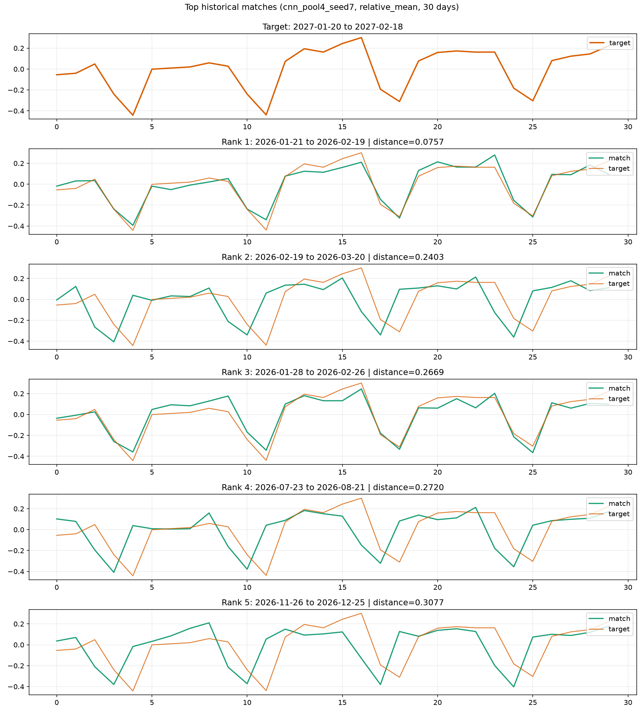

각 방법 내 최적 튜닝 구성:

| 윈도우_길이 | 전처리 | 방법 | top3_rmse_tune | top3_rmse_holdout | ensemble3_rmse_holdout | shape_corr_holdout |
| --- | --- | --- | --- | --- | --- | --- |
| 30 | relative_mean | cnn_pool4_seed7 | 0.059655 | 0.105953 | 0.090389 | 0.965906 |
| 30 | log_zscore | hybrid_shape | 0.062385 | 0.093699 | 0.083849 | 0.971429 |
| 30 | minmax | euclidean | 0.062517 | 0.095310 | 0.083662 | 0.970368 |
| 30 | log_zscore | hybrid | 0.062983 | 0.095976 | 0.085718 | 0.971429 |
| 45 | log_zscore | dtw_0.05 | 0.063171 | 0.102016 | 0.092488 | 0.963232 |
| 30 | minmax | cosine | 0.063731 | 0.093113 | 0.081469 | 0.971559 |
| 30 | log_zscore | correlation | 0.063827 | 0.093699 | 0.083849 | 0.971429 |
| 30 | smooth3_zscore | hybrid_warp | 0.065334 | 0.095151 | 0.083399 | 0.968708 |
| 45 | relative_mean | cnn_pool4_seed19 | 0.065458 | 0.109216 | 0.099585 | 0.960014 |
| 30 | log_zscore | dtw_0.15 | 0.066358 | 0.096952 | 0.089337 | 0.966750 |
| 30 | log_zscore | dtw_0.30 | 0.066358 | 0.096952 | 0.089337 | 0.966750 |
| 90 | smooth3_zscore | weekday_recent | 0.075495 | 0.098277 | 0.091103 | 0.913897 |
| 30 | relative_first | feature | 0.079468 | 0.139703 | 0.127121 | 0.599648 |
| 30 | relative_mean | cnn_pool1_seed7 | 0.110663 | 0.088243 | 0.081039 | 0.958814 |
| 30 | zscore | cnn_pool1_seed19 | 0.169864 | 0.107266 | 0.091229 | 0.954001 |
| 75 | zscore | recent | 0.226635 | 0.284933 | 0.282589 | 0.270877 |


선택 방법의 쿼리 수준 결과(7일 및 14일 예측 기간):

| 쿼리_종료일 | 분할 | 예측_기간 | top1_rmse | top3_rmse | ensemble3_rmse | shape_corr |
| --- | --- | --- | --- | --- | --- | --- |
| 2026-09-12 | tune | 7 | 0.042579 | 0.054009 | 0.042078 | 0.980648 |
| 2026-09-12 | tune | 14 | 0.063295 | 0.073315 | 0.064987 | 0.980648 |
| 2026-09-26 | tune | 7 | 0.089425 | 0.082063 | 0.063936 | 0.961775 |
| 2026-09-26 | tune | 14 | 0.075110 | 0.076447 | 0.060152 | 0.961775 |
| 2026-10-10 | tune | 7 | 0.047914 | 0.055279 | 0.048163 | 0.969278 |
| 2026-10-10 | tune | 14 | 0.053536 | 0.060451 | 0.054257 | 0.969278 |
| 2026-10-24 | tune | 7 | 0.077494 | 0.061181 | 0.047839 | 0.955599 |
| 2026-10-24 | tune | 14 | 0.105808 | 0.088954 | 0.082099 | 0.955599 |
| 2026-11-07 | tune | 7 | 0.057362 | 0.066473 | 0.058202 | 0.963229 |
| 2026-11-07 | tune | 14 | 0.056406 | 0.065881 | 0.057797 | 0.963229 |
| 2026-11-21 | tune | 7 | 0.053401 | 0.050394 | 0.030442 | 0.957711 |
| 2026-11-21 | tune | 14 | 0.056055 | 0.062566 | 0.051094 | 0.957711 |
| 2026-12-05 | tune | 7 | 0.040615 | 0.048184 | 0.035503 | 0.958766 |
| 2026-12-05 | tune | 14 | 0.044439 | 0.051547 | 0.042004 | 0.958766 |
| 2026-12-19 | holdout | 7 | 0.061309 | 0.091574 | 0.046445 | 0.968137 |
| 2026-12-19 | holdout | 14 | 0.100052 | 0.115284 | 0.064775 | 0.968137 |
| 2027-01-02 | holdout | 7 | 0.106386 | 0.099747 | 0.094895 | 0.963306 |
| 2027-01-02 | holdout | 14 | 0.117600 | 0.100681 | 0.095864 | 0.963306 |
| 2027-01-16 | holdout | 7 | 0.052836 | 0.061618 | 0.050621 | 0.952645 |
| 2027-01-16 | holdout | 14 | 0.055221 | 0.068438 | 0.061758 | 0.952645 |
| 2027-01-30 | holdout | 7 | 0.163093 | 0.170872 | 0.169595 | 0.979537 |
| 2027-01-30 | holdout | 14 | 0.135944 | 0.145546 | 0.143355 | 0.979537 |


### 초고속 / IP / 도매 (`0e3afcaf0299`)

선택: **45 days / minmax / cosine**. 대상: **2027-01-05 to 2027-02-18**. 아래의 모든 과거 기간은 **초고속 / IP / 도매**에 속합니다.

| 순위 | 시작일 | 종료일 | 거리 | 유사도_점수 | 형태_상관 | 평균_비율 |
| --- | --- | --- | --- | --- | --- | --- |
| 1 | 2026-02-03 | 2026-03-19 | 0.009397 | 0.990691 | 0.945220 | 1.153167 |
| 2 | 2026-01-06 | 2026-02-19 | 0.009930 | 0.990167 | 0.942136 | 1.048646 |
| 3 | 2026-07-07 | 2026-08-20 | 0.010041 | 0.990059 | 0.941828 | 0.991854 |
| 4 | 2026-06-30 | 2026-08-13 | 0.011668 | 0.988466 | 0.931471 | 0.975218 |
| 5 | 2026-06-09 | 2026-07-23 | 0.012951 | 0.987215 | 0.924046 | 0.931735 |


`mean_ratio`는 이 세그먼트 내 후보 평균 / 대상 평균입니다. `distance`는 방법별 값이며 `similarity_score = 1/(1+distance)`는 확률이 아닌 표시 점수입니다. 하이브리드 거리는 적격 풀에 따라 달라집니다. DTW는 이동된 이벤트를 정렬할 수 있으므로 워핑하지 않은 원시 상관관계는 거리에서 예상하는 것보다 낮을 수 있습니다.

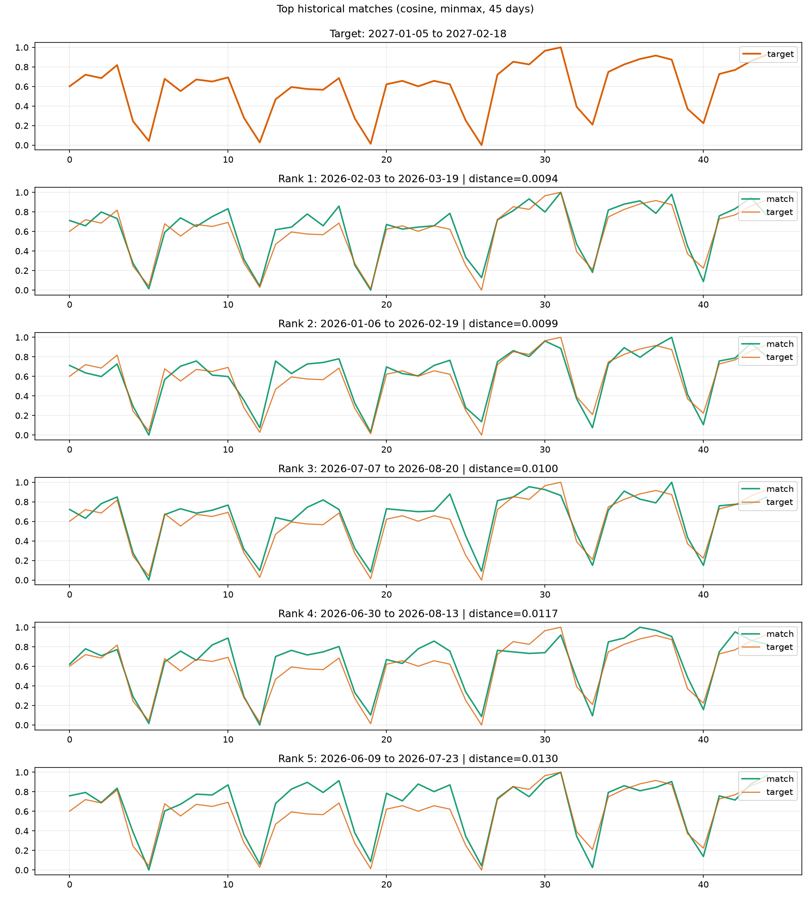

각 방법 내 최적 튜닝 구성:

| 윈도우_길이 | 전처리 | 방법 | top3_rmse_tune | top3_rmse_holdout | ensemble3_rmse_holdout | shape_corr_holdout |
| --- | --- | --- | --- | --- | --- | --- |
| 45 | minmax | cosine | 0.055545 | 0.107222 | 0.103230 | 0.967472 |
| 45 | zscore | euclidean | 0.056415 | 0.107222 | 0.103230 | 0.967472 |
| 45 | minmax | correlation | 0.056415 | 0.107222 | 0.103230 | 0.967472 |
| 30 | minmax | hybrid_warp | 0.059173 | 0.094474 | 0.087344 | 0.966706 |
| 45 | log_zscore | hybrid_shape | 0.059259 | 0.108352 | 0.101629 | 0.967127 |
| 45 | zscore | hybrid | 0.060631 | 0.103831 | 0.099229 | 0.966753 |
| 30 | relative_mean | cnn_pool4_seed19 | 0.060895 | 0.108146 | 0.101339 | 0.959664 |
| 30 | minmax | dtw_0.05 | 0.061389 | 0.083457 | 0.074838 | 0.962893 |
| 30 | minmax | dtw_0.30 | 0.061389 | 0.083457 | 0.074838 | 0.962893 |
| 30 | minmax | dtw_0.15 | 0.061389 | 0.083457 | 0.074838 | 0.962893 |
| 30 | detrended_zscore | feature | 0.066317 | 0.134912 | 0.126573 | 0.932550 |
| 45 | zscore | cnn_pool4_seed7 | 0.068518 | 0.142511 | 0.125240 | 0.643468 |
| 30 | relative_mean | cnn_pool1_seed7 | 0.082522 | 0.126207 | 0.115952 | 0.957335 |
| 30 | smooth3_zscore | weekday_recent | 0.084283 | 0.102571 | 0.096765 | 0.935070 |
| 30 | zscore | cnn_pool1_seed19 | 0.122330 | 0.151077 | 0.130512 | 0.956769 |
| 75 | smooth14_zscore | recent | 0.229921 | 0.278781 | 0.276175 | 0.289823 |


선택 방법의 쿼리 수준 결과(7일 및 14일 예측 기간):

| 쿼리_종료일 | 분할 | 예측_기간 | top1_rmse | top3_rmse | ensemble3_rmse | shape_corr |
| --- | --- | --- | --- | --- | --- | --- |
| 2026-09-12 | tune | 7 | 0.045150 | 0.043609 | 0.018016 | 0.957282 |
| 2026-09-12 | tune | 14 | 0.047427 | 0.056543 | 0.040395 | 0.957282 |
| 2026-09-26 | tune | 7 | 0.095330 | 0.078746 | 0.058211 | 0.968756 |
| 2026-09-26 | tune | 14 | 0.124428 | 0.095654 | 0.071297 | 0.968756 |
| 2026-10-10 | tune | 7 | 0.033485 | 0.031315 | 0.021229 | 0.956406 |
| 2026-10-10 | tune | 14 | 0.054777 | 0.049956 | 0.041756 | 0.956406 |
| 2026-10-24 | tune | 7 | 0.050942 | 0.052001 | 0.027510 | 0.971399 |
| 2026-10-24 | tune | 14 | 0.064394 | 0.059552 | 0.036471 | 0.971399 |
| 2026-11-07 | tune | 7 | 0.082106 | 0.065338 | 0.031020 | 0.960929 |
| 2026-11-07 | tune | 14 | 0.070946 | 0.073943 | 0.043132 | 0.960929 |
| 2026-11-21 | tune | 7 | 0.069145 | 0.062762 | 0.048386 | 0.959065 |
| 2026-11-21 | tune | 14 | 0.071275 | 0.062074 | 0.046945 | 0.959065 |
| 2026-12-05 | tune | 7 | 0.051406 | 0.055044 | 0.030822 | 0.969207 |
| 2026-12-05 | tune | 14 | 0.049759 | 0.059605 | 0.035723 | 0.969207 |
| 2026-12-19 | holdout | 7 | 0.036011 | 0.048525 | 0.046309 | 0.968349 |
| 2026-12-19 | holdout | 14 | 0.068647 | 0.090343 | 0.059175 | 0.968349 |
| 2027-01-02 | holdout | 7 | 0.093890 | 0.117348 | 0.110229 | 0.968914 |
| 2027-01-02 | holdout | 14 | 0.116217 | 0.138020 | 0.132051 | 0.968914 |
| 2027-01-16 | holdout | 7 | 0.047620 | 0.064950 | 0.060718 | 0.966740 |
| 2027-01-16 | holdout | 14 | 0.044317 | 0.063317 | 0.054963 | 0.966740 |
| 2027-01-30 | holdout | 7 | 0.197316 | 0.198064 | 0.195662 | 0.965885 |
| 2027-01-30 | holdout | 14 | 0.199764 | 0.200343 | 0.197767 | 0.965885 |


### 초고속 / IP / 지역 (`2450c7d374c3`)

선택: **45 days / minmax / hybrid_shape**. 대상: **2027-01-05 to 2027-02-18**. 아래의 모든 과거 기간은 **초고속 / IP / 지역**에 속합니다.

| 순위 | 시작일 | 종료일 | 거리 | 유사도_점수 | 형태_상관 | 평균_비율 |
| --- | --- | --- | --- | --- | --- | --- |
| 1 | 2026-08-04 | 2026-09-17 | 0.002640 | 0.997367 | 0.952811 | 1.074136 |
| 2 | 2026-07-28 | 2026-09-10 | 0.004620 | 0.995401 | 0.945612 | 1.053132 |
| 3 | 2026-10-27 | 2026-12-10 | 0.016502 | 0.983766 | 0.944743 | 0.990865 |
| 4 | 2026-02-03 | 2026-03-19 | 0.017822 | 0.982490 | 0.942082 | 1.140940 |
| 5 | 2026-07-07 | 2026-08-20 | 0.020462 | 0.979948 | 0.933869 | 1.003729 |


`mean_ratio`는 이 세그먼트 내 후보 평균 / 대상 평균입니다. `distance`는 방법별 값이며 `similarity_score = 1/(1+distance)`는 확률이 아닌 표시 점수입니다. 하이브리드 거리는 적격 풀에 따라 달라집니다. DTW는 이동된 이벤트를 정렬할 수 있으므로 워핑하지 않은 원시 상관관계는 거리에서 예상하는 것보다 낮을 수 있습니다.

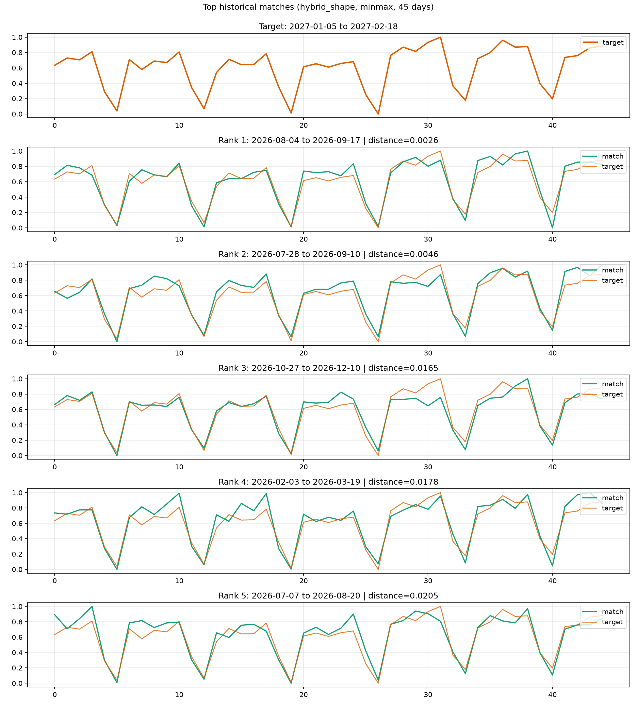

각 방법 내 최적 튜닝 구성:

| 윈도우_길이 | 전처리 | 방법 | top3_rmse_tune | top3_rmse_holdout | ensemble3_rmse_holdout | shape_corr_holdout |
| --- | --- | --- | --- | --- | --- | --- |
| 45 | minmax | hybrid_shape | 0.055787 | 0.087502 | 0.074218 | 0.966999 |
| 45 | minmax | hybrid_warp | 0.057046 | 0.085576 | 0.074638 | 0.965424 |
| 45 | minmax | hybrid | 0.057046 | 0.082007 | 0.070652 | 0.965784 |
| 45 | smooth3_zscore | cosine | 0.058943 | 0.092584 | 0.079621 | 0.967963 |
| 45 | smooth3_zscore | euclidean | 0.058943 | 0.092584 | 0.079621 | 0.967963 |
| 45 | smooth3_zscore | correlation | 0.058943 | 0.092584 | 0.079621 | 0.967963 |
| 45 | log_zscore | dtw_0.30 | 0.059967 | 0.076847 | 0.066723 | 0.962002 |
| 45 | log_zscore | dtw_0.15 | 0.059967 | 0.076847 | 0.066723 | 0.962002 |
| 60 | minmax | dtw_0.05 | 0.061166 | 0.082247 | 0.071697 | 0.953355 |
| 30 | relative_mean | cnn_pool4_seed19 | 0.065348 | 0.088643 | 0.079732 | 0.965869 |
| 30 | relative_mean | cnn_pool4_seed7 | 0.070536 | 0.095039 | 0.076785 | 0.970164 |
| 90 | relative_first | weekday_recent | 0.083625 | 0.084458 | 0.073329 | 0.915409 |
| 30 | relative_mean | cnn_pool1_seed7 | 0.093581 | 0.094928 | 0.086432 | 0.961765 |
| 30 | detrended_zscore | feature | 0.102197 | 0.117111 | 0.098638 | 0.769106 |
| 30 | zscore | cnn_pool1_seed19 | 0.139403 | 0.091415 | 0.073545 | 0.950634 |
| 75 | detrended_zscore | recent | 0.227629 | 0.274321 | 0.271530 | 0.282611 |


선택 방법의 쿼리 수준 결과(7일 및 14일 예측 기간):

| 쿼리_종료일 | 분할 | 예측_기간 | top1_rmse | top3_rmse | ensemble3_rmse | shape_corr |
| --- | --- | --- | --- | --- | --- | --- |
| 2026-09-12 | tune | 7 | 0.060231 | 0.051334 | 0.022617 | 0.956490 |
| 2026-09-12 | tune | 14 | 0.101059 | 0.065192 | 0.050793 | 0.956490 |
| 2026-09-26 | tune | 7 | 0.068672 | 0.067767 | 0.053676 | 0.960000 |
| 2026-09-26 | tune | 14 | 0.067238 | 0.059111 | 0.043766 | 0.960000 |
| 2026-10-10 | tune | 7 | 0.049106 | 0.056962 | 0.038294 | 0.968278 |
| 2026-10-10 | tune | 14 | 0.050889 | 0.062823 | 0.040545 | 0.968278 |
| 2026-10-24 | tune | 7 | 0.045783 | 0.055288 | 0.042064 | 0.965588 |
| 2026-10-24 | tune | 14 | 0.050553 | 0.068514 | 0.058501 | 0.965588 |
| 2026-11-07 | tune | 7 | 0.074022 | 0.058509 | 0.052017 | 0.963529 |
| 2026-11-07 | tune | 14 | 0.057562 | 0.053456 | 0.046286 | 0.963529 |
| 2026-11-21 | tune | 7 | 0.051498 | 0.043156 | 0.030492 | 0.965350 |
| 2026-11-21 | tune | 14 | 0.067476 | 0.073711 | 0.065637 | 0.965350 |
| 2026-12-05 | tune | 7 | 0.050981 | 0.057490 | 0.043970 | 0.956203 |
| 2026-12-05 | tune | 14 | 0.067884 | 0.073713 | 0.043993 | 0.956203 |
| 2026-12-19 | holdout | 7 | 0.027960 | 0.052239 | 0.029094 | 0.959767 |
| 2026-12-19 | holdout | 14 | 0.045616 | 0.059695 | 0.034494 | 0.959767 |
| 2027-01-02 | holdout | 7 | 0.047518 | 0.065525 | 0.049847 | 0.969012 |
| 2027-01-02 | holdout | 14 | 0.055875 | 0.069297 | 0.054473 | 0.969012 |
| 2027-01-16 | holdout | 7 | 0.053667 | 0.076752 | 0.066204 | 0.966592 |
| 2027-01-16 | holdout | 14 | 0.052871 | 0.080345 | 0.071426 | 0.966592 |
| 2027-01-30 | holdout | 7 | 0.126844 | 0.155492 | 0.151725 | 0.972624 |
| 2027-01-30 | holdout | 14 | 0.106388 | 0.145927 | 0.139988 | 0.972624 |


### 초고속 / IP / 직접 (`e3c548d25a7c`)

선택: **30 days / smooth14_zscore / hybrid_shape**. 대상: **2027-01-20 to 2027-02-18**. 아래의 모든 과거 기간은 **초고속 / IP / 직접**에 속합니다.

| 순위 | 시작일 | 종료일 | 거리 | 유사도_점수 | 형태_상관 | 평균_비율 |
| --- | --- | --- | --- | --- | --- | --- |
| 1 | 2026-02-18 | 2026-03-19 | 0.000000 | 1.000000 | 0.947424 | 1.105344 |
| 2 | 2026-01-21 | 2026-02-19 | 0.006471 | 0.993571 | 0.949117 | 0.961395 |
| 3 | 2026-01-28 | 2026-02-26 | 0.011176 | 0.988947 | 0.954656 | 1.001028 |
| 4 | 2026-11-18 | 2026-12-17 | 0.011176 | 0.988947 | 0.967032 | 1.082220 |
| 5 | 2026-08-12 | 2026-09-10 | 0.016471 | 0.983796 | 0.958726 | 1.105730 |


`mean_ratio`는 이 세그먼트 내 후보 평균 / 대상 평균입니다. `distance`는 방법별 값이며 `similarity_score = 1/(1+distance)`는 확률이 아닌 표시 점수입니다. 하이브리드 거리는 적격 풀에 따라 달라집니다. DTW는 이동된 이벤트를 정렬할 수 있으므로 워핑하지 않은 원시 상관관계는 거리에서 예상하는 것보다 낮을 수 있습니다.


각 방법 내 최적 튜닝 구성:

| 윈도우_길이 | 전처리 | 방법 | top3_rmse_tune | top3_rmse_holdout | ensemble3_rmse_holdout | shape_corr_holdout |
| --- | --- | --- | --- | --- | --- | --- |
| 30 | smooth14_zscore | hybrid_shape | 0.059136 | 0.102484 | 0.085148 | 0.955716 |
| 30 | smooth14_zscore | euclidean | 0.059136 | 0.097826 | 0.080860 | 0.955716 |
| 30 | smooth14_zscore | cosine | 0.059136 | 0.097826 | 0.080860 | 0.955716 |
| 30 | smooth14_zscore | correlation | 0.059136 | 0.097826 | 0.080860 | 0.955716 |
| 30 | smooth14_zscore | hybrid | 0.059519 | 0.104512 | 0.087127 | 0.957504 |
| 30 | log_zscore | hybrid_warp | 0.059599 | 0.099989 | 0.088911 | 0.968909 |
| 30 | log_zscore | dtw_0.30 | 0.060089 | 0.100745 | 0.089269 | 0.968909 |
| 30 | log_zscore | dtw_0.15 | 0.060089 | 0.100745 | 0.089269 | 0.968909 |
| 30 | log_zscore | dtw_0.05 | 0.060089 | 0.099989 | 0.088911 | 0.968909 |
| 45 | relative_mean | cnn_pool4_seed19 | 0.064888 | 0.113329 | 0.104916 | 0.796441 |
| 75 | zscore | cnn_pool4_seed7 | 0.070742 | 0.167050 | 0.138039 | 0.768546 |
| 90 | log_zscore | weekday_recent | 0.075958 | 0.145410 | 0.137765 | 0.879137 |
| 30 | relative_mean | feature | 0.079280 | 0.159988 | 0.152041 | 0.787878 |
| 30 | zscore | cnn_pool1_seed19 | 0.109835 | 0.186881 | 0.160281 | 0.626132 |
| 30 | relative_mean | cnn_pool1_seed7 | 0.110986 | 0.175137 | 0.165420 | 0.616857 |
| 75 | difference_zscore | recent | 0.230165 | 0.288865 | 0.286227 | 0.260682 |


선택 방법의 쿼리 수준 결과(7일 및 14일 예측 기간):

| 쿼리_종료일 | 분할 | 예측_기간 | top1_rmse | top3_rmse | ensemble3_rmse | shape_corr |
| --- | --- | --- | --- | --- | --- | --- |
| 2026-09-12 | tune | 7 | 0.044905 | 0.064616 | 0.053918 | 0.940861 |
| 2026-09-12 | tune | 14 | 0.135061 | 0.099479 | 0.091605 | 0.940861 |
| 2026-09-26 | tune | 7 | 0.083031 | 0.078381 | 0.062542 | 0.957735 |
| 2026-09-26 | tune | 14 | 0.098931 | 0.083612 | 0.063820 | 0.957735 |
| 2026-10-10 | tune | 7 | 0.039722 | 0.056462 | 0.041639 | 0.965278 |
| 2026-10-10 | tune | 14 | 0.044777 | 0.054376 | 0.042712 | 0.965278 |
| 2026-10-24 | tune | 7 | 0.050254 | 0.053664 | 0.033728 | 0.960383 |
| 2026-10-24 | tune | 14 | 0.056486 | 0.055485 | 0.041237 | 0.960383 |
| 2026-11-07 | tune | 7 | 0.030651 | 0.055349 | 0.037262 | 0.972479 |
| 2026-11-07 | tune | 14 | 0.053147 | 0.066841 | 0.050497 | 0.972479 |
| 2026-11-21 | tune | 7 | 0.025840 | 0.043255 | 0.020389 | 0.960130 |
| 2026-11-21 | tune | 14 | 0.055044 | 0.075382 | 0.063952 | 0.960130 |
| 2026-12-05 | tune | 7 | 0.039390 | 0.062226 | 0.050253 | 0.953174 |
| 2026-12-05 | tune | 14 | 0.043304 | 0.061289 | 0.046828 | 0.953174 |
| 2026-12-19 | holdout | 7 | 0.058871 | 0.043114 | 0.029913 | 0.959001 |
| 2026-12-19 | holdout | 14 | 0.165090 | 0.098131 | 0.075776 | 0.959001 |
| 2027-01-02 | holdout | 7 | 0.102295 | 0.117974 | 0.114962 | 0.957593 |
| 2027-01-02 | holdout | 14 | 0.113190 | 0.122092 | 0.119002 | 0.957593 |
| 2027-01-16 | holdout | 7 | 0.072843 | 0.116813 | 0.066422 | 0.945151 |
| 2027-01-16 | holdout | 14 | 0.057420 | 0.117156 | 0.078394 | 0.945151 |
| 2027-01-30 | holdout | 7 | 0.107531 | 0.132033 | 0.129297 | 0.961120 |
| 2027-01-30 | holdout | 14 | 0.083713 | 0.120003 | 0.113706 | 0.961120 |


## 요일 인지 DTW 후속 분석

앞서 정의한 6개 정제를 각 리프 세그먼트에서 다시 실행했습니다. z-점수 또는 최소-최대 방식을 사용하는 45일, 15% 밴드 DTW에 시작 요일이 일치하지 않을 때 백분위 거리에 0.25/0.50/1.00을 더하는 방식입니다. 이들은 진단용 대안으로 남으며 주 그리드 승자를 대체하지 않습니다. 설계는 이전 집계 시각 검토에서 비롯되었으므로 독립적인 확증 근거가 아닙니다. 아래 각 행은 튜닝 쿼리 7개 또는 홀드아웃 쿼리 4개의 결과를 평균 내거나, 최신 대상의 형태 상관관계(미래 오류는 없음)를 보고합니다.

| 세그먼트_ID | 서비스 | 서비스_하위 | 채널 | preprocessing | penalty | split | top3_rmse | shape_corr |
| --- | --- | --- | --- | --- | --- | --- | --- | --- |
| 0989766617fb | 방송 | IP | 직접 | minmax | 0.250000 | holdout | 0.083851 | 0.960603 |
| 0989766617fb | 방송 | IP | 직접 | minmax | 0.250000 | latest | — | 0.951387 |
| 0989766617fb | 방송 | IP | 직접 | minmax | 0.250000 | tune | 0.066717 | 0.960161 |
| 0989766617fb | 방송 | IP | 직접 | minmax | 0.500000 | holdout | 0.083851 | 0.960603 |
| 0989766617fb | 방송 | IP | 직접 | minmax | 0.500000 | latest | — | 0.951387 |
| 0989766617fb | 방송 | IP | 직접 | minmax | 0.500000 | tune | 0.066717 | 0.960161 |
| 0989766617fb | 방송 | IP | 직접 | minmax | 1.000000 | holdout | 0.083851 | 0.960603 |
| 0989766617fb | 방송 | IP | 직접 | minmax | 1.000000 | latest | — | 0.951387 |
| 0989766617fb | 방송 | IP | 직접 | minmax | 1.000000 | tune | 0.066717 | 0.960161 |
| 0989766617fb | 방송 | IP | 직접 | zscore | 0.250000 | holdout | 0.094997 | 0.955449 |
| 0989766617fb | 방송 | IP | 직접 | zscore | 0.250000 | latest | — | 0.954196 |
| 0989766617fb | 방송 | IP | 직접 | zscore | 0.250000 | tune | 0.060358 | 0.959359 |
| 0989766617fb | 방송 | IP | 직접 | zscore | 0.500000 | holdout | 0.094997 | 0.955449 |
| 0989766617fb | 방송 | IP | 직접 | zscore | 0.500000 | latest | — | 0.954196 |
| 0989766617fb | 방송 | IP | 직접 | zscore | 0.500000 | tune | 0.060358 | 0.959359 |
| 0989766617fb | 방송 | IP | 직접 | zscore | 1.000000 | holdout | 0.094997 | 0.955449 |
| 0989766617fb | 방송 | IP | 직접 | zscore | 1.000000 | latest | — | 0.954196 |
| 0989766617fb | 방송 | IP | 직접 | zscore | 1.000000 | tune | 0.060358 | 0.959359 |
| 0a5bf90d7c42 | 방송 | CA | 지역 | minmax | 0.250000 | holdout | 0.099619 | 0.963114 |
| 0a5bf90d7c42 | 방송 | CA | 지역 | minmax | 0.250000 | latest | — | 0.956913 |
| 0a5bf90d7c42 | 방송 | CA | 지역 | minmax | 0.250000 | tune | 0.063306 | 0.959975 |
| 0a5bf90d7c42 | 방송 | CA | 지역 | minmax | 0.500000 | holdout | 0.099619 | 0.963114 |
| 0a5bf90d7c42 | 방송 | CA | 지역 | minmax | 0.500000 | latest | — | 0.956913 |
| 0a5bf90d7c42 | 방송 | CA | 지역 | minmax | 0.500000 | tune | 0.063306 | 0.959975 |
| 0a5bf90d7c42 | 방송 | CA | 지역 | minmax | 1.000000 | holdout | 0.099619 | 0.963114 |
| 0a5bf90d7c42 | 방송 | CA | 지역 | minmax | 1.000000 | latest | — | 0.956913 |
| 0a5bf90d7c42 | 방송 | CA | 지역 | minmax | 1.000000 | tune | 0.063306 | 0.959975 |
| 0a5bf90d7c42 | 방송 | CA | 지역 | zscore | 0.250000 | holdout | 0.087611 | 0.967345 |
| 0a5bf90d7c42 | 방송 | CA | 지역 | zscore | 0.250000 | latest | — | 0.946786 |
| 0a5bf90d7c42 | 방송 | CA | 지역 | zscore | 0.250000 | tune | 0.063373 | 0.962941 |
| 0a5bf90d7c42 | 방송 | CA | 지역 | zscore | 0.500000 | holdout | 0.087611 | 0.967345 |
| 0a5bf90d7c42 | 방송 | CA | 지역 | zscore | 0.500000 | latest | — | 0.946786 |
| 0a5bf90d7c42 | 방송 | CA | 지역 | zscore | 0.500000 | tune | 0.063373 | 0.962941 |
| 0a5bf90d7c42 | 방송 | CA | 지역 | zscore | 1.000000 | holdout | 0.087611 | 0.967345 |
| 0a5bf90d7c42 | 방송 | CA | 지역 | zscore | 1.000000 | latest | — | 0.946786 |
| 0a5bf90d7c42 | 방송 | CA | 지역 | zscore | 1.000000 | tune | 0.063373 | 0.962941 |
| 0c0eb13f2ab3 | 방송 | CA | 직접 | minmax | 0.250000 | holdout | 0.101289 | 0.964852 |
| 0c0eb13f2ab3 | 방송 | CA | 직접 | minmax | 0.250000 | latest | — | 0.951670 |
| 0c0eb13f2ab3 | 방송 | CA | 직접 | minmax | 0.250000 | tune | 0.062820 | 0.958898 |
| 0c0eb13f2ab3 | 방송 | CA | 직접 | minmax | 0.500000 | holdout | 0.101289 | 0.964852 |
| 0c0eb13f2ab3 | 방송 | CA | 직접 | minmax | 0.500000 | latest | — | 0.951670 |
| 0c0eb13f2ab3 | 방송 | CA | 직접 | minmax | 0.500000 | tune | 0.062820 | 0.958898 |
| 0c0eb13f2ab3 | 방송 | CA | 직접 | minmax | 1.000000 | holdout | 0.101289 | 0.964852 |
| 0c0eb13f2ab3 | 방송 | CA | 직접 | minmax | 1.000000 | latest | — | 0.951670 |
| 0c0eb13f2ab3 | 방송 | CA | 직접 | minmax | 1.000000 | tune | 0.062820 | 0.958898 |
| 0c0eb13f2ab3 | 방송 | CA | 직접 | zscore | 0.250000 | holdout | 0.100672 | 0.955814 |
| 0c0eb13f2ab3 | 방송 | CA | 직접 | zscore | 0.250000 | latest | — | 0.942970 |
| 0c0eb13f2ab3 | 방송 | CA | 직접 | zscore | 0.250000 | tune | 0.057063 | 0.964188 |
| 0c0eb13f2ab3 | 방송 | CA | 직접 | zscore | 0.500000 | holdout | 0.100672 | 0.955814 |
| 0c0eb13f2ab3 | 방송 | CA | 직접 | zscore | 0.500000 | latest | — | 0.942970 |
| 0c0eb13f2ab3 | 방송 | CA | 직접 | zscore | 0.500000 | tune | 0.057063 | 0.964188 |
| 0c0eb13f2ab3 | 방송 | CA | 직접 | zscore | 1.000000 | holdout | 0.100672 | 0.955814 |
| 0c0eb13f2ab3 | 방송 | CA | 직접 | zscore | 1.000000 | latest | — | 0.942970 |
| 0c0eb13f2ab3 | 방송 | CA | 직접 | zscore | 1.000000 | tune | 0.057063 | 0.964188 |
| 0e3afcaf0299 | 초고속 | IP | 도매 | minmax | 0.250000 | holdout | 0.100499 | 0.959297 |
| 0e3afcaf0299 | 초고속 | IP | 도매 | minmax | 0.250000 | latest | — | 0.945220 |
| 0e3afcaf0299 | 초고속 | IP | 도매 | minmax | 0.250000 | tune | 0.070865 | 0.957798 |
| 0e3afcaf0299 | 초고속 | IP | 도매 | minmax | 0.500000 | holdout | 0.100499 | 0.959297 |
| 0e3afcaf0299 | 초고속 | IP | 도매 | minmax | 0.500000 | latest | — | 0.945220 |
| 0e3afcaf0299 | 초고속 | IP | 도매 | minmax | 0.500000 | tune | 0.070865 | 0.957798 |
| 0e3afcaf0299 | 초고속 | IP | 도매 | minmax | 1.000000 | holdout | 0.100499 | 0.959297 |
| 0e3afcaf0299 | 초고속 | IP | 도매 | minmax | 1.000000 | latest | — | 0.945220 |
| 0e3afcaf0299 | 초고속 | IP | 도매 | minmax | 1.000000 | tune | 0.070865 | 0.957798 |
| 0e3afcaf0299 | 초고속 | IP | 도매 | zscore | 0.250000 | holdout | 0.102228 | 0.966753 |
| 0e3afcaf0299 | 초고속 | IP | 도매 | zscore | 0.250000 | latest | — | 0.945220 |
| 0e3afcaf0299 | 초고속 | IP | 도매 | zscore | 0.250000 | tune | 0.066647 | 0.963002 |
| 0e3afcaf0299 | 초고속 | IP | 도매 | zscore | 0.500000 | holdout | 0.102228 | 0.966753 |
| 0e3afcaf0299 | 초고속 | IP | 도매 | zscore | 0.500000 | latest | — | 0.945220 |
| 0e3afcaf0299 | 초고속 | IP | 도매 | zscore | 0.500000 | tune | 0.066647 | 0.963002 |
| 0e3afcaf0299 | 초고속 | IP | 도매 | zscore | 1.000000 | holdout | 0.102228 | 0.966753 |
| 0e3afcaf0299 | 초고속 | IP | 도매 | zscore | 1.000000 | latest | — | 0.945220 |
| 0e3afcaf0299 | 초고속 | IP | 도매 | zscore | 1.000000 | tune | 0.066647 | 0.963002 |
| 18352c78631e | 방송 | CA | SKT | minmax | 0.250000 | holdout | 0.107449 | 0.952712 |
| 18352c78631e | 방송 | CA | SKT | minmax | 0.250000 | latest | — | 0.938317 |
| 18352c78631e | 방송 | CA | SKT | minmax | 0.250000 | tune | 0.057190 | 0.954803 |
| 18352c78631e | 방송 | CA | SKT | minmax | 0.500000 | holdout | 0.107449 | 0.952712 |
| 18352c78631e | 방송 | CA | SKT | minmax | 0.500000 | latest | — | 0.938317 |
| 18352c78631e | 방송 | CA | SKT | minmax | 0.500000 | tune | 0.057190 | 0.954803 |
| 18352c78631e | 방송 | CA | SKT | minmax | 1.000000 | holdout | 0.107449 | 0.952712 |
| 18352c78631e | 방송 | CA | SKT | minmax | 1.000000 | latest | — | 0.938317 |
| 18352c78631e | 방송 | CA | SKT | minmax | 1.000000 | tune | 0.057190 | 0.954803 |
| 18352c78631e | 방송 | CA | SKT | zscore | 0.250000 | holdout | 0.098433 | 0.963571 |
| 18352c78631e | 방송 | CA | SKT | zscore | 0.250000 | latest | — | 0.945799 |
| 18352c78631e | 방송 | CA | SKT | zscore | 0.250000 | tune | 0.068839 | 0.962751 |
| 18352c78631e | 방송 | CA | SKT | zscore | 0.500000 | holdout | 0.098433 | 0.963571 |
| 18352c78631e | 방송 | CA | SKT | zscore | 0.500000 | latest | — | 0.945799 |
| 18352c78631e | 방송 | CA | SKT | zscore | 0.500000 | tune | 0.068839 | 0.962751 |
| 18352c78631e | 방송 | CA | SKT | zscore | 1.000000 | holdout | 0.098433 | 0.963571 |
| 18352c78631e | 방송 | CA | SKT | zscore | 1.000000 | latest | — | 0.945799 |
| 18352c78631e | 방송 | CA | SKT | zscore | 1.000000 | tune | 0.068839 | 0.962751 |
| 20cf95d205c3 | 초고속 | IP | SKT | minmax | 0.250000 | holdout | 0.100759 | 0.962577 |
| 20cf95d205c3 | 초고속 | IP | SKT | minmax | 0.250000 | latest | — | 0.938851 |
| 20cf95d205c3 | 초고속 | IP | SKT | minmax | 0.250000 | tune | 0.068634 | 0.960153 |
| 20cf95d205c3 | 초고속 | IP | SKT | minmax | 0.500000 | holdout | 0.100759 | 0.962577 |
| 20cf95d205c3 | 초고속 | IP | SKT | minmax | 0.500000 | latest | — | 0.938851 |
| 20cf95d205c3 | 초고속 | IP | SKT | minmax | 0.500000 | tune | 0.068634 | 0.960153 |
| 20cf95d205c3 | 초고속 | IP | SKT | minmax | 1.000000 | holdout | 0.100759 | 0.962577 |
| 20cf95d205c3 | 초고속 | IP | SKT | minmax | 1.000000 | latest | — | 0.938851 |
| 20cf95d205c3 | 초고속 | IP | SKT | minmax | 1.000000 | tune | 0.068634 | 0.960153 |
| 20cf95d205c3 | 초고속 | IP | SKT | zscore | 0.250000 | holdout | 0.100759 | 0.961836 |
| 20cf95d205c3 | 초고속 | IP | SKT | zscore | 0.250000 | latest | — | 0.935781 |
| 20cf95d205c3 | 초고속 | IP | SKT | zscore | 0.250000 | tune | 0.068273 | 0.962353 |
| 20cf95d205c3 | 초고속 | IP | SKT | zscore | 0.500000 | holdout | 0.100759 | 0.961836 |
| 20cf95d205c3 | 초고속 | IP | SKT | zscore | 0.500000 | latest | — | 0.935781 |
| 20cf95d205c3 | 초고속 | IP | SKT | zscore | 0.500000 | tune | 0.068273 | 0.962353 |
| 20cf95d205c3 | 초고속 | IP | SKT | zscore | 1.000000 | holdout | 0.100759 | 0.961836 |
| 20cf95d205c3 | 초고속 | IP | SKT | zscore | 1.000000 | latest | — | 0.935781 |
| 20cf95d205c3 | 초고속 | IP | SKT | zscore | 1.000000 | tune | 0.068273 | 0.962353 |
| 230825814f5c | 초고속 | IP | HnS | minmax | 0.250000 | holdout | 0.113869 | 0.958403 |
| 230825814f5c | 초고속 | IP | HnS | minmax | 0.250000 | latest | — | 0.951130 |
| 230825814f5c | 초고속 | IP | HnS | minmax | 0.250000 | tune | 0.062897 | 0.959981 |
| 230825814f5c | 초고속 | IP | HnS | minmax | 0.500000 | holdout | 0.113869 | 0.958403 |
| 230825814f5c | 초고속 | IP | HnS | minmax | 0.500000 | latest | — | 0.951130 |
| 230825814f5c | 초고속 | IP | HnS | minmax | 0.500000 | tune | 0.062897 | 0.959981 |
| 230825814f5c | 초고속 | IP | HnS | minmax | 1.000000 | holdout | 0.113869 | 0.958403 |
| 230825814f5c | 초고속 | IP | HnS | minmax | 1.000000 | latest | — | 0.951130 |
| 230825814f5c | 초고속 | IP | HnS | minmax | 1.000000 | tune | 0.062897 | 0.959981 |
| 230825814f5c | 초고속 | IP | HnS | zscore | 0.250000 | holdout | 0.106855 | 0.958403 |
| 230825814f5c | 초고속 | IP | HnS | zscore | 0.250000 | latest | — | 0.933173 |
| 230825814f5c | 초고속 | IP | HnS | zscore | 0.250000 | tune | 0.067907 | 0.960914 |
| 230825814f5c | 초고속 | IP | HnS | zscore | 0.500000 | holdout | 0.106855 | 0.958403 |
| 230825814f5c | 초고속 | IP | HnS | zscore | 0.500000 | latest | — | 0.933173 |
| 230825814f5c | 초고속 | IP | HnS | zscore | 0.500000 | tune | 0.067907 | 0.960914 |
| 230825814f5c | 초고속 | IP | HnS | zscore | 1.000000 | holdout | 0.106855 | 0.958403 |
| 230825814f5c | 초고속 | IP | HnS | zscore | 1.000000 | latest | — | 0.933173 |
| 230825814f5c | 초고속 | IP | HnS | zscore | 1.000000 | tune | 0.067907 | 0.960914 |
| 2450c7d374c3 | 초고속 | IP | 지역 | minmax | 0.250000 | holdout | 0.080870 | 0.965424 |
| 2450c7d374c3 | 초고속 | IP | 지역 | minmax | 0.250000 | latest | — | 0.945612 |
| 2450c7d374c3 | 초고속 | IP | 지역 | minmax | 0.250000 | tune | 0.057046 | 0.962029 |
| 2450c7d374c3 | 초고속 | IP | 지역 | minmax | 0.500000 | holdout | 0.080870 | 0.965424 |
| 2450c7d374c3 | 초고속 | IP | 지역 | minmax | 0.500000 | latest | — | 0.945612 |
| 2450c7d374c3 | 초고속 | IP | 지역 | minmax | 0.500000 | tune | 0.057046 | 0.962029 |
| 2450c7d374c3 | 초고속 | IP | 지역 | minmax | 1.000000 | holdout | 0.080870 | 0.965424 |
| 2450c7d374c3 | 초고속 | IP | 지역 | minmax | 1.000000 | latest | — | 0.945612 |
| 2450c7d374c3 | 초고속 | IP | 지역 | minmax | 1.000000 | tune | 0.057046 | 0.962029 |
| 2450c7d374c3 | 초고속 | IP | 지역 | zscore | 0.250000 | holdout | 0.079712 | 0.966041 |
| 2450c7d374c3 | 초고속 | IP | 지역 | zscore | 0.250000 | latest | — | 0.945612 |
| 2450c7d374c3 | 초고속 | IP | 지역 | zscore | 0.250000 | tune | 0.063213 | 0.961743 |
| 2450c7d374c3 | 초고속 | IP | 지역 | zscore | 0.500000 | holdout | 0.079712 | 0.966041 |
| 2450c7d374c3 | 초고속 | IP | 지역 | zscore | 0.500000 | latest | — | 0.945612 |
| 2450c7d374c3 | 초고속 | IP | 지역 | zscore | 0.500000 | tune | 0.063213 | 0.961743 |
| 2450c7d374c3 | 초고속 | IP | 지역 | zscore | 1.000000 | holdout | 0.079712 | 0.966041 |
| 2450c7d374c3 | 초고속 | IP | 지역 | zscore | 1.000000 | latest | — | 0.945612 |
| 2450c7d374c3 | 초고속 | IP | 지역 | zscore | 1.000000 | tune | 0.063213 | 0.961743 |
| 40c7ebecf537 | 초고속 | CA | HnS | minmax | 0.250000 | holdout | 0.098214 | 0.963849 |
| 40c7ebecf537 | 초고속 | CA | HnS | minmax | 0.250000 | latest | — | 0.940823 |
| 40c7ebecf537 | 초고속 | CA | HnS | minmax | 0.250000 | tune | 0.068646 | 0.960080 |
| 40c7ebecf537 | 초고속 | CA | HnS | minmax | 0.500000 | holdout | 0.098214 | 0.963849 |
| 40c7ebecf537 | 초고속 | CA | HnS | minmax | 0.500000 | latest | — | 0.940823 |
| 40c7ebecf537 | 초고속 | CA | HnS | minmax | 0.500000 | tune | 0.068646 | 0.960080 |
| 40c7ebecf537 | 초고속 | CA | HnS | minmax | 1.000000 | holdout | 0.098214 | 0.963849 |
| 40c7ebecf537 | 초고속 | CA | HnS | minmax | 1.000000 | latest | — | 0.940823 |
| 40c7ebecf537 | 초고속 | CA | HnS | minmax | 1.000000 | tune | 0.068646 | 0.960080 |
| 40c7ebecf537 | 초고속 | CA | HnS | zscore | 0.250000 | holdout | 0.099061 | 0.965044 |
| 40c7ebecf537 | 초고속 | CA | HnS | zscore | 0.250000 | latest | — | 0.942519 |
| 40c7ebecf537 | 초고속 | CA | HnS | zscore | 0.250000 | tune | 0.063000 | 0.959553 |
| 40c7ebecf537 | 초고속 | CA | HnS | zscore | 0.500000 | holdout | 0.099061 | 0.965044 |
| 40c7ebecf537 | 초고속 | CA | HnS | zscore | 0.500000 | latest | — | 0.942519 |
| 40c7ebecf537 | 초고속 | CA | HnS | zscore | 0.500000 | tune | 0.063000 | 0.959553 |
| 40c7ebecf537 | 초고속 | CA | HnS | zscore | 1.000000 | holdout | 0.099061 | 0.965044 |
| 40c7ebecf537 | 초고속 | CA | HnS | zscore | 1.000000 | latest | — | 0.942519 |
| 40c7ebecf537 | 초고속 | CA | HnS | zscore | 1.000000 | tune | 0.063000 | 0.959553 |
| 579b43ec1eda | 방송 | IP | 지역 | minmax | 0.250000 | holdout | 0.091604 | 0.967598 |
| 579b43ec1eda | 방송 | IP | 지역 | minmax | 0.250000 | latest | — | 0.962412 |
| 579b43ec1eda | 방송 | IP | 지역 | minmax | 0.250000 | tune | 0.075940 | 0.953809 |
| 579b43ec1eda | 방송 | IP | 지역 | minmax | 0.500000 | holdout | 0.091604 | 0.967598 |
| 579b43ec1eda | 방송 | IP | 지역 | minmax | 0.500000 | latest | — | 0.962412 |
| 579b43ec1eda | 방송 | IP | 지역 | minmax | 0.500000 | tune | 0.075940 | 0.953809 |
| 579b43ec1eda | 방송 | IP | 지역 | minmax | 1.000000 | holdout | 0.091604 | 0.967598 |
| 579b43ec1eda | 방송 | IP | 지역 | minmax | 1.000000 | latest | — | 0.962412 |
| 579b43ec1eda | 방송 | IP | 지역 | minmax | 1.000000 | tune | 0.075940 | 0.953809 |
| 579b43ec1eda | 방송 | IP | 지역 | zscore | 0.250000 | holdout | 0.093347 | 0.966640 |
| 579b43ec1eda | 방송 | IP | 지역 | zscore | 0.250000 | latest | — | 0.962412 |
| 579b43ec1eda | 방송 | IP | 지역 | zscore | 0.250000 | tune | 0.063058 | 0.957356 |
| 579b43ec1eda | 방송 | IP | 지역 | zscore | 0.500000 | holdout | 0.093347 | 0.966640 |
| 579b43ec1eda | 방송 | IP | 지역 | zscore | 0.500000 | latest | — | 0.962412 |
| 579b43ec1eda | 방송 | IP | 지역 | zscore | 0.500000 | tune | 0.063058 | 0.957356 |
| 579b43ec1eda | 방송 | IP | 지역 | zscore | 1.000000 | holdout | 0.093347 | 0.966640 |
| 579b43ec1eda | 방송 | IP | 지역 | zscore | 1.000000 | latest | — | 0.962412 |
| 579b43ec1eda | 방송 | IP | 지역 | zscore | 1.000000 | tune | 0.063058 | 0.957356 |
| 63ea07e8f506 | 방송 | IP | SKT | minmax | 0.250000 | holdout | 0.103912 | 0.954641 |
| 63ea07e8f506 | 방송 | IP | SKT | minmax | 0.250000 | latest | — | 0.963809 |
| 63ea07e8f506 | 방송 | IP | SKT | minmax | 0.250000 | tune | 0.078349 | 0.957470 |
| 63ea07e8f506 | 방송 | IP | SKT | minmax | 0.500000 | holdout | 0.103912 | 0.954641 |
| 63ea07e8f506 | 방송 | IP | SKT | minmax | 0.500000 | latest | — | 0.963809 |
| 63ea07e8f506 | 방송 | IP | SKT | minmax | 0.500000 | tune | 0.078349 | 0.957470 |
| 63ea07e8f506 | 방송 | IP | SKT | minmax | 1.000000 | holdout | 0.103912 | 0.954641 |
| 63ea07e8f506 | 방송 | IP | SKT | minmax | 1.000000 | latest | — | 0.963809 |
| 63ea07e8f506 | 방송 | IP | SKT | minmax | 1.000000 | tune | 0.078349 | 0.957470 |
| 63ea07e8f506 | 방송 | IP | SKT | zscore | 0.250000 | holdout | 0.101955 | 0.958991 |
| 63ea07e8f506 | 방송 | IP | SKT | zscore | 0.250000 | latest | — | 0.963809 |
| 63ea07e8f506 | 방송 | IP | SKT | zscore | 0.250000 | tune | 0.072817 | 0.953497 |
| 63ea07e8f506 | 방송 | IP | SKT | zscore | 0.500000 | holdout | 0.101955 | 0.958991 |
| 63ea07e8f506 | 방송 | IP | SKT | zscore | 0.500000 | latest | — | 0.963809 |
| 63ea07e8f506 | 방송 | IP | SKT | zscore | 0.500000 | tune | 0.072817 | 0.953497 |
| 63ea07e8f506 | 방송 | IP | SKT | zscore | 1.000000 | holdout | 0.101955 | 0.958991 |
| 63ea07e8f506 | 방송 | IP | SKT | zscore | 1.000000 | latest | — | 0.963809 |
| 63ea07e8f506 | 방송 | IP | SKT | zscore | 1.000000 | tune | 0.072817 | 0.953497 |
| 66c47cd90c08 | 방송 | CA | 도매 | minmax | 0.250000 | holdout | 0.098101 | 0.951788 |
| 66c47cd90c08 | 방송 | CA | 도매 | minmax | 0.250000 | latest | — | 0.953432 |
| 66c47cd90c08 | 방송 | CA | 도매 | minmax | 0.250000 | tune | 0.062022 | 0.959903 |
| 66c47cd90c08 | 방송 | CA | 도매 | minmax | 0.500000 | holdout | 0.098101 | 0.951788 |
| 66c47cd90c08 | 방송 | CA | 도매 | minmax | 0.500000 | latest | — | 0.953432 |
| 66c47cd90c08 | 방송 | CA | 도매 | minmax | 0.500000 | tune | 0.062022 | 0.959903 |
| 66c47cd90c08 | 방송 | CA | 도매 | minmax | 1.000000 | holdout | 0.098101 | 0.951788 |
| 66c47cd90c08 | 방송 | CA | 도매 | minmax | 1.000000 | latest | — | 0.953432 |
| 66c47cd90c08 | 방송 | CA | 도매 | minmax | 1.000000 | tune | 0.062022 | 0.959903 |
| 66c47cd90c08 | 방송 | CA | 도매 | zscore | 0.250000 | holdout | 0.095949 | 0.956997 |
| 66c47cd90c08 | 방송 | CA | 도매 | zscore | 0.250000 | latest | — | 0.953432 |
| 66c47cd90c08 | 방송 | CA | 도매 | zscore | 0.250000 | tune | 0.066539 | 0.962659 |
| 66c47cd90c08 | 방송 | CA | 도매 | zscore | 0.500000 | holdout | 0.095949 | 0.956997 |
| 66c47cd90c08 | 방송 | CA | 도매 | zscore | 0.500000 | latest | — | 0.953432 |
| 66c47cd90c08 | 방송 | CA | 도매 | zscore | 0.500000 | tune | 0.066539 | 0.962659 |
| 66c47cd90c08 | 방송 | CA | 도매 | zscore | 1.000000 | holdout | 0.095949 | 0.956997 |
| 66c47cd90c08 | 방송 | CA | 도매 | zscore | 1.000000 | latest | — | 0.953432 |
| 66c47cd90c08 | 방송 | CA | 도매 | zscore | 1.000000 | tune | 0.066539 | 0.962659 |
| 86899e3d463d | 방송 | IP | HnS | minmax | 0.250000 | holdout | 0.101877 | 0.961278 |
| 86899e3d463d | 방송 | IP | HnS | minmax | 0.250000 | latest | — | 0.941180 |
| 86899e3d463d | 방송 | IP | HnS | minmax | 0.250000 | tune | 0.063377 | 0.957926 |
| 86899e3d463d | 방송 | IP | HnS | minmax | 0.500000 | holdout | 0.101877 | 0.961278 |
| 86899e3d463d | 방송 | IP | HnS | minmax | 0.500000 | latest | — | 0.941180 |
| 86899e3d463d | 방송 | IP | HnS | minmax | 0.500000 | tune | 0.063377 | 0.957926 |
| 86899e3d463d | 방송 | IP | HnS | minmax | 1.000000 | holdout | 0.101877 | 0.961278 |
| 86899e3d463d | 방송 | IP | HnS | minmax | 1.000000 | latest | — | 0.941180 |
| 86899e3d463d | 방송 | IP | HnS | minmax | 1.000000 | tune | 0.063377 | 0.957926 |
| 86899e3d463d | 방송 | IP | HnS | zscore | 0.250000 | holdout | 0.096859 | 0.965611 |
| 86899e3d463d | 방송 | IP | HnS | zscore | 0.250000 | latest | — | 0.947183 |
| 86899e3d463d | 방송 | IP | HnS | zscore | 0.250000 | tune | 0.060035 | 0.960887 |
| 86899e3d463d | 방송 | IP | HnS | zscore | 0.500000 | holdout | 0.096859 | 0.965611 |
| 86899e3d463d | 방송 | IP | HnS | zscore | 0.500000 | latest | — | 0.947183 |
| 86899e3d463d | 방송 | IP | HnS | zscore | 0.500000 | tune | 0.060035 | 0.960887 |
| 86899e3d463d | 방송 | IP | HnS | zscore | 1.000000 | holdout | 0.096859 | 0.965611 |
| 86899e3d463d | 방송 | IP | HnS | zscore | 1.000000 | latest | — | 0.947183 |
| 86899e3d463d | 방송 | IP | HnS | zscore | 1.000000 | tune | 0.060035 | 0.960887 |
| bccb4b32ed84 | 초고속 | CA | 도매 | minmax | 0.250000 | holdout | 0.099915 | 0.955691 |
| bccb4b32ed84 | 초고속 | CA | 도매 | minmax | 0.250000 | latest | — | 0.943708 |
| bccb4b32ed84 | 초고속 | CA | 도매 | minmax | 0.250000 | tune | 0.076615 | 0.944901 |
| bccb4b32ed84 | 초고속 | CA | 도매 | minmax | 0.500000 | holdout | 0.099915 | 0.955691 |
| bccb4b32ed84 | 초고속 | CA | 도매 | minmax | 0.500000 | latest | — | 0.943708 |
| bccb4b32ed84 | 초고속 | CA | 도매 | minmax | 0.500000 | tune | 0.076615 | 0.944901 |
| bccb4b32ed84 | 초고속 | CA | 도매 | minmax | 1.000000 | holdout | 0.099915 | 0.955691 |
| bccb4b32ed84 | 초고속 | CA | 도매 | minmax | 1.000000 | latest | — | 0.943708 |
| bccb4b32ed84 | 초고속 | CA | 도매 | minmax | 1.000000 | tune | 0.076615 | 0.944901 |
| bccb4b32ed84 | 초고속 | CA | 도매 | zscore | 0.250000 | holdout | 0.097725 | 0.957407 |
| bccb4b32ed84 | 초고속 | CA | 도매 | zscore | 0.250000 | latest | — | 0.943708 |
| bccb4b32ed84 | 초고속 | CA | 도매 | zscore | 0.250000 | tune | 0.063862 | 0.953674 |
| bccb4b32ed84 | 초고속 | CA | 도매 | zscore | 0.500000 | holdout | 0.097725 | 0.957407 |
| bccb4b32ed84 | 초고속 | CA | 도매 | zscore | 0.500000 | latest | — | 0.943708 |
| bccb4b32ed84 | 초고속 | CA | 도매 | zscore | 0.500000 | tune | 0.063862 | 0.953674 |
| bccb4b32ed84 | 초고속 | CA | 도매 | zscore | 1.000000 | holdout | 0.097725 | 0.957407 |
| bccb4b32ed84 | 초고속 | CA | 도매 | zscore | 1.000000 | latest | — | 0.943708 |
| bccb4b32ed84 | 초고속 | CA | 도매 | zscore | 1.000000 | tune | 0.063862 | 0.953674 |
| c3769a55f43c | 초고속 | CA | SKT | minmax | 0.250000 | holdout | 0.115023 | 0.957277 |
| c3769a55f43c | 초고속 | CA | SKT | minmax | 0.250000 | latest | — | 0.954211 |
| c3769a55f43c | 초고속 | CA | SKT | minmax | 0.250000 | tune | 0.070045 | 0.947313 |
| c3769a55f43c | 초고속 | CA | SKT | minmax | 0.500000 | holdout | 0.115023 | 0.957277 |
| c3769a55f43c | 초고속 | CA | SKT | minmax | 0.500000 | latest | — | 0.954211 |
| c3769a55f43c | 초고속 | CA | SKT | minmax | 0.500000 | tune | 0.070045 | 0.947313 |
| c3769a55f43c | 초고속 | CA | SKT | minmax | 1.000000 | holdout | 0.115023 | 0.957277 |
| c3769a55f43c | 초고속 | CA | SKT | minmax | 1.000000 | latest | — | 0.954211 |
| c3769a55f43c | 초고속 | CA | SKT | minmax | 1.000000 | tune | 0.070045 | 0.947313 |
| c3769a55f43c | 초고속 | CA | SKT | zscore | 0.250000 | holdout | 0.108608 | 0.957277 |
| c3769a55f43c | 초고속 | CA | SKT | zscore | 0.250000 | latest | — | 0.938527 |
| c3769a55f43c | 초고속 | CA | SKT | zscore | 0.250000 | tune | 0.068090 | 0.952082 |
| c3769a55f43c | 초고속 | CA | SKT | zscore | 0.500000 | holdout | 0.108608 | 0.957277 |
| c3769a55f43c | 초고속 | CA | SKT | zscore | 0.500000 | latest | — | 0.938527 |
| c3769a55f43c | 초고속 | CA | SKT | zscore | 0.500000 | tune | 0.068090 | 0.952082 |
| c3769a55f43c | 초고속 | CA | SKT | zscore | 1.000000 | holdout | 0.108608 | 0.957277 |
| c3769a55f43c | 초고속 | CA | SKT | zscore | 1.000000 | latest | — | 0.938527 |
| c3769a55f43c | 초고속 | CA | SKT | zscore | 1.000000 | tune | 0.068090 | 0.952082 |
| d48840b938e2 | 초고속 | CA | 지역 | minmax | 0.250000 | holdout | 0.091973 | 0.963640 |
| d48840b938e2 | 초고속 | CA | 지역 | minmax | 0.250000 | latest | — | 0.950259 |
| d48840b938e2 | 초고속 | CA | 지역 | minmax | 0.250000 | tune | 0.071866 | 0.952464 |
| d48840b938e2 | 초고속 | CA | 지역 | minmax | 0.500000 | holdout | 0.091973 | 0.963640 |
| d48840b938e2 | 초고속 | CA | 지역 | minmax | 0.500000 | latest | — | 0.950259 |
| d48840b938e2 | 초고속 | CA | 지역 | minmax | 0.500000 | tune | 0.071866 | 0.952464 |
| d48840b938e2 | 초고속 | CA | 지역 | minmax | 1.000000 | holdout | 0.091973 | 0.963640 |
| d48840b938e2 | 초고속 | CA | 지역 | minmax | 1.000000 | latest | — | 0.950259 |
| d48840b938e2 | 초고속 | CA | 지역 | minmax | 1.000000 | tune | 0.071866 | 0.952464 |
| d48840b938e2 | 초고속 | CA | 지역 | zscore | 0.250000 | holdout | 0.100762 | 0.959777 |
| d48840b938e2 | 초고속 | CA | 지역 | zscore | 0.250000 | latest | — | 0.950259 |
| d48840b938e2 | 초고속 | CA | 지역 | zscore | 0.250000 | tune | 0.071105 | 0.960372 |
| d48840b938e2 | 초고속 | CA | 지역 | zscore | 0.500000 | holdout | 0.100762 | 0.959777 |
| d48840b938e2 | 초고속 | CA | 지역 | zscore | 0.500000 | latest | — | 0.950259 |
| d48840b938e2 | 초고속 | CA | 지역 | zscore | 0.500000 | tune | 0.071105 | 0.960372 |
| d48840b938e2 | 초고속 | CA | 지역 | zscore | 1.000000 | holdout | 0.100762 | 0.959777 |
| d48840b938e2 | 초고속 | CA | 지역 | zscore | 1.000000 | latest | — | 0.950259 |
| d48840b938e2 | 초고속 | CA | 지역 | zscore | 1.000000 | tune | 0.071105 | 0.960372 |
| e3c548d25a7c | 초고속 | IP | 직접 | minmax | 0.250000 | holdout | 0.091036 | 0.955534 |
| e3c548d25a7c | 초고속 | IP | 직접 | minmax | 0.250000 | latest | — | 0.947821 |
| e3c548d25a7c | 초고속 | IP | 직접 | minmax | 0.250000 | tune | 0.066708 | 0.961348 |
| e3c548d25a7c | 초고속 | IP | 직접 | minmax | 0.500000 | holdout | 0.091036 | 0.955534 |
| e3c548d25a7c | 초고속 | IP | 직접 | minmax | 0.500000 | latest | — | 0.947821 |
| e3c548d25a7c | 초고속 | IP | 직접 | minmax | 0.500000 | tune | 0.066708 | 0.961348 |
| e3c548d25a7c | 초고속 | IP | 직접 | minmax | 1.000000 | holdout | 0.091036 | 0.955534 |
| e3c548d25a7c | 초고속 | IP | 직접 | minmax | 1.000000 | latest | — | 0.947821 |
| e3c548d25a7c | 초고속 | IP | 직접 | minmax | 1.000000 | tune | 0.066708 | 0.961348 |
| e3c548d25a7c | 초고속 | IP | 직접 | zscore | 0.250000 | holdout | 0.086153 | 0.953619 |
| e3c548d25a7c | 초고속 | IP | 직접 | zscore | 0.250000 | latest | — | 0.955909 |
| e3c548d25a7c | 초고속 | IP | 직접 | zscore | 0.250000 | tune | 0.068123 | 0.962224 |
| e3c548d25a7c | 초고속 | IP | 직접 | zscore | 0.500000 | holdout | 0.086153 | 0.953619 |
| e3c548d25a7c | 초고속 | IP | 직접 | zscore | 0.500000 | latest | — | 0.955909 |
| e3c548d25a7c | 초고속 | IP | 직접 | zscore | 0.500000 | tune | 0.068123 | 0.962224 |
| e3c548d25a7c | 초고속 | IP | 직접 | zscore | 1.000000 | holdout | 0.086153 | 0.953619 |
| e3c548d25a7c | 초고속 | IP | 직접 | zscore | 1.000000 | latest | — | 0.955909 |
| e3c548d25a7c | 초고속 | IP | 직접 | zscore | 1.000000 | tune | 0.068123 | 0.962224 |
| e4939806e566 | 방송 | IP | 도매 | minmax | 0.250000 | holdout | 0.093212 | 0.939283 |
| e4939806e566 | 방송 | IP | 도매 | minmax | 0.250000 | latest | — | 0.945410 |
| e4939806e566 | 방송 | IP | 도매 | minmax | 0.250000 | tune | 0.062576 | 0.959222 |
| e4939806e566 | 방송 | IP | 도매 | minmax | 0.500000 | holdout | 0.093212 | 0.939283 |
| e4939806e566 | 방송 | IP | 도매 | minmax | 0.500000 | latest | — | 0.945410 |
| e4939806e566 | 방송 | IP | 도매 | minmax | 0.500000 | tune | 0.062576 | 0.959222 |
| e4939806e566 | 방송 | IP | 도매 | minmax | 1.000000 | holdout | 0.093212 | 0.939283 |
| e4939806e566 | 방송 | IP | 도매 | minmax | 1.000000 | latest | — | 0.945410 |
| e4939806e566 | 방송 | IP | 도매 | minmax | 1.000000 | tune | 0.062576 | 0.959222 |
| e4939806e566 | 방송 | IP | 도매 | zscore | 0.250000 | holdout | 0.091412 | 0.947407 |
| e4939806e566 | 방송 | IP | 도매 | zscore | 0.250000 | latest | — | 0.943153 |
| e4939806e566 | 방송 | IP | 도매 | zscore | 0.250000 | tune | 0.063931 | 0.959907 |
| e4939806e566 | 방송 | IP | 도매 | zscore | 0.500000 | holdout | 0.091412 | 0.947407 |
| e4939806e566 | 방송 | IP | 도매 | zscore | 0.500000 | latest | — | 0.943153 |
| e4939806e566 | 방송 | IP | 도매 | zscore | 0.500000 | tune | 0.063931 | 0.959907 |
| e4939806e566 | 방송 | IP | 도매 | zscore | 1.000000 | holdout | 0.091412 | 0.947407 |
| e4939806e566 | 방송 | IP | 도매 | zscore | 1.000000 | latest | — | 0.943153 |
| e4939806e566 | 방송 | IP | 도매 | zscore | 1.000000 | tune | 0.063931 | 0.959907 |
| f297f42e0750 | 초고속 | CA | 직접 | minmax | 0.250000 | holdout | 0.086973 | 0.966728 |
| f297f42e0750 | 초고속 | CA | 직접 | minmax | 0.250000 | latest | — | 0.967316 |
| f297f42e0750 | 초고속 | CA | 직접 | minmax | 0.250000 | tune | 0.059616 | 0.962846 |
| f297f42e0750 | 초고속 | CA | 직접 | minmax | 0.500000 | holdout | 0.086973 | 0.966728 |
| f297f42e0750 | 초고속 | CA | 직접 | minmax | 0.500000 | latest | — | 0.967316 |
| f297f42e0750 | 초고속 | CA | 직접 | minmax | 0.500000 | tune | 0.059616 | 0.962846 |
| f297f42e0750 | 초고속 | CA | 직접 | minmax | 1.000000 | holdout | 0.086973 | 0.966728 |
| f297f42e0750 | 초고속 | CA | 직접 | minmax | 1.000000 | latest | — | 0.967316 |
| f297f42e0750 | 초고속 | CA | 직접 | minmax | 1.000000 | tune | 0.059616 | 0.962846 |
| f297f42e0750 | 초고속 | CA | 직접 | zscore | 0.250000 | holdout | 0.096557 | 0.964482 |
| f297f42e0750 | 초고속 | CA | 직접 | zscore | 0.250000 | latest | — | 0.967316 |
| f297f42e0750 | 초고속 | CA | 직접 | zscore | 0.250000 | tune | 0.059719 | 0.963750 |
| f297f42e0750 | 초고속 | CA | 직접 | zscore | 0.500000 | holdout | 0.096557 | 0.964482 |
| f297f42e0750 | 초고속 | CA | 직접 | zscore | 0.500000 | latest | — | 0.967316 |
| f297f42e0750 | 초고속 | CA | 직접 | zscore | 0.500000 | tune | 0.059719 | 0.963750 |
| f297f42e0750 | 초고속 | CA | 직접 | zscore | 1.000000 | holdout | 0.096557 | 0.964482 |
| f297f42e0750 | 초고속 | CA | 직접 | zscore | 1.000000 | latest | — | 0.967316 |
| f297f42e0750 | 초고속 | CA | 직접 | zscore | 1.000000 | tune | 0.059719 | 0.963750 |
| feabb2216405 | 방송 | CA | HnS | minmax | 0.250000 | holdout | 0.102344 | 0.967449 |
| feabb2216405 | 방송 | CA | HnS | minmax | 0.250000 | latest | — | 0.956633 |
| feabb2216405 | 방송 | CA | HnS | minmax | 0.250000 | tune | 0.063537 | 0.949523 |
| feabb2216405 | 방송 | CA | HnS | minmax | 0.500000 | holdout | 0.102344 | 0.967449 |
| feabb2216405 | 방송 | CA | HnS | minmax | 0.500000 | latest | — | 0.956633 |
| feabb2216405 | 방송 | CA | HnS | minmax | 0.500000 | tune | 0.063537 | 0.949523 |
| feabb2216405 | 방송 | CA | HnS | minmax | 1.000000 | holdout | 0.102344 | 0.967449 |
| feabb2216405 | 방송 | CA | HnS | minmax | 1.000000 | latest | — | 0.956633 |
| feabb2216405 | 방송 | CA | HnS | minmax | 1.000000 | tune | 0.063537 | 0.949523 |
| feabb2216405 | 방송 | CA | HnS | zscore | 0.250000 | holdout | 0.108522 | 0.964303 |
| feabb2216405 | 방송 | CA | HnS | zscore | 0.250000 | latest | — | 0.956633 |
| feabb2216405 | 방송 | CA | HnS | zscore | 0.250000 | tune | 0.062176 | 0.957811 |
| feabb2216405 | 방송 | CA | HnS | zscore | 0.500000 | holdout | 0.108522 | 0.964303 |
| feabb2216405 | 방송 | CA | HnS | zscore | 0.500000 | latest | — | 0.956633 |
| feabb2216405 | 방송 | CA | HnS | zscore | 0.500000 | tune | 0.062176 | 0.957811 |
| feabb2216405 | 방송 | CA | HnS | zscore | 1.000000 | holdout | 0.108522 | 0.964303 |
| feabb2216405 | 방송 | CA | HnS | zscore | 1.000000 | latest | — | 0.956633 |
| feabb2216405 | 방송 | CA | HnS | zscore | 1.000000 | tune | 0.062176 | 0.957811 |

## 한계 및 재현성

이전 전체 가입자 분석의 권고는 이어받지 않습니다. 관련 근거는 세그먼트별 결과입니다. 데이터셋이 짧고 세그먼트당 홀드아웃 쿼리는 4개뿐이며 후보 윈도우는 겹치고 많은 설정을 시도했습니다. 선택된 모델이나 높은 형태 상관관계 모두 미래 가입자 행동을 보장하지 않습니다. 이후 홀드아웃 쿼리는 앞선 홀드아웃 관측값이 과거가 된 후 사용할 수 있으며, 이는 확장형 시간순 평가입니다.

종합 점수는 관측 윈도우 평균으로 정규화합니다. 이 추출 데이터의 모든 평균은 양수이며, 평균이 0인 시계열에는 별도의 평가 설계가 필요합니다. 중앙 평활화는 각 관측 윈도우 안에 제한됩니다. 누락 관측값은 미래 값으로 채우지 않고 거부합니다. 6개 DTW 정제는 진단용이며 품질과 관계없이 모든 값을 유지합니다.

빠른 스윕은 계속 사용할 수 있지만 이전의 연속성 대리 지표를 사용합니다. 빠른 스윕 오류를 이 보고서의 종합 점수와 혼합하지 마세요.

```bash
PYTHONDONTWRITEBYTECODE=1 MPLBACKEND=Agg OPENBLAS_NUM_THREADS=1 OMP_NUM_THREADS=1 \
  /tmp/broadband-similarity-env/bin/python process/similarity/similarity_check.py \
  --comprehensive --workers 6 --output-dir /tmp/broadband-leaf-analysis
```

선택적 의존성은 이전 실행에 사용한 외부 환경에 설치했습니다. 버전: {"python": "3.12.12", "numpy": "2.5.1", "pandas": "3.0.5", "torch": "2.14.0"}. Every segment's data SHA-256, full key, dates and selected configuration are recorded in `segment_manifest.json`.

모든 수치 출력은 `/tmp/broadband-leaf-analysis/`에 있으며 세그먼트마다 별도의 안정 ID 디렉터리가 있습니다. 주 요약 행은 56,000개, 쿼리/예측 기간 행은 308,000개, 전체 구성 최신 매칭은 70,000개, 선택된 최신 매칭은 100개입니다. 모든 CSV에는 세 차원 키가 모두 포함됩니다. 로컬 CSV/JSON은 저장소 밖에 두며, 보고서 이미지와 [전체 14,000행 구성 부록](similarity-analysis-segment-configurations.md)은 의도적으로 제공하는 문서 산출물입니다.

회귀 검증은 결합 세그먼트 거부, 다른 채널 변경에 대한 불변성, 부분 필터 디스패치, 누락/중복 관측값, DTW, 동률 순위, 상수 변환 및 미래 격리 CNN 학습을 포괄합니다. 전체 실행 및 결과 감사는 20개 세그먼트 ID, 동일 세그먼트 수치, 후보 날짜 간격, 튜닝 전용 선택, 결과 차원 및 유한 지표를 검증합니다. 작업 요약은 `document/job/job.log`를 참조하세요.
